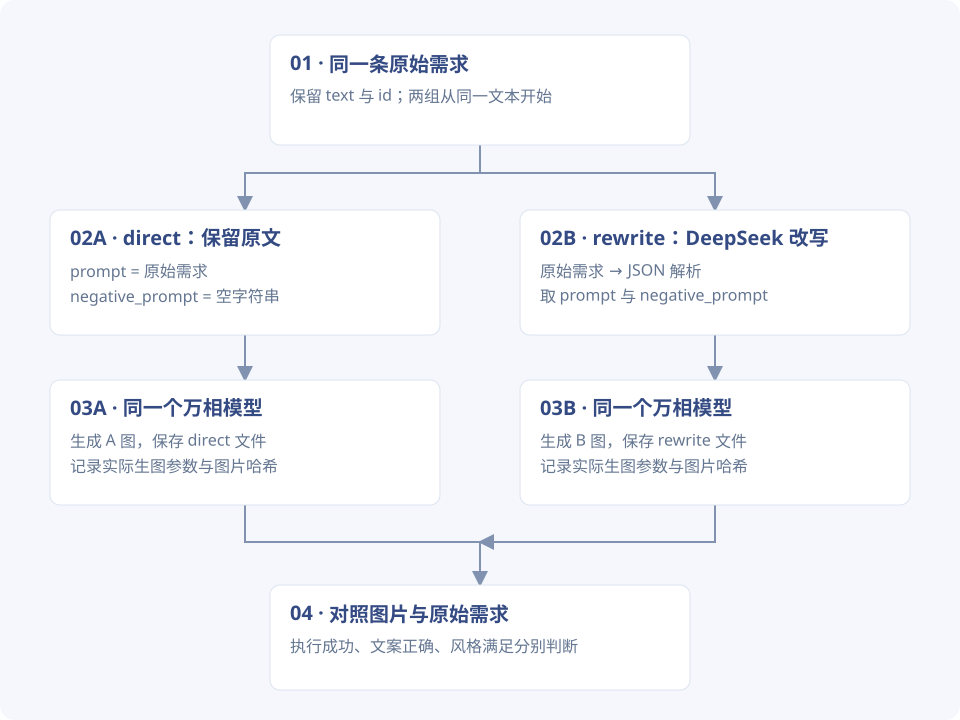
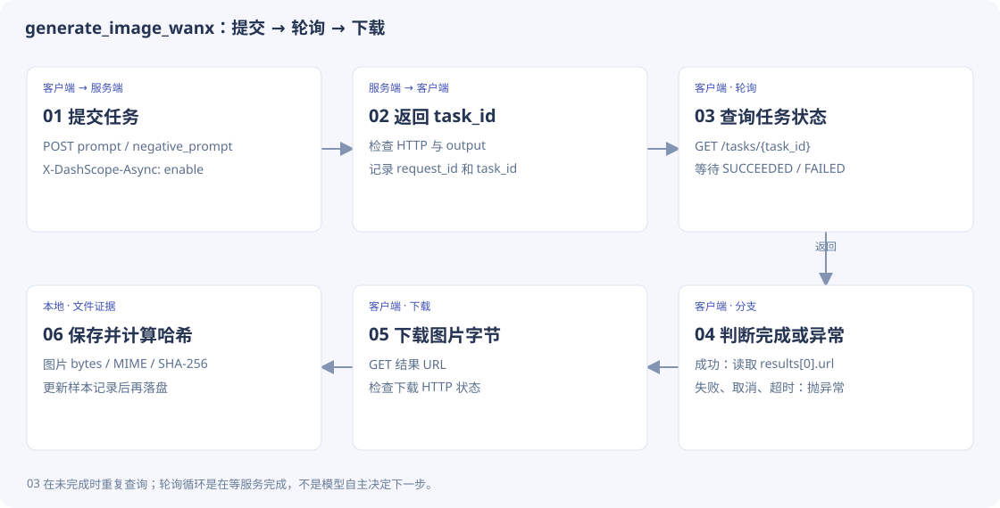

# 1-4 · 生图工作流代码精读

[先看 10 张实测图片](images.md) · [代码来源与阅读约定](code-guide.md)

!!! note "阅读约定"
    **课程源码原文**：从课程当前学习版本逐行摘录，附路径和行号。**学习配套脚本原文**：本次为替代实验编写并实际使用的代码。**教学示意 / 建议实现**：为了说明设计写的示例，不是原文件，也不代表已经加入运行器。

## 1. 固定工作流：程序决定先后顺序

本次入口是 `learning/task0/run_image_learning.py`，复用课程 `pipeline.py` 的解析与万相生图函数。五条需求分别走 direct 与 rewrite，两条路线使用同一个生图模型。

模型只负责改写文本；是否改写由 `if route == "rewrite"` 决定。这里不是模型自主选下一步的 Agent loop。


[](../assets/code-flow/images-branches.svg)

*读图：A、B 各一张；未配对随机种子，不能把这次观察推广为稳定质量排名。*

## 2. 双层循环怎样生成十个样本

**本次学习配套脚本原文** · `learning/task0/run_image_learning.py` · L74–L88。仅去除公共缩进，未增补注释。

```python linenums="74"
save()
for requirement in REQUIREMENTS:
    for route in ["direct", "rewrite"]:
        record = {
            "requirement": requirement["id"],
            "route": route,
            "input": requirement["text"],
            "image": None,
            "error": None,
            "calls": [],
        }
        data["runs"].append(record)
        try:
            prompt = requirement["text"]
            negative = ""
```

外层遍历需求，内层遍历路线。`record` 在执行前就加入 `data["runs"]`，所以后面即使报错，仍能为该样本填写 `error`。`image=None` 表示尚未取得图片，不应提前写成功。

每个样本都重新从原始 `requirement["text"]` 设置 `prompt`；B 组不会错误地沿用上一条需求的改写。

## 3. 改写节点：从自然语言到结构化参数

**本次学习配套脚本原文** · `learning/task0/run_image_learning.py` · L89–L111。仅去除公共缩进，未增补注释。

```python linenums="89"
if route == "rewrite":
    messages = [
        {"role": "system", "content": REWRITE_SYSTEM_PROMPT},
        {"role": "user", "content": prompt},
    ]
    response = client.chat.completions.create(
        model=data["rewrite_model"], messages=messages
    )
    raw = response.choices[0].message.content or ""
    rewritten = parse_rewrite_output(raw)
    record["rewrite"] = rewritten
    record["calls"].append(
        {
            "provider": "deepseek",
            "model": data["rewrite_model"],
            "response_id": response.id,
            "request": {"messages": messages},
            "raw_output": raw,
            "usage": response.usage.model_dump() if response.usage else {},
        }
    )
    prompt = rewritten["prompt"]
    negative = rewritten["negative_prompt"]
```

1. `messages` 包含课程的改写系统提示与当前原始需求。
2. `response.choices[0].message.content` 是模型返回文本；空内容暂转为 `""`，随后由解析器明确拒绝。
3. `parse_rewrite_output` 将文本转换成三字段字典。
4. 保存原始输出和请求摘要，才能反查是改写阶段丢了要求，还是生成阶段没做到。
5. 真正传给图片模型的是 `prompt` 与 `negative_prompt`；`style_notes` 只作解释，不是生图参数。

## 4. 解析 JSON，不等于检查语义

**课程源码原文** · `chapter1/image-gen-workflow/pipeline.py` · L46–L80。仅去除公共缩进，未增补注释。

[打开该版本源码](https://github.com/bojieli/ai-agent-book/blob/cf7f7a8e16b234ac303034e4ec8f75bf2d61ac2c/chapter1/image-gen-workflow/pipeline.py#L46)

```python linenums="46"
if not isinstance(text, str) or not text.strip():
    raise ValueError("改写输出为空")

cleaned = text.strip()
if cleaned.startswith("```"):
    # 去掉首行围栏与结尾围栏
    lines = cleaned.splitlines()
    lines = [l for l in lines if not l.strip().startswith("```")]
    cleaned = "\n".join(lines).strip()

decoder = json.JSONDecoder()
start = cleaned.find("{")
if start == -1:
    raise ValueError(f"改写输出中没有 JSON 对象: {cleaned[:100]!r}")
try:
    obj, _ = decoder.raw_decode(cleaned[start:])
except json.JSONDecodeError as e:
    raise ValueError(f"改写输出不是合法 JSON: {e}") from e

if not isinstance(obj, dict):
    raise ValueError("改写输出的 JSON 不是对象")
prompt = obj.get("prompt")
if not isinstance(prompt, str) or not prompt.strip():
    raise ValueError("改写输出缺少非空的 prompt 字段")
negative = obj.get("negative_prompt", "")
if not isinstance(negative, str):
    raise ValueError("negative_prompt 字段必须是字符串")
notes = obj.get("style_notes", "")
if not isinstance(notes, str):
    raise ValueError("style_notes 字段必须是字符串")
return {
    "prompt": prompt.strip(),
    "negative_prompt": negative.strip(),
    "style_notes": notes.strip(),
}
```

| 检查 | 拦住什么 | 拦不住什么 |
| --- | --- | --- |
| 输入非空字符串 | 空响应 | 内容是否忠于需求 |
| 去围栏并找 `{` | 常见代码围栏包装 | 前后附加文本仍可能被容忍 |
| `raw_decode` | JSON 语法错误 | `prompt` 的描述是否正确 |
| `prompt` 非空字符串 | 缺少主要参数 | 必须呈现的文字被删掉 |
| negative、notes 类型正确 | 错误字段类型 | 负面提示词与原需求冲突 |

`raw_decode` 返回对象与结束位置，但这里忽略结束位置，因此不要求整个响应严格只有一个 JSON 对象。它适合容错解析，不能声称做了严格的完整响应验证。

## 5. 异步生图：提交成功还没拿到图片


[](../assets/code-flow/images-async.svg)

*读图：03 在未完成时重复查询；轮询循环是在等服务完成，不是模型自主决定下一步。*

**课程源码原文** · `chapter1/image-gen-workflow/pipeline.py` · L191–L226。仅去除公共缩进，未增补注释。

[打开该版本源码](https://github.com/bojieli/ai-agent-book/blob/cf7f7a8e16b234ac303034e4ec8f75bf2d61ac2c/chapter1/image-gen-workflow/pipeline.py#L191)

```python linenums="191"
deadline = t0 + Config.TASK_POLL_TIMEOUT
try:
    while True:
        time.sleep(Config.TASK_POLL_INTERVAL)
        r = requests.get(poll_url, headers=headers, timeout=30)
        body = r.json()
        status = body.get("output", {}).get("task_status")
        if status == "SUCCEEDED":
            break
        if status in ("FAILED", "CANCELED"):
            raise RuntimeError(f"任务失败: {body}")
        if time.monotonic() > deadline:
            raise TimeoutError(f"轮询超时（{Config.TASK_POLL_TIMEOUT}s），最后状态 {status}")
    poll["response_id"] = body.get("request_id")
    poll["usage"] = body.get("usage", {})
    poll["task_metrics"] = {
        k: body["output"].get(k)
        for k in ("submit_time", "scheduled_time", "end_time")
    }
    result = body["output"]["results"][0]
    image_url = result["url"]
    poll["actual_prompt"] = result.get("actual_prompt")
    _finish(poll, t0)
except Exception as e:
    poll["status"] = "error"
    poll["error"] = f"{type(e).__name__}: {e}"
    _finish(poll, t0)
    raise

dl = _new_call_record("dashscope", Config.WANX_MODEL, image_url.split("?")[0])
t0 = time.monotonic()
r = requests.get(image_url, timeout=60)
r.raise_for_status()
mime = r.headers.get("Content-Type", "image/png").split(";")[0]
dl["response_bytes"] = len(r.content)
_finish(dl, t0)
```

- `task_id` 是服务端异步任务标识，和改写响应的 `response.id` 不是同一个 ID。
- 每次循环先等待，再查询状态。成功退出；失败或取消直接抛错。
- `deadline` 使用 `time.monotonic()`，用于计算经过时间，避免系统时钟调整影响超时判断。
- 这个超时不是硬截止：HTTP 查询本身还有最长 30 秒等待，轮询间隔也占时间。
- `actual_prompt` 若提供则记录下来，可帮助观察服务端是否又改写过提示词。
- 轮询代码没有逐次保存所有 HTTP 回执；返回的 calls 是 submit、poll、download 三段汇总。不要把三条记录当成恰好三次 HTTP 请求。

## 6. 下载、文件名和证据之间的对应

**本次学习配套脚本原文** · `learning/task0/run_image_learning.py` · L112–L129。仅去除公共缩进，未增补注释。

```python linenums="112"
record["image_request"] = {
    "prompt": prompt,
    "negative_prompt": negative,
    "model": Config.WANX_MODEL,
    "size": Config.WANX_SIZE,
}
image, mime, calls = generate_image_wanx(prompt, negative)
record["calls"].extend(calls)
ext = {"image/png": ".png", "image/jpeg": ".jpg", "image/webp": ".webp"}[mime]
filename = requirement["id"] + "-" + route + ext
(output / filename).write_bytes(image)
record["image"] = {
    "path": filename,
    "mime": mime,
    "bytes": len(image),
    "sha256": hashlib.sha256(image).hexdigest(),
}
print(requirement["id"], route, "image saved", flush=True)
```

`generate_image_wanx` 返回三元组：图片字节、MIME 类型、调用记录。文件名由需求 ID 和路线组成，例如 `headphone-poster-rewrite.png`。SHA-256 用于验证字节是否变化，不判断图片内容质量。

保存证据的 `save()` 会对环境中的 API_KEY 值做替换，再保存 JSON 与哈希。脱敏和文件完整性分别解决不同问题。

## 7. 出错时如何继续、哪些记录仍可能缺失

**本次学习配套脚本原文** · `learning/task0/run_image_learning.py` · L130–L146。仅去除公共缩进，未增补注释。

```python linenums="130"
        except Exception as exc:  # noqa: BLE001 -- persist failed external calls as experiment evidence
            message = f"{type(exc).__name__}: {exc}"
            for secret in secrets:
                message = message.replace(secret, "[REDACTED]")
            record["error"] = message
            print(requirement["id"], route, message, flush=True)
            if not any(r["image"] for r in data["runs"]):
                data["stop_reason"] = (
                    "First image failed; stopped instead of repeating unavailable service across ten cells."
                )
                save()
                return 1
        save()
data["completed_images"] = sum(bool(r["image"]) for r in data["runs"])
data["passed_execution"] = data["completed_images"] == 10
save()
return 0 if data["passed_execution"] else 1
```

- 样本失败后记录异常；如果此前没有任何成功图片，就停止整个批次，避免对不可用服务连发十组。
- 如果已有成功样本，后续单个失败会被记录，循环继续。
- 最后的 `passed_execution` 只检查是否取得十张图片。它没有检查海报文字、构图等要求。
- 上游 `generate_image_wanx` 内部失败时会抛出异常，调用方可能拿不到它未返回的调用记录；因此本次成功路径证据较完整，但不能声称所有失败请求均完整落盘。

## 8. 海报文案在哪里丢掉了

课程改写系统提示把 `text` 列为负面词示例，这只是通用建议，却可能与当前需求“必须有中文文案”冲突。本次改写结果把指定中文删掉，且负面词包括 text/letters/words。

问题发生在**生成之前的改写节点**；JSON 格式正确、图片下载成功都无法修复它。应把不可丢失要求单独保存，在改写后检查。

```python title="建议实现 · 教学示意，未加入本次实验"
required_text = "深夜独处也清净"
rewritten = parse_rewrite_output(raw)
if required_text not in rewritten["prompt"]:
    return invalid_rewrite("改写丢失指定文案")
# 这只检查输入保留，最终图片仍需核对文字是否正确。
```

这里只示范精确文案约束。对于“简约”“未来感”等语义要求，不能仅靠字符串包含判断；还需人工或专门的内容评价。

## 9. 亲手练习

把 `rewrite_requirement`、`validate_rewrite`、`generate_image`、`save_sample` 分成四个函数。先用固定 JSON 与假图片验证接口，再接真实 API。保留每次失败原因，最后分别统计“执行成功”和“需求满足”。
