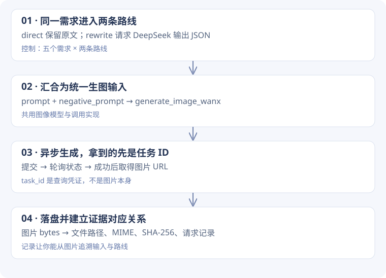

# 1-4 · 怎样设计一个可比较的生图工作流？

[实验结果与图片](images.md) · [代码来源约定](code-guide.md)

<div class="design-lead"><span>设计问题 / IMAGES</span><p>要比较提示词改写有没有帮助，需要知道两条路径在哪处分开、在哪处重新共用实现，以及哪些差异还没有控制。</p></div>

!!! note "怎样读这一页"
    先理解为什么需要这些模块，再跟随例子进入函数。标为“教学推演”的数据仅帮助理解，不是实验日志；代码块注明来源。完整摘录放在页末的备查链接中。

## 1. 从两段脚本推到一条公共流水线

最直观的写法是“原提示词生图”一份脚本、“改写后生图”另一份脚本。但若两份脚本选了不同图像模型、尺寸或保存方式，就很难把差异归因于提示词。

本次学习运行器把同一需求送入 `direct` 和 `rewrite` 两条路线，之后都调用 `generate_image_wanx`。改写模型用 DeepSeek，图像模型都用 `wan2.2-t2i-flash`。它是学习替代实验，不是原课程 Gemini / OpenAI 对照的完成证明。



## 2. 跟一个需求穿过分支

用本次真实需求中的海报文字约束：“深夜独处也清净”。以下是数据流的简化展示，完整请求见实验记录。

| 阶段 | direct | rewrite |
| --- | --- | --- |
| 原始输入 | 包含指定文案的需求 | 相同需求 |
| 中间处理 | 直接使用原文 | 改写模型输出 `prompt`、`negative_prompt`、`notes` |
| 生图输入 | 原需求进入图像模型 | 改写后的英文描述进入图像模型 |
| 需要验收 | 图像是否包含准确文案 | 先检查改写是否保留文案，再检查图片 |

这解释了为什么“改写 JSON 能解析”远远不够。解析器能验证字段形状，却不知道哪一句中文是用户不可丢失的要求。本次 rewrite 遗漏了指定文案，还出现排除文字的负面提示；两条路线最终都没有满足准确文案要求。

## 3. 为什么把改写结果定义为结构化字段？

`parse_rewrite_output` 去掉围栏、寻找首个 JSON 对象，用 `raw_decode` 解析，检查对象与非空 prompt，再规范化其他字段。它解决的是模型输出可能夹带说明的问题，让下游函数只接收明确的 prompt 和 negative prompt。

这个宽容设计也有代价：首个对象后的文字可被忽略，能解析不等于严格遵守“只输出 JSON”。`notes` 解释改写，但生图主输入取的是 `prompt` 与 `negative_prompt`，不能靠 notes 补回丢失的硬约束。

**如果自己增强设计**：把原始需求里的硬约束单独保存，在改写前后校验，再决定是否允许生图。这是建议增强，本次运行器没有实现通用约束校验器。

### 共用的生成入口如何保证两条路线汇合

**学习配套脚本原文** · `learning/task0/run_image_learning.py` L112–120。这里只去除公共缩进。

```python linenums="112"
record["image_request"] = {
    "prompt": prompt,
    "negative_prompt": negative,
    "model": Config.WANX_MODEL,
    "size": Config.WANX_SIZE,
}
image, mime, calls = generate_image_wanx(prompt, negative)
record["calls"].extend(calls)
ext = {"image/png": ".png", "image/jpeg": ".jpg", "image/webp": ".webp"}[mime]
```

运行到这里时，`prompt` 和 `negative` 已经由前面的 route 分支确定。`record["image_request"]` 记录即将发送的输入，紧接着调用公共生成函数；返回值同时包含图片、类型和调用记录。把“记录输入”和“执行生成”放在相邻位置，有助于核对每张图究竟使用了什么条件。

## 4. 为什么提交成功后还要轮询？

图像生成耗时较长，服务先返回 `task_id`。提交成功只能说明任务被接收；直接把这次 HTTP 成功当成图片完成，会提前交付不存在的结果。

| 状态 | 手里有什么 | 下一步 |
| --- | --- | --- |
| 提交成功 | `task_id` | 用 ID 查询状态 |
| 尚未完成 | 状态信息 | 等待后再次查询 |
| `SUCCEEDED` | 结果中的图片 URL | 下载图片字节 |
| `FAILED` / `CANCELED` | 错误信息 | 抛出错误，由运行器记录 |
| 超过等待期限 | 未得到可用结果 | 结束等待，记录失败 |

函数的超时包含请求超时和轮询期限，不是一个到点瞬间打断全部工作的硬截止。读轮询代码时要看期限检查位于哪里，而不只看变量叫 `deadline`。

## 5. 为什么保存图片还要存哈希和请求？

只留下十张图片，过几天就难以确定哪张对应哪个 prompt。运行器按需求与路线记录改写输出、图像请求、调用信息，再保存 MIME、字节数与 SHA-256。文件扩展名也由 MIME 决定，避免内容和后缀错配。

哈希证明“现在的文件与当时记录的字节一致”，不证明图片符合需求。调用记录也有边界：生图函数把提交、轮询、下载聚合成记录，记录条数不等于底层 HTTP 请求数；函数中途抛错时，尚未返回的内部记录不会完整传回调用者。

### 在真实代码里找分支与汇合点

打开 `learning/task0/run_image_learning.py`：L75 起遍历需求，L76 遍历两条 route；L89 的条件只控制是否改写，L118 汇合到同一 `generate_image_wanx`。L130 起处理失败，并在运行中持续保存已有结果。

接着读 `chapter1/image-gen-workflow/pipeline.py`：先看 `parse_rewrite_output` 的输入契约，再看 `generate_image_wanx` 的提交、状态循环与下载。此时每段代码都在回答一个你已知道的问题。

## 6. 这个比较能支持什么结论？

本次五个需求、两条路线，共十张图片成功落盘，说明工作流可运行。没有匹配随机种子，每个条件仅一张，不能把某一张更好看完全归因于改写。应先逐项看构图、主体、指定文案等需求是否满足，再讨论风格偏好。

**自检题**：为了更公平比较，能否给两条路线换成不同的图像模型？为了验证海报文案，检查 `prompt` 非空够不够？

??? tip "思路对照"
    换图像模型会同时改变另一个因素；若目的是研究改写，应尽可能保持生成配置一致并增加重复样本。非空 prompt 只验证结构；准确文案需要单独的约束检查和输出图像核对。若服务支持控制种子，可纳入配对设计，但不能假设当前接口已支持。

[逐段源码与异步 SVG 备查](images-code-reference.md) · [回到实验复盘](review.md)
