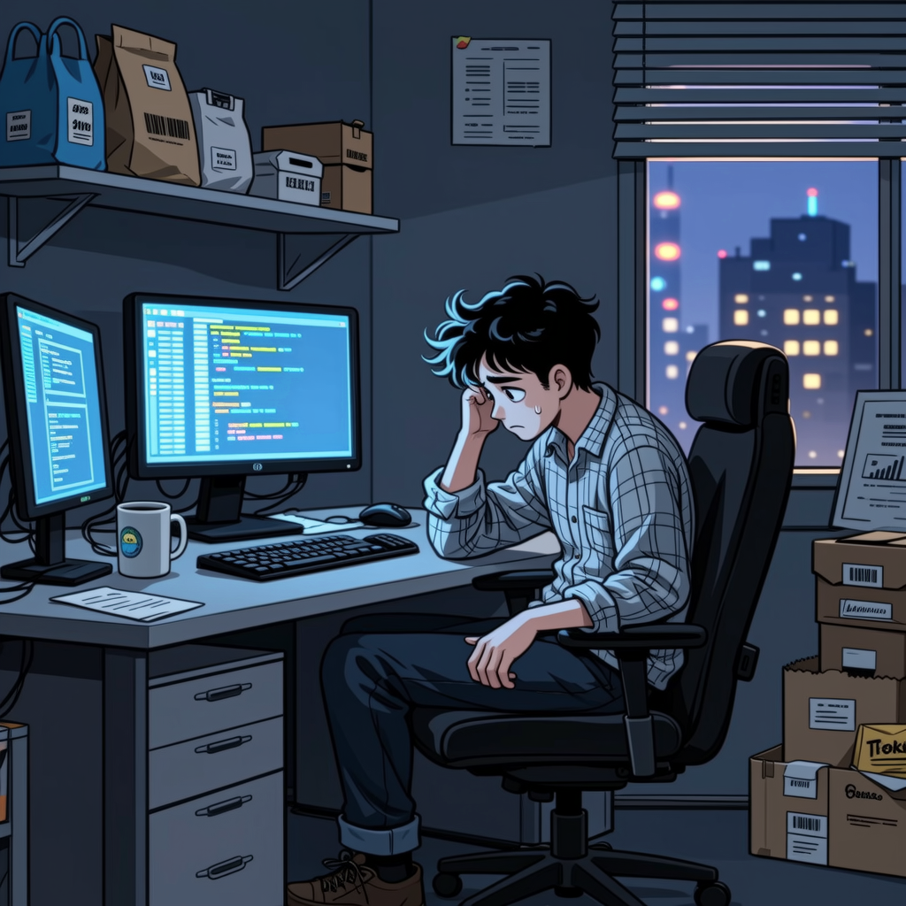
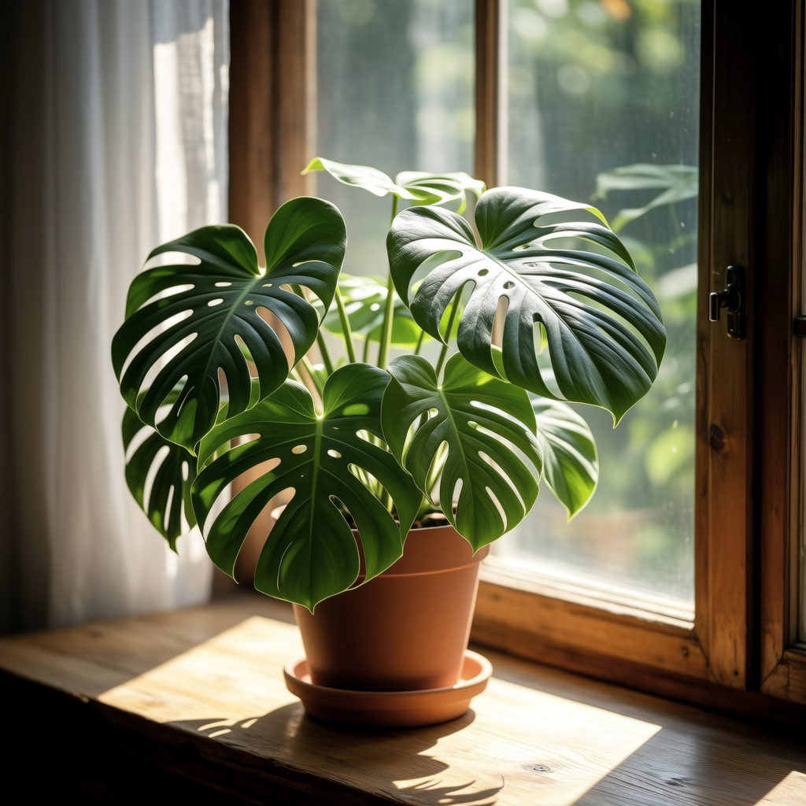
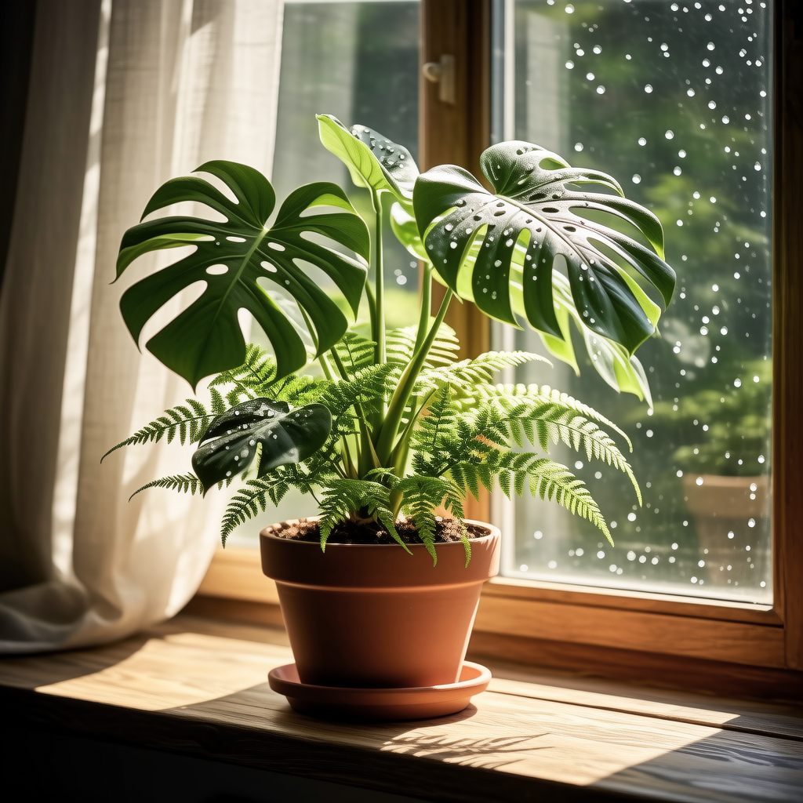
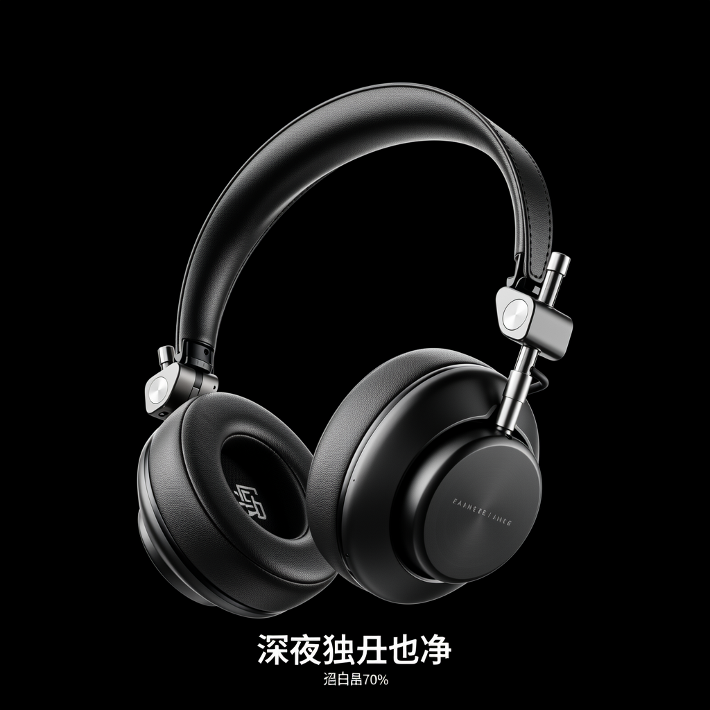
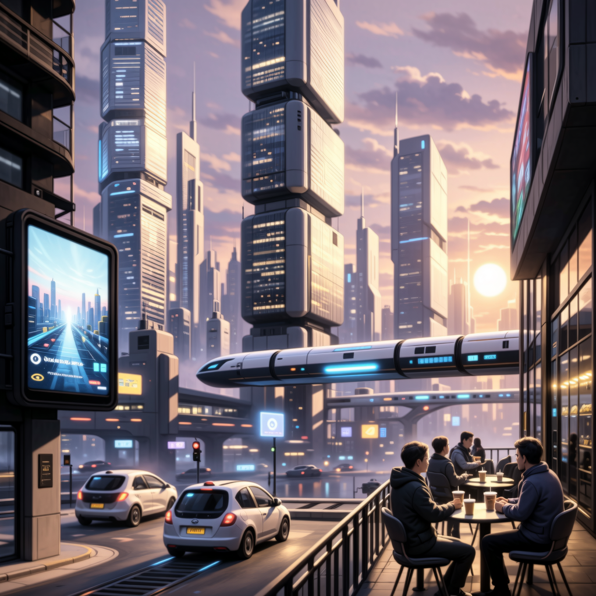
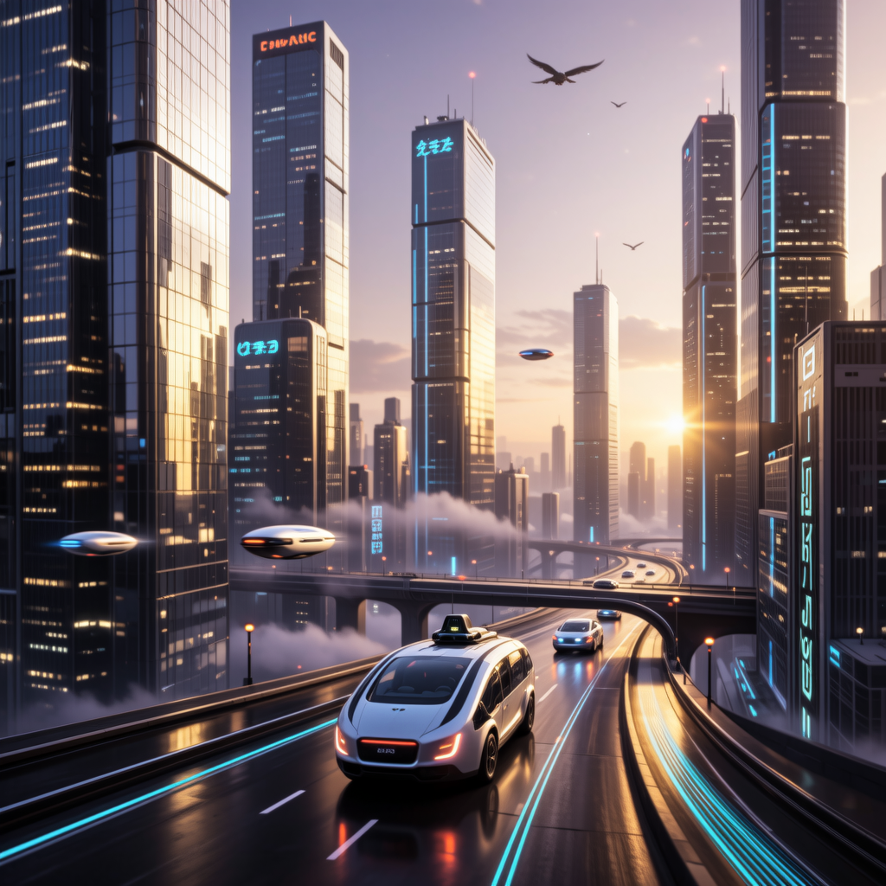

# 1-4 · 提示词与生图

!!! tip "按实际调用顺序读代码"
    [打开本实验的生图代码精读：源码原文、逐步解释与 SVG 流程图](images-code.md)

TASK 0 · 实验记录与代码阅读 · 2026.09

## 改写增加细节，也可能丢掉需求

<svg aria-label="提示词改写与生图" role="img" viewbox="0 0 1000 220" xmlns="http://www.w3.org/2000/svg"><defs><marker id="arrow-images" markerheight="7" markerwidth="7" orient="auto" refx="6" refy="3.5"><path d="M0 0L7 3.5L0 7" fill="#768bb1"></path></marker></defs><rect fill="#edf2fc" height="220" rx="14" width="1000"></rect><path d="M242.0 105h20" marker-end="url(#arrow-images)" stroke="#768bb1" stroke-width="2"></path><rect fill="white" height="135" rx="10" stroke="#d3ddec" width="222.0" x="20.0" y="40"></rect><text fill="#2a51df" font-size="14" x="35.0" y="70">01</text><text fill="#18243d" font-size="20" font-weight="600" x="35.0" y="103">同一原始需求</text><text fill="#536783" font-size="14" x="35.0" y="137">五个需求，逐一对照</text><path d="M488.0 105h20" marker-end="url(#arrow-images)" stroke="#768bb1" stroke-width="2"></path><rect fill="white" height="135" rx="10" stroke="#d3ddec" width="222.0" x="266.0" y="40"></rect><text fill="#2a51df" font-size="14" x="281.0" y="70">02</text><text fill="#18243d" font-size="20" font-weight="600" x="281.0" y="103">A 直接 / B 改写</text><text fill="#536783" font-size="14" x="281.0" y="137">B 使用 DeepSeek</text><path d="M734.0 105h20" marker-end="url(#arrow-images)" stroke="#768bb1" stroke-width="2"></path><rect fill="white" height="135" rx="10" stroke="#d3ddec" width="222.0" x="512.0" y="40"></rect><text fill="#2a51df" font-size="14" x="527.0" y="70">03</text><text fill="#18243d" font-size="20" font-weight="600" x="527.0" y="103">同一个万相模型</text><text fill="#536783" font-size="14" x="527.0" y="137">每条路线各生成一张</text><rect fill="white" height="135" rx="10" stroke="#d3ddec" width="222.0" x="758.0" y="40"></rect><text fill="#2a51df" font-size="14" x="773.0" y="70">04</text><text fill="#18243d" font-size="20" font-weight="600" x="773.0" y="103">看图 + 查提示词</text><text fill="#536783" font-size="14" x="773.0" y="137">忠实度与增补分别记录</text></svg>

五条原始需求 × 两条路线，模型均为 <code>wan2.2-t2i-flash</code>。B 组使用上游改写系统提示词，由 DeepSeek 输出 prompt、negative_prompt、style_notes。该对照研究“外部改写节点”的影响，没有对 Gemini 或 GPT-Image 的原生能力作结论。

每格只生成一次，没有配对随机种子；同一生图服务的内部提示词处理也可能起作用。以下是样本观察，不是统计性的质量排名。

<h3>帮我画一个周末加班的程序员，风格丧一点</h3>
<figure><figcaption>A · 原始中文直接生成</figcaption>

查看实际输入与改写
<pre>{
  "image_request": {
    "prompt": "帮我画一个周末加班的程序员，风格丧一点",
    "negative_prompt": "",
    "model": "wan2.2-t2i-flash",
    "size": "1024*1024"
  },
  "rewrite": null
}</pre>
</figure><figure><figcaption>B · DeepSeek 改写后生成</figcaption>

查看实际输入与改写
<pre>{
  "image_request": {
    "prompt": "masterpiece, best quality, highly detailed, ultra detailed, cinematic still, a exhausted young male programmer sitting alone at his desk on a weekend, hunched shoulders, slumped posture, dark circles under eyes, blank dead-eyed stare, messy unkempt hair, wearing a faded oversized hoodie, hand resting limply on keyboard, multiple monitors glowing with lines of code, harsh blue monitor light on his face, half-eaten cup noodles, empty energy drink cans and cold coffee cups, tangled cables, sticky notes, messy desk, empty open-plan office at night, rows of dark silent desks behind him, one flickering fluorescent ceiling light, late night, window with city lights blurred in the distance, cold desaturated color grading, teal and gray tones, muted colors, dim moody lighting, volumetric haze, film grain, melancholic, lonely, weary, quiet despair, slice-of-life realism, shallow depth of field, medium shot, rule of thirds composition",
    "negative_prompt": "lowres, bad anatomy, bad hands, extra fingers, missing fingers, fused fingers, deformed, disfigured, blurry, out of focus, watermark, signature, text, logo, username, jpeg artifacts, ugly, oversaturated, cheerful, bright sunny, smiling, happy, party, crowd, colorful neon, cartoonish, chibi, 3d render, plastic skin, duplicate, cropped",
    "model": "wan2.2-t2i-flash",
    "size": "1024*1024"
  },
  "rewrite": {
    "prompt": "masterpiece, best quality, highly detailed, ultra detailed, cinematic still, a exhausted young male programmer sitting alone at his desk on a weekend, hunched shoulders, slumped posture, dark circles under eyes, blank dead-eyed stare, messy unkempt hair, wearing a faded oversized hoodie, hand resting limply on keyboard, multiple monitors glowing with lines of code, harsh blue monitor light on his face, half-eaten cup noodles, empty energy drink cans and cold coffee cups, tangled cables, sticky notes, messy desk, empty open-plan office at night, rows of dark silent desks behind him, one flickering fluorescent ceiling light, late night, window with city lights blurred in the distance, cold desaturated color grading, teal and gray tones, muted colors, dim moody lighting, volumetric haze, film grain, melancholic, lonely, weary, quiet despair, slice-of-life realism, shallow depth of field, medium shot, rule of thirds composition",
    "negative_prompt": "lowres, bad anatomy, bad hands, extra fingers, missing fingers, fused fingers, deformed, disfigured, blurry, out of focus, watermark, signature, text, logo, username, jpeg artifacts, ugly, oversaturated, cheerful, bright sunny, smiling, happy, party, crowd, colorful neon, cartoonish, chibi, 3d render, plastic skin, duplicate, cropped",
    "style_notes": "把'周末加班程序员'落到具体可画的细节上：疲惫体态、黑眼圈、空荡办公室、泡面与空罐、冷蓝屏幕光与闪烁日光灯，用来强化'丧'；风格定为电影感写实插画，用去饱和青灰调、颗粒感与冷光营造压抑孤独氛围，同时用景深和三分构图突出人物；负面词重点压制明快、饱和、笑容等与丧感冲突的元素以及手部畸变。"
  }
}</pre>
</figure>

<strong>人工查看：</strong>两组都表现深夜加班。直出偏插画、人物扶额；改写版增加空荡办公室、泡面和饮料，偏写实。两张图本身都不能证明“周末”。

<h3>帮我画一盆放在窗台上的绿植，早晨的阳光刚好照进来</h3>
<figure><figcaption>A · 原始中文直接生成</figcaption>

查看实际输入与改写
<pre>{
  "image_request": {
    "prompt": "帮我画一盆放在窗台上的绿植，早晨的阳光刚好照进来",
    "negative_prompt": "",
    "model": "wan2.2-t2i-flash",
    "size": "1024*1024"
  },
  "rewrite": null
}</pre>
</figure><figure><figcaption>B · DeepSeek 改写后生成</figcaption>

查看实际输入与改写
<pre>{
  "image_request": {
    "prompt": "masterpiece, best quality, highly detailed, a lush potted green plant on a wooden windowsill, monstera and fern leaves, ceramic terracotta pot, warm golden morning sunlight streaming through the window, soft god rays, gentle backlighting, sunlight falling on the leaves, translucent glowing foliage, dust motes in the air, sheer white curtain slightly blurred in background, dew drops on leaves, shallow depth of field, cozy peaceful morning atmosphere, indoor plant photography, natural light, 50mm lens, soft pastel color palette, photorealistic, 8k",
    "negative_prompt": "lowres, bad anatomy, blurry, jpeg artifacts, watermark, text, signature, oversaturated, harsh shadows, night, gloomy, dark, wilted plant, dead leaves, messy composition, cluttered background, cartoon, 3d render, deformed pot, extra leaves, distorted perspective",
    "model": "wan2.2-t2i-flash",
    "size": "1024*1024"
  },
  "rewrite": {
    "prompt": "masterpiece, best quality, highly detailed, a lush potted green plant on a wooden windowsill, monstera and fern leaves, ceramic terracotta pot, warm golden morning sunlight streaming through the window, soft god rays, gentle backlighting, sunlight falling on the leaves, translucent glowing foliage, dust motes in the air, sheer white curtain slightly blurred in background, dew drops on leaves, shallow depth of field, cozy peaceful morning atmosphere, indoor plant photography, natural light, 50mm lens, soft pastel color palette, photorealistic, 8k",
    "negative_prompt": "lowres, bad anatomy, blurry, jpeg artifacts, watermark, text, signature, oversaturated, harsh shadows, night, gloomy, dark, wilted plant, dead leaves, messy composition, cluttered background, cartoon, 3d render, deformed pot, extra leaves, distorted perspective",
    "style_notes": "把口语需求补全为写实室内植物摄影：明确主体（龟背竹/蕨类+陶盆）、光线（金色晨光逆光+光柱+尘埃颗粒）、环境（木窗台、纱帘虚化）与氛围（安静温暖），并加入景深、镜头与画质词强化真实感；负面词针对光照、植物状态和画面杂乱做了排除。"
  }
}</pre>
</figure>

<strong>人工查看：</strong>两组都有窗台绿植与晨光。改写版增加蕨类与明显光点，画面更复杂；原始需求并未要求这些细节。

<h3>帮我做一张新款降噪耳机的产品海报，主打“深夜独处也清净”这句文案，风格简约高级</h3>
<figure><figcaption>A · 原始中文直接生成</figcaption>

查看实际输入与改写
<pre>{
  "image_request": {
    "prompt": "帮我做一张新款降噪耳机的产品海报，主打“深夜独处也清净”这句文案，风格简约高级",
    "negative_prompt": "",
    "model": "wan2.2-t2i-flash",
    "size": "1024*1024"
  },
  "rewrite": null
}</pre>
</figure><figure><figcaption>B · DeepSeek 改写后生成</figcaption>

查看实际输入与改写
<pre>{
  "image_request": {
    "prompt": "commercial product photography of premium over-ear noise-cancelling headphones, matte black with subtle metallic accents, floating centered composition, deep midnight blue and charcoal gradient background, minimalist high-end aesthetic, single soft moonlight rim light from upper left, gentle cool blue glow, subtle mist and dust particles in air, soft reflection on glossy dark surface, large empty negative space on upper two-thirds for copy, vertical poster layout, calm solitary late-night mood, 85mm lens, shallow depth of field, sharp focus on product, cold color grading, cinematic studio lighting, masterpiece, best quality, ultra detailed, 8k, advertising key visual",
    "negative_prompt": "text, letters, words, watermark, signature, logo, typography, lowres, blurry, out of focus, bad anatomy, distorted product, extra headphones, duplicate, cluttered background, busy composition, oversaturated, garish colors, warm orange tones, plastic cheap look, jpeg artifacts, heavy noise, people, hands, faces, cartoon, illustration, flat lighting",
    "model": "wan2.2-t2i-flash",
    "size": "1024*1024"
  },
  "rewrite": {
    "prompt": "commercial product photography of premium over-ear noise-cancelling headphones, matte black with subtle metallic accents, floating centered composition, deep midnight blue and charcoal gradient background, minimalist high-end aesthetic, single soft moonlight rim light from upper left, gentle cool blue glow, subtle mist and dust particles in air, soft reflection on glossy dark surface, large empty negative space on upper two-thirds for copy, vertical poster layout, calm solitary late-night mood, 85mm lens, shallow depth of field, sharp focus on product, cold color grading, cinematic studio lighting, masterpiece, best quality, ultra detailed, 8k, advertising key visual",
    "negative_prompt": "text, letters, words, watermark, signature, logo, typography, lowres, blurry, out of focus, bad anatomy, distorted product, extra headphones, duplicate, cluttered background, busy composition, oversaturated, garish colors, warm orange tones, plastic cheap look, jpeg artifacts, heavy noise, people, hands, faces, cartoon, illustration, flat lighting",
    "style_notes": "把口语需求转成极简高级的产品广告视觉：主体设为磨砂黑头戴式降噪耳机居中悬浮，用深夜蓝黑渐变背景+单侧冷调轮廓光+薄雾营造“深夜独处”的安静氛围，并特意留出上方大面积空白供后期排版文案；因模型英文文字渲染不可靠，负面词中屏蔽文字与logo，文案建议在排版软件里叠加。"
  }
}</pre>
</figure>

<strong>人工查看：</strong>两组均未完整呈现指定文案。直出尝试中文，但有错字与缺字；改写先删除中文文案，并把 text/letters/words 放进负面词，最终仍生成英文样式伪文案。美观与满足需求必须分开评分。

<h3>帮我画一个 AGI 实现以后程序员的工作场景</h3>
<figure><figcaption>A · 原始中文直接生成</figcaption>

查看实际输入与改写
<pre>{
  "image_request": {
    "prompt": "帮我画一个 AGI 实现以后程序员的工作场景",
    "negative_prompt": "",
    "model": "wan2.2-t2i-flash",
    "size": "1024*1024"
  },
  "rewrite": null
}</pre>
</figure><figure><figcaption>B · DeepSeek 改写后生成</figcaption>

查看实际输入与改写
<pre>{
  "image_request": {
    "prompt": "masterpiece, best quality, highly detailed, cinematic concept art, sci-fi illustration, a post-AGI software workplace, one human programmer reclining in an ergonomic chair, calmly supervising dozens of glowing AI agent avatars that write and refactor code across floating holographic screens, cascading streams of self-organizing source code, translucent neural-interface panels, diagrams merging and resolving themselves, the human only nudging intent with a gesture, vast open control room, glass walls, soft volumetric god rays, mix of warm amber desk light and cool cyan hologram glow, humans as curators and reviewers instead of typists, quiet utopian mood with a faint undercurrent of unease, wide establishing shot, shallow depth of field, futuristic UI, iridescent particles, fog, ultra detailed environment, 8k, trending on artstation",
    "negative_prompt": "lowres, bad anatomy, bad hands, extra fingers, missing fingers, fused fingers, deformed face, blurry, jpeg artifacts, watermark, signature, text, logo, ui text gibberish, oversaturated, flat lighting, cluttered composition, cliche robot army, terminator, dystopian ruins, guns, gore, distorted perspective, duplicate characters",
    "model": "wan2.2-t2i-flash",
    "size": "1024*1024"
  },
  "rewrite": {
    "prompt": "masterpiece, best quality, highly detailed, cinematic concept art, sci-fi illustration, a post-AGI software workplace, one human programmer reclining in an ergonomic chair, calmly supervising dozens of glowing AI agent avatars that write and refactor code across floating holographic screens, cascading streams of self-organizing source code, translucent neural-interface panels, diagrams merging and resolving themselves, the human only nudging intent with a gesture, vast open control room, glass walls, soft volumetric god rays, mix of warm amber desk light and cool cyan hologram glow, humans as curators and reviewers instead of typists, quiet utopian mood with a faint undercurrent of unease, wide establishing shot, shallow depth of field, futuristic UI, iridescent particles, fog, ultra detailed environment, 8k, trending on artstation",
    "negative_prompt": "lowres, bad anatomy, bad hands, extra fingers, missing fingers, fused fingers, deformed face, blurry, jpeg artifacts, watermark, signature, text, logo, ui text gibberish, oversaturated, flat lighting, cluttered composition, cliche robot army, terminator, dystopian ruins, guns, gore, distorted perspective, duplicate characters",
    "style_notes": "把口语需求定位为'AGI 之后程序员从写码者变成意图指挥者'的科幻概念图：增补了全息代码流、AI 智能体化形、神经接口与手势交互等关键视觉符号，用大场景+冷暖对比光营造平静中带一丝不安的乌托邦氛围，并在负面词中排除机器大军、末日废墟等易跑偏的套路。"
  }
}</pre>
</figure>

<strong>人工查看：</strong>直出呈现多人围桌与全息界面；改写呈现单人监看多个智能体屏幕。改写把宽泛主题收敛为“人类监督 AI”，属于新增解释，不是用户明确要求。

<h3>帮我画一幅“未来城市的早晨”的画</h3>
<figure><figcaption>A · 原始中文直接生成</figcaption>

查看实际输入与改写
<pre>{
  "image_request": {
    "prompt": "帮我画一幅“未来城市的早晨”的画",
    "negative_prompt": "",
    "model": "wan2.2-t2i-flash",
    "size": "1024*1024"
  },
  "rewrite": null
}</pre>
</figure><figure><figcaption>B · DeepSeek 改写后生成</figcaption>

查看实际输入与改写
<pre>{
  "image_request": {
    "prompt": "a futuristic city in the early morning, sunrise over sleek glass skyscrapers, flying vehicles and airships between towers, elevated skyways with light trails, holographic billboards glowing softly, clean utopian sci-fi metropolis, golden morning sunlight, volumetric light rays, thin morning mist and haze, warm orange and cyan color palette, reflective wet streets, birds in the distance, cinematic wide angle composition, low angle view, sci-fi concept art, matte painting, highly detailed, sharp focus, depth of field, masterpiece, best quality, 8k, ultra detailed, trending on artstation",
    "negative_prompt": "lowres, bad quality, worst quality, blurry, jpeg artifacts, watermark, signature, text, logo, bad anatomy, deformed buildings, distorted perspective, warped architecture, messy composition, cluttered, oversaturated, dull colors, dark night, stormy weather, crowd, people close-up, noise, grainy",
    "model": "wan2.2-t2i-flash",
    "size": "1024*1024"
  },
  "rewrite": {
    "prompt": "a futuristic city in the early morning, sunrise over sleek glass skyscrapers, flying vehicles and airships between towers, elevated skyways with light trails, holographic billboards glowing softly, clean utopian sci-fi metropolis, golden morning sunlight, volumetric light rays, thin morning mist and haze, warm orange and cyan color palette, reflective wet streets, birds in the distance, cinematic wide angle composition, low angle view, sci-fi concept art, matte painting, highly detailed, sharp focus, depth of field, masterpiece, best quality, 8k, ultra detailed, trending on artstation",
    "negative_prompt": "lowres, bad quality, worst quality, blurry, jpeg artifacts, watermark, signature, text, logo, bad anatomy, deformed buildings, distorted perspective, warped architecture, messy composition, cluttered, oversaturated, dull colors, dark night, stormy weather, crowd, people close-up, noise, grainy",
    "style_notes": "把口语化的“未来城市的早晨”补全为可渲染的画面：主体定为乌托邦式清晨未来都市，加入玻璃摩天楼、飞行器、全息广告牌等科幻元素，并用金色晨光、体积光、薄雾和青橙配色锁定“早晨”的时间与氛围；同时以电影感广角+低机位构图强化空间纵深，负面词则排除夜景、脏乱与建筑畸变等干扰。"
  }
}</pre>
</figure>

<strong>人工查看：</strong>两组都有未来城市与低角度暖光。直出含街边活动和轨道交通；改写偏道路、车辆与高楼。无法由单张样本断言哪种路线稳定更好。

最清楚的设计问题出现在耳机海报：改写器为了规避文字渲染，擅自把“必须呈现的文案”改成“后期再叠字”。这是任务契约发生变化，不是一次无损的提示词优化。

 · <a href="../assets/images/contact-sheet.jpg">全部图片对照总览 ↗</a>

<h3>代码怎么分工</h3>
<code>run_image_learning.py</code> 固定需求与两条路线；上游 <code>parse_rewrite_output()</code> 校验 JSON；<code>generate_image_wanx()</code> 负责提交任务、轮询、下载；图片 SHA-256 确认证据文件。生成成功和满足需求是两项不同检查。

