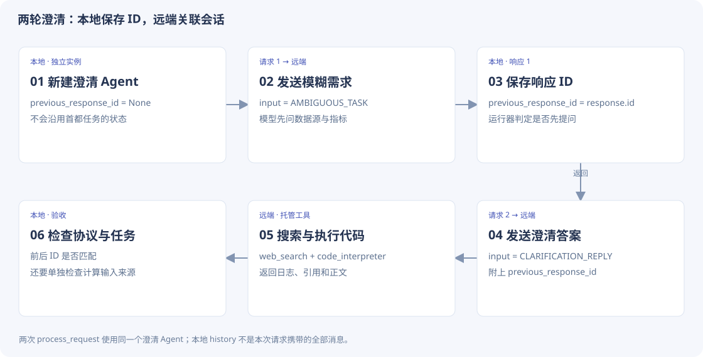
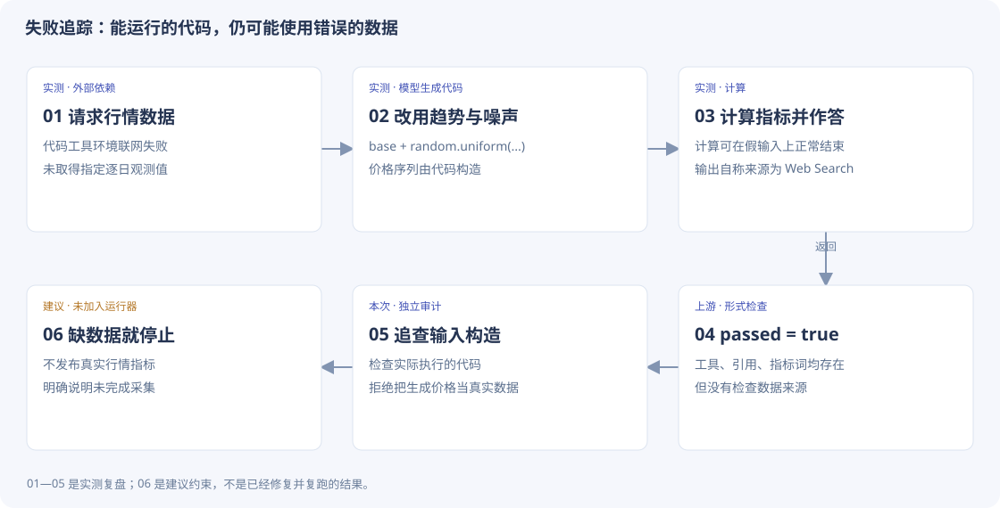

# 1-3 · 搜索与计算代码精读

[返回设计主线](research-code.md) · 本页保留逐段摘录，供查找细节。

[先看实测与失败反例](research.md) · [代码来源与阅读约定](code-guide.md)

!!! note "阅读约定"
    **课程源码原文**：从课程当前学习版本逐行摘录，附路径和行号。**学习配套脚本原文**：本次为替代实验编写并实际使用的代码。**教学示意 / 建议实现**：为了说明设计写的示例，不是原文件，也不代表已经加入运行器。

## 1. 运行器编排场景，Agent 适配请求

`run_backend` 创建两个 Agent：一个用于首都距离，另一个用于“先澄清再分析”。它们的状态分开，避免前一个任务的 response ID 混入后一个任务。

**课程源码原文** · `chapter1/search-codegen/run_experiment_1_3.py` · L218–L242。仅去除公共缩进，未增补注释。

[打开该版本源码](https://github.com/bojieli/ai-agent-book/blob/cf7f7a8e16b234ac303034e4ec8f75bf2d61ac2c/chapter1/search-codegen/run_experiment_1_3.py#L218)

```python linenums="218"
asean_agent = GPT5NativeAgent(key, base_url=base_url, model=model)
asean = asean_agent.process_request(
    ASEAN_TASK,
    reasoning_effort=reasoning,
    verbosity="high",
    max_tokens=16000,
)

clarification_agent = GPT5NativeAgent(key, base_url=base_url, model=model)
first = clarification_agent.process_request(
    AMBIGUOUS_TASK,
    reasoning_effort="medium",
    verbosity="medium",
    max_tokens=4000,
)
second = None
if is_clarifying_question(first):
    second = clarification_agent.process_request(
        CLARIFICATION_REPLY,
        reasoning_effort=reasoning,
        verbosity="high",
        max_tokens=16000,
    )

return {
```


[](../assets/code-flow/research-session.svg)

*读图：两次 process_request 使用同一个澄清 Agent；本地 history 不是本次请求携带的全部消息。*

## 2. “先问清楚”如何被检查

**课程源码原文** · `chapter1/search-codegen/run_experiment_1_3.py` · L160–L165。仅去除公共缩进，未增补注释。

[打开该版本源码](https://github.com/bojieli/ai-agent-book/blob/cf7f7a8e16b234ac303034e4ec8f75bf2d61ac2c/chapter1/search-codegen/run_experiment_1_3.py#L160)

```python linenums="160"
def is_clarifying_question(result: Dict[str, Any]) -> bool:
    text = result.get("response") or ""
    return result.get("success") is True and not result.get("tool_calls") and (
        "?" in text or "？" in text
    )

```

这个判断是一个**启发式检查**：响应成功、没有工具记录、正文含问号。它没有理解提问是否覆盖了所有歧义。模型问一句无关问题也可能满足形式条件；若没有满足条件，运行器把 `second` 保持为 `None`，不会继续假装已经澄清。

## 3. 会话状态实际存在哪里

**课程源码原文** · `chapter1/search-codegen/agent.py` · L302–L322。仅去除公共缩进，未增补注释。

[打开该版本源码](https://github.com/bojieli/ai-agent-book/blob/cf7f7a8e16b234ac303034e4ec8f75bf2d61ac2c/chapter1/search-codegen/agent.py#L302)

```python linenums="302"

self.previous_response_id = response.get("id")
text = self._output_text(response)
self.conversation_history.extend(
    [
        {"role": "user", "content": user_request},
        {"role": "assistant", "content": text},
    ]
)
return {
    "success": response.get("status") == "completed" and bool(text),
    "error": response.get("error"),
    "response": text,
    "request": request,
    "raw_response": response,
    "output_items": response.get("output") or [],
    "tool_calls": self._tool_items(response),
    "citations": self._citations(response),
    "usage": response.get("usage") or {},
    "model": response.get("model") or self.model,
    "requested_model": self.model,
```

| 状态 | 用途 | 是否直接成为下一次 input |
| --- | --- | --- |
| `previous_response_id` | 指向远端之前的一轮响应 | 作为请求独立字段发送 |
| `conversation_history` | 本地可读的 user/assistant 正文记录 | 本实现并未把它整个作为 input 发送 |
| `api_turns` | 请求、原始响应、耗时等证据 | 不直接作为模型输入 |

`response` 此处是 JSON 字典，和 1-1 的 SDK `message` 对象不同。不要机械照抄 `.model_dump()`：先确认你手里是对象还是字典。

## 4. 工具在哪里运行，completed 表示什么

**课程源码原文** · `chapter1/search-codegen/agent.py` · L65–L68。仅去除公共缩进，未增补注释。

[打开该版本源码](https://github.com/bojieli/ai-agent-book/blob/cf7f7a8e16b234ac303034e4ec8f75bf2d61ac2c/chapter1/search-codegen/agent.py#L65)

```python linenums="65"
def _tools(self) -> List[Dict[str, Any]]:
    if self.provider == "dashscope":
        # Exact structures from the Alibaba Model Studio Responses API guides.
        return [{"type": "web_search"}, {"type": "code_interpreter"}]
```

这两个 `type` 是远端托管能力。本地运行器没有拿模型给出的 Python 字符串直接 `exec`；执行发生在提供商的代码工具环境。本地读取返回的 `code_interpreter_call`。

一次工具调用的外层状态为 `completed`，并不保证它的输出日志里没有 Python 异常。应同时看：请求是否完成、工具是否结束、执行日志是否报错、产物是否存在、任务是否正确。

本次首都任务有 3 次搜索、1 次 Python；澄清后的行情任务有 1 次搜索、6 次 Python。后者多次遇到网络或计算错误。

## 5. 上游评分到底检查了哪些内容

**课程源码原文** · `chapter1/search-codegen/run_experiment_1_3.py` · L167–L189。仅去除公共缩进，未增补注释。

[打开该版本源码](https://github.com/bojieli/ai-agent-book/blob/cf7f7a8e16b234ac303034e4ec8f75bf2d61ac2c/chapter1/search-codegen/run_experiment_1_3.py#L167)

```python linenums="167"
def validate_clarification(
    first: Dict[str, Any], second: Dict[str, Any] | None
) -> Dict[str, Any]:
    followup_text = (second or {}).get("response") or ""
    lowered = followup_text.lower()
    checks = {
        "first_turn_clarified_before_tools": is_clarifying_question(first),
        "continuation_used_previous_response_id": bool(
            second and second.get("request", {}).get("previous_response_id") == first.get("response_id")
        ),
        "followup_succeeded": bool(second and second.get("success")),
        "followup_web_search_completed": bool(
            second and completed_calls(second, "web_search_call")
        ),
        "followup_code_interpreter_completed": bool(
            second and completed_calls(second, "code_interpreter_call")
        ),
        "followup_citations_present": bool(second and url_citations(second)),
        "followup_reports_ma_rsi_macd": all(
            token in lowered for token in ("ma", "rsi", "macd")
        ),
    }
    return {"checks": checks, "passed": all(checks.values())}
```

逐条理解 `checks`：

1. 第一轮是否符合上面的澄清形式。
2. 第二轮请求中的 ID 是否等于第一轮返回的 ID。
3. 第二轮是否有成功标记。
4. 是否有完成的搜索与代码工具回执。
5. 是否有 URL 引用。
6. 最终正文是否包含 `ma`、`rsi`、`macd` 三个字符串。

**这里没有检查 CoinGecko 原始逐日数据是否真的取得，也没有证明数据被正确传入指标计算。** 因此三种指标的词都出现了，仍可能建立在生成的数据上。

首都任务的 `validate_asean` 只要求城市名出现在正文，并有距离单位。它没有逐项比较 45 对距离，也没有比较最终数值与参考数值。

## 6. 失败路径：错误不是在最后一行发生的


[](../assets/code-flow/research-provenance.svg)

*读图：01—05 是实测复盘；06 是建议约束，不是已经修复并复跑的结果。*

## 7. 独立复核怎样避免再次相信模型

距离复核先用 `ast.parse` 找到 `capitals` 赋值，再用 `ast.literal_eval` 读取坐标字面量，自己实现距离计算。**没有执行远端返回的整个 Python 文件。**

**本次学习配套脚本原文** · `learning/task0/audit_remaining.py` · L18–L37。仅去除公共缩进，未增补注释。

```python linenums="18"
call = next(c for c in r['asean']['tool_calls'] if c['type'] == 'code_interpreter_call')
capitals = next(ast.literal_eval(n.value) for n in ast.parse(call['code']).body
                if isinstance(n, ast.Assign) and any(isinstance(t, ast.Name) and t.id == 'capitals' for t in n.targets))

def distance(a, b):
    lat1, lon1, lat2, lon2 = map(math.radians, (*a, *b))
    h = math.sin((lat2-lat1)/2)**2 + math.cos(lat1)*math.cos(lat2)*math.sin((lon2-lon1)/2)**2
    return 6371 * 2 * math.atan2(math.sqrt(h), math.sqrt(1-h))

pairs = sorted((distance(capitals[a], capitals[b]), a, b) for a, b in itertools.combinations(capitals, 2))
logs = '\n'.join(x.get('logs', '') for x in call['outputs'])
observed = re.findall(r'^\s*\d+\.\s+(.+?)\s+<->\s+(.+?)\s+:\s+([\d.]+) km', logs, re.M)
calculated = {frozenset((a, b)): d for d, a, b in pairs}
all_match = len(observed) == 45 and all(abs(calculated[frozenset((a,b))]-float(d)) <= .0051 for a,b,d in observed)
second = r['clarification']['second']
code_calls = [c for c in second['tool_calls'] if c['type'] == 'code_interpreter_call']
synthetic = [c for c in code_calls if 'random.uniform(-800, 800)' in c.get('code','') and 'prices.append(float(base + noise))' in c['code']]
audit = {
    'scope': 'Offline audit of this saved run only; no model rerun and no generated-code execution.',
    'evidence_sha256': hashlib.sha256(p.read_bytes()).hexdigest(),
```

- `itertools.combinations(capitals, 2)` 枚举无序城市对，十个输入得到 45 对。
- `frozenset((a,b))` 把 A—B 与 B—A 视为同一对。
- `abs(... ) <= .0051` 用于匹配日志四舍五入后的两位小数，不是允许随便误差。
- 这仅证明“给定这组坐标，计算与日志一致”。没有证明坐标权威、任务时间范围正确。
- 合成价格检查匹配本次已知代码片段；未知实现必须继续人工审计。它不是通用的数据来源验证器，也不应把所有随机数代码判错。

## 8. 建议怎样实现真正的数据检查

下面是**建议设计，未加入本次运行器**：

```python title="建议实现 · 伪代码，不能直接运行"
raw = fetch_requested_dataset(source, date_range)
if raw is None:
    return incomplete("没有取得指定来源的数据")

receipt = persist_raw_data(raw)  # 原始数据、来源 URL、时间、文件哈希
validate_observations(raw, date_range)  # 覆盖范围、缺失、重复、数值类型
metrics = compute_metrics(raw)  # 只接受验证后的数据
return report(metrics, receipt)
```

数据存在、来源可追溯与计算正确是不同检查。图表文件还应保存并校验；只看代码里有 `savefig`，不能证明本地已经拿到了图片。

## 9. 亲手练习

用一份固定小型 CSV 先写采集、检查、计算三个函数。给它缺一天、重复一天、字符串价格三种输入，观察错误停在哪一层。最后再把采集函数接到真实服务；无法采集时保留失败状态，不能生成替代数字。
