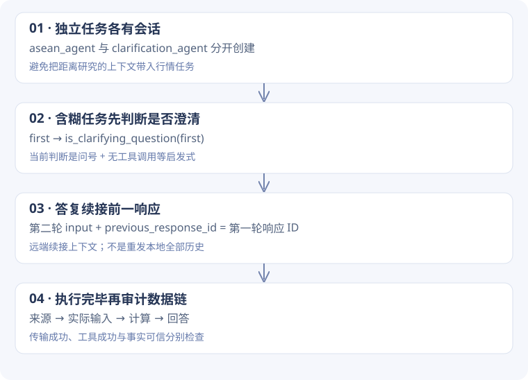

# 1-3 · 为什么“算完了”还不能判成功？

[实验结果](research.md) · [代码来源约定](code-guide.md)

<div class="design-lead"><span>设计问题 / RESEARCH</span><p>搜索负责找到数据，计算负责变换数据，验收负责确认这次计算回答了真实问题。三者不能相互代替。</p></div>

!!! note "怎样读这一页"
    先理解为什么需要这些模块，再跟随例子进入函数。标为“教学推演”的数据仅帮助理解，不是实验日志；代码块注明来源。完整摘录放在页末的备查链接中。

## 1. 先把两个任务拆开

本实验有两个不同的控制问题。东盟距离任务的输入范围已确定，可以直接搜索与计算；行情任务起初含糊，需要先问清楚，再接着做。把它们塞进同一个会话，会让第二个任务继承无关上下文；每次都创建新会话，又会使澄清答复失去所指。

源码的选择是：**独立任务用独立 Agent，同一任务的澄清用同一个 Agent**。这是状态归属的设计，不只是变量起两个名字。



## 2. 为什么需要 previous_response_id？

**教学推演**：第一轮“帮我分析最近行情”，模型问“哪个资产、时间范围？”。第二轮用户只说“BTC，最近 30 天，MA / RSI / MACD”。如果只发第二句话给全新会话，前面的约束和澄清关系便丢失。

| 时刻 | Agent 本地字段 | 下一次发什么 |
| --- | --- | --- |
| 首轮之前 | `previous_response_id = None` | 原始问题 |
| 收到首轮响应 | 保存响应 ID，如占位符 `resp_A` | 暂不执行下一轮 |
| 收到澄清答复 | 仍为 `resp_A` | 答复文本 + `previous_response_id: resp_A` |

适配器也把 user / assistant 文本记入 `conversation_history`，但它不是下一次完整发送的 messages 数组。这条路线使用远端响应 ID 续接。读源码时不要把本地日志误当作传输策略。

### 控制流程在运行器，而不是提示词里

**课程源码原文** · `chapter1/search-codegen/run_experiment_1_3.py` L226–240 · [定位源码](https://github.com/bojieli/ai-agent-book/blob/cf7f7a8e16b234ac303034e4ec8f75bf2d61ac2c/chapter1/search-codegen/run_experiment_1_3.py#L226)

```python linenums="226"
clarification_agent = GPT5NativeAgent(key, base_url=base_url, model=model)
first = clarification_agent.process_request(
    AMBIGUOUS_TASK,
    reasoning_effort="medium",
    verbosity="medium",
    max_tokens=4000,
)
second = None
if is_clarifying_question(first):
    second = clarification_agent.process_request(
        CLARIFICATION_REPLY,
        reasoning_effort=reasoning,
        verbosity="high",
        max_tokens=16000,
    )
```

`second = None` 表示分支可能不发生。`is_clarifying_question` 判断成功、未用工具且文本有问号，是一个实用但有限的启发式：带问号不一定真在澄清，没有问号也可能是在询问信息。因此它控制了流程，却不能自动证明对话设计正确。

## 3. 距离任务：计算正确究竟指什么？

先把数据链写出来：城市名单 → 坐标 → 两两组合 → 球面距离 → 最短组合。固定 10 个城市需要计算 `10 × 9 / 2 = 45` 对；只看回答出现两个城市名字，并不能证明其余 44 对都算过。

上游 `validate_asean` 检查搜索、代码执行、引用与回答特征，但没有把全部 45 个距离逐一重新计算。学习审计因此从代码记录中读取坐标字面量，用独立的 Haversine 计算核对全部组合。

**为什么读取字面量而不执行模型代码？** 审计只需要坐标这个输入；执行整段代码会把原来的计算过程再次当成证据。使用 AST 取字面量后独立计算，更容易区分“输入是什么”和“计算是否正确”。

本次相同坐标下 45 对计算可核对，最近为吉隆坡—新加坡约 316.35 km。这说明给定输入下的计算一致；不自动证明坐标来源权威。任务固定 10 国，而当前东盟为 11 国，若要覆盖现有成员，还要改名单并核对 55 对。

## 4. 行情任务：一条会制造假成功的路径

实际记录中的链条是：真实行情接口访问失败 → 后续代码生成趋势加随机扰动的数据 → 计算指标 → 回答把它描述成行情分析。代码工具完成，不能挽救输入失真。

| 层次 | 本次能观察到什么 | 能否据此接受行情结论 |
| --- | --- | --- |
| 请求层 | 响应完成 | 不能，只说明请求结束 |
| 工具层 | 搜索与代码有完成记录 | 不能，只说明动作完成 |
| 数据层 | 出现合成价格代码 | 不能当真实市场数据 |
| 结论层 | 基于该价格序列计算指标 | 只能说明对合成数据做了运算 |

学习审计命中了具体的 `random.uniform(-800, 800)` 和价格追加模式，因而否决本次真实行情验收。这个检测器针对当前记录，**不是所有合成数据的通用识别器**。没有命中也不能自动放行。

## 5. 如果自己写，应该在哪里阻止错误？

理想的干预点在计算之前：先验证数据来源、日期覆盖、条数和缺失，再让计算消费已验证数据。否则等回答生成后再猜数据真假，很难补救。

下面是**建议设计，尚未加入当前运行器**：

```text
抓取价格 → 保存来源与原始样本 → 检查真实性与时间范围
                                  ├─ 通过 → 计算指标 → 核对结果
                                  └─ 不通过 → 标记任务未完成，解释缺口
```

这里“中止”比自动造数据更符合任务目标。只有用户明确要模拟数据演示时，才应切换到有标签的模拟任务；那是另一项任务的成功标准。

## 6. 读源码与修改练习

先读运行器 `run_backend` 看任务与会话归属，再读适配器 `_build_request` 和 `process_request` 看 ID 如何读写，接着读 `is_clarifying_question` / `validate_asean`，最后对照学习脚本 `audit_remaining.py`。这个顺序能让你看见“运行器判通过”与“独立审计否决”为什么可以同时发生。

**自检题**：把第二轮改成新建 Agent，但仍发送原来的澄清答复，会丢什么？把 10 国任务改成 11 国，只改标题又会漏什么？

??? tip "思路对照"
    前者丢失远端会话续接 ID；后者没有更改实际城市输入、组合数量与验收条件。两者都提醒我们：修改展示文字不等于修改程序行为。

[逐段源码与会话 SVG 备查](research-code-reference.md) · [下一课：可比较的生图流水线](images-code.md)
