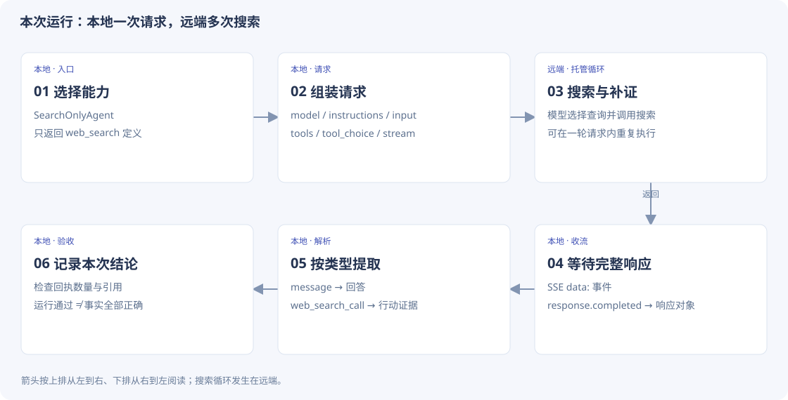
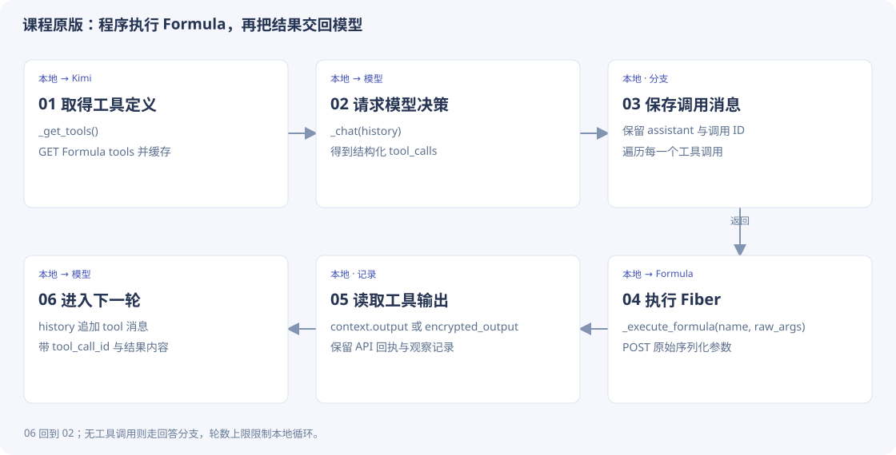

# 1-2 · 搜索实验代码精读

[返回设计主线](search-code.md) · 本页保留逐段摘录，供查找细节。

[先看本次实验结果](search.md) · [代码来源与阅读约定](code-guide.md)

!!! note "阅读约定"
    **课程源码原文**：从课程当前学习版本逐行摘录，附路径和行号。**学习配套脚本原文**：本次为替代实验编写并实际使用的代码。**教学示意 / 建议实现**：为了说明设计写的示例，不是原文件，也不代表已经加入运行器。

## 1. 先辨认本次运行的是哪条路线

本次使用 `SearchOnlyAgent` 继承课程的 `GPT5NativeAgent`，只暴露百炼的 `web_search`。类名沿用上游，**不代表本次实际调用 GPT 模型**；模型名来自 `Config.resolve("dashscope")`，证据记录为 `qwen3.7-plus`。

| 层 | 代码入口 | 负责什么 |
| --- | --- | --- |
| 学习实验入口 | `learning/task0/run_search_learning.py::main` | 固定问题、选择提供商、检查回执、保存证据 |
| 工具选择 | `SearchOnlyAgent._tools` | 覆盖父类工具列表，只允许搜索 |
| 请求与结果适配 | `chapter1/search-codegen/agent.py` | 构造请求、处理流、提取工具与引用 |
| 搜索决策与执行 | 提供商的托管工具服务 | 决定查询、执行搜索、必要时继续补证 |


[](../assets/code-flow/search-hosted.svg)

*读图：箭头按上排从左到右、下排从右到左阅读；搜索循环发生在远端。*

## 2. 继承只替换工具列表

**本次学习配套脚本原文** · `learning/task0/run_search_learning.py` · L16–L18。仅去除公共缩进，未增补注释。

```python linenums="16"
class SearchOnlyAgent(GPT5NativeAgent):
    def _tools(self):
        return [{"type": "web_search"}]
```

- `SearchOnlyAgent(GPT5NativeAgent)` 复用父类的网络、流式响应和记录代码。
- `_tools` 与父类方法同名，所以父类构造请求时调用 `self._tools()`，会取得这个子类的列表。
- 列表里的 `{"type": "web_search"}` 是提供商认识的托管工具声明，不是本地 Python 搜索函数。
- 这里没有 `for tool_call ... execute_tool(...)`。不能把“一次请求”误计成“一次搜索”。

## 3. 入口怎样把任务交给 Agent

**本次学习配套脚本原文** · `learning/task0/run_search_learning.py` · L33–L48。仅去除公共缩进，未增补注释。

```python linenums="33"
key, url, model = Config.resolve("dashscope")
agent = SearchOnlyAgent(key, base_url=url, model=model)
agent.system_prompt = "你是资料核查助手。必须实际调用搜索工具并引用来源，不得把记忆当搜索结果。先搜索，再找证据缺口，执行不同查询补证。明确区分已证实与尚不确定的信息。"
task = "截至 2026 年 9 月 16 日，请核查东盟成员数量、成员名单及东帝汶正式入盟日期，并核查印度尼西亚首都雅加达与努山塔拉的法律地位。优先官方来源，至少执行两次不同的搜索补充证据；给出检索日期与可点击的来源链接。"
result = agent.process_request(task, max_tokens=10000)
calls = [
    x
    for x in result.get("output_items", [])
    if x.get("type") == "web_search_call" and x.get("status") == "completed"
]
checks = {
    "response_succeeded": result.get("success") is True,
    "search_receipt_present": bool(calls),
    "at_least_two_search_receipts": len(calls) >= 2,
    "sources_present": bool(result.get("citations")),
}
```

| 表达式 | 输入 / 输出 | 为什么这样写 |
| --- | --- | --- |
| `Config.resolve("dashscope")` | 返回 key、URL、model | 入口选择提供商；不把服务配置硬编码进搜索逻辑 |
| `SearchOnlyAgent(...)` | 创建一个独立实例 | 保存本次会话状态与 API 记录 |
| `system_prompt = ...` | 设置行为要求 | 要求补证与引用，但提示词本身不能证明执行发生 |
| `process_request(task, max_tokens=10000)` | 返回规范化的结果字典 | `max_tokens` 在适配层映射为 `max_output_tokens` |
| 过滤 `output_items` | 得到已完成搜索记录 | 从结构化输出计数，避免相信模型自述的次数 |

本次请求要求至少两次不同查询，程序检查的是“至少两个完成回执”，**没有自动比较查询是否不同、来源是否可靠**。人工复盘与验收应补上这些条件。

## 4. 请求字典：每个字段送给谁

**课程源码原文** · `chapter1/search-codegen/agent.py` · L94–L117。仅去除公共缩进，未增补注释。

[打开该版本源码](https://github.com/bojieli/ai-agent-book/blob/cf7f7a8e16b234ac303034e4ec8f75bf2d61ac2c/chapter1/search-codegen/agent.py#L94)

```python linenums="94"
request: Dict[str, Any] = {
    "model": self.model,
    "instructions": self.system_prompt,
    "input": input_text,
}
if self.provider == "dashscope":
    # DashScope runs thinking natively and has no reasoning.effort or
    # text.verbosity knobs; its gateway also drops non-streaming
    # requests that stay silent for ~60s, so streaming is mandatory.
    request["stream"] = True
else:
    request["reasoning"] = {"effort": reasoning_effort}
    request["background"] = background
    request["store"] = True
    if verbosity:
        request["text"] = {"verbosity": verbosity}
if max_output_tokens:
    request["max_output_tokens"] = max_output_tokens
if use_tools:
    request["tools"] = self._tools()
    request["tool_choice"] = tool_choice
if self.previous_response_id:
    request["previous_response_id"] = self.previous_response_id
return request
```

- `model` 指定模型，`instructions` 放系统指令，`input` 放当前问题。
- `stream=True` 是本地适配器为百炼选择的传输方式。它与“开启本地 Agent loop”是两回事。
- `tools` 来自前面的子类覆盖；`tool_choice="auto"` 让模型选择是否使用工具。
- `previous_response_id` 仅在已有续接 ID 时加入。本实验只有一轮请求，1-3 的澄清任务才会用到续接。

## 5. 流式事件怎样变成最终对象

**课程源码原文** · `chapter1/search-codegen/agent.py` · L213–L231。仅去除公共缩进，未增补注释。

[打开该版本源码](https://github.com/bojieli/ai-agent-book/blob/cf7f7a8e16b234ac303034e4ec8f75bf2d61ac2c/chapter1/search-codegen/agent.py#L213)

```python linenums="213"
        return status_code, {"raw_text": http_response.text}, event_counts
    for line in http_response.iter_lines(decode_unicode=True):
        if not line or not line.startswith("data:"):
            continue
        data = line[len("data:"):].strip()
        if data == "[DONE]":
            break
        try:
            event = json.loads(data)
        except ValueError:
            continue
        event_type = event.get("type") or "unknown"
        event_counts[event_type] = event_counts.get(event_type, 0) + 1
        if event_type in {"response.completed", "response.failed"}:
            final_response = event.get("response")
if final_response is None:
    return status_code, {"error": {"type": "stream_incomplete",
                                   "message": "stream ended without response.completed"}}, event_counts
return status_code, final_response, event_counts
```

逐步读这一段：

1. `iter_lines` 逐行读取 HTTP 流；空行、非 `data:` 行跳过。
2. 取出 `data:` 后面的 JSON。`[DONE]` 是结束标记，不是回答正文。
3. 用事件类型累计计数。收到 `response.completed` 或 `response.failed` 时保存其中的 `response`。
4. 流结束后若没有终态响应，返回 `stream_incomplete`，不把已有零散内容当完整成功结果。

注意：此处错误消息固定写“without response.completed”，但判断也接受 `response.failed` 作为终态；后者仍需由后续结果检查判失败。

## 6. 为什么回答、行动、引用要分开取

**课程源码原文** · `chapter1/search-codegen/agent.py` · L133–L145。仅去除公共缩进，未增补注释。

[打开该版本源码](https://github.com/bojieli/ai-agent-book/blob/cf7f7a8e16b234ac303034e4ec8f75bf2d61ac2c/chapter1/search-codegen/agent.py#L133)

```python linenums="133"
def _tool_items(response: Dict[str, Any]) -> List[Dict[str, Any]]:
    if not isinstance(response, dict):
        return []
    return [
        item
        for item in response.get("output") or []
        if isinstance(item, dict)
        and item.get("type") in {
            "web_search_call",
            "code_interpreter_call",
            "hosted_tool_call",
        }
    ]
```

`_tool_items` 只保留三类托管工具记录，`_output_text` 单独从 message 中提取正文。`_citations` 还会从百炼 `web_search_call.action.sources` 提取 URL，统一转为引用记录。

同一个 `output` 列表可以混合消息与工具记录。只打印最终正文会丢失搜索次数；只看有引用也不能证明引用支持答案。

**本次学习配套脚本原文** · `learning/task0/run_search_learning.py` · L49–L65。仅去除公共缩进，未增补注释。

```python linenums="49"
data = {
    "experiment": "1-2 learning variant",
    "canonical_reproduction": False,
    "difference": "DashScope hosted search instead of Moonshot Formula; no local ReAct loop reproduced",
    "task": task,
    "result": result,
    "api_turns": agent.api_turns,
    "checks": checks,
    "passed": all(checks.values()),
}
payload = json.dumps(data, ensure_ascii=False, indent=2)
assert key not in payload
path = output / "evidence.json"
path.write_text(payload + "\n")
path.with_suffix(".sha256").write_text(
    hashlib.sha256(path.read_bytes()).hexdigest() + "  evidence.json\n"
)
```

`passed = all(checks.values())` 的意思是这里列出的四项都通过。它不包含“所有事实正确”，因此本次 4 次回执与正文自述“两次搜索”的差异需要我们另外指出。

## 7. 对照课程原版：本地循环在哪里

这一部分是**课程代码阅读，未完成 Kimi 原版实跑**。


[](../assets/code-flow/search-original.svg)

*读图：06 回到 02；无工具调用则走回答分支，轮数上限限制本地循环。*

**课程源码原文** · `chapter1/web-search-agent/agent.py` · L449–L479。仅去除公共缩进，未增补注释。

[打开该版本源码](https://github.com/bojieli/ai-agent-book/blob/cf7f7a8e16b234ac303034e4ec8f75bf2d61ac2c/chapter1/web-search-agent/agent.py#L449)

```python linenums="449"
        # 行动：记录一次工具调用
        self._emit({"iteration": iteration, "type": "action",
                    "tool": tool_call_name, "args": tool_call_arguments})

        if tool_call_name == "web_search":
            # Formula requires the original serialized
            # arguments, even though the parsed copy above is
            # retained for a readable ReAct trace.
            tool_result = self._execute_formula(
                tool_call_name,
                tool_call.function.arguments or "{}",
            )
        else:
            tool_result = f"Error: unable to find tool by name '{tool_call_name}'"

        tool_content = (
            tool_result
            if isinstance(tool_result, str)
            else json.dumps(tool_result, ensure_ascii=False)
        )
        # 观察：记录工具返回结果
        self._emit({"iteration": iteration, "type": "observation",
                    "tool": tool_call_name, "content": tool_content})
        # 构建工具响应消息并添加到历史
        self.conversation_history.append({
            "role": "tool",
            "tool_call_id": tool_call.id,
            "content": tool_content
        })
elif finish_reason == "length":
    # 输出预算（max_tokens）耗尽导致截断：返回已生成内容并明确标注，
```

- `tool_call_arguments` 是解析后的字典，用于可读日志；真正传给 Formula 的仍是原始字符串 `tool_call.function.arguments`。
- `tool_call.id` 与工具返回消息配对。没有这个关联，模型无法可靠对应哪次调用得到哪条结果。
- 工具输出被追加到 `conversation_history`，下一次 `_chat` 才能看见它。这是本地程序负责推进的循环。

## 8. 自己实现时的最小练习

先固定一个问题，只允许一种搜索工具。保存请求、结构化回执、引用和回答四份信息；把“回执数”“不同查询数”“有引用的事实数”分别统计。然后对照本地循环与托管循环，解释哪段代码在决定是否继续。
