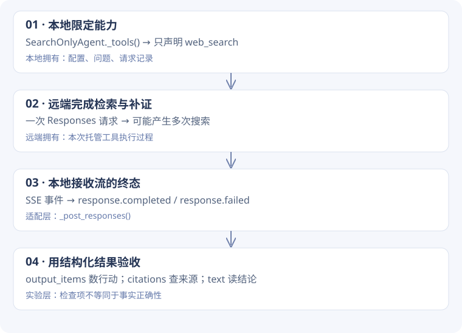

# 1-2 · 搜索循环应该由谁执行？

[实验结果](search.md) · [代码来源约定](code-guide.md)

<div class="design-lead"><span>设计问题 / SEARCH</span><p>用户只问一次，系统可能搜索多次。先确定循环在哪里，才能看懂程序为什么没有本地工具循环。</p></div>

!!! note "怎样读这一页"
    先理解为什么需要这些模块，再跟随例子进入函数。标为“教学推演”的数据仅帮助理解，不是实验日志；代码块注明来源。完整摘录放在页末的备查链接中。

## 1. 需求如何变成模块边界

任务要求核查东盟信息并补充证据。最简单的“直接问模型”只能得到一段回答，无法证明它查过资料。加上搜索后，又会出现两个职责：**决定下一次查什么**，以及**核实它确实查了什么**。

本次采用提供商托管搜索：远端模型和工具服务负责搜索循环；本地负责声明工具、收齐响应、检查回执、保存证据。因此 `process_request()` 一次调用内部不需要我们再写 `while tool_calls`。课程还提供本地控制工具循环的另一条路线，后面再对照。



## 2. 为什么只写一个三行子类？

父类已经能处理提供商配置、HTTP、流式响应、引用提取。实验只需要限制可用工具；重新实现整个客户端会扩大需要验证的范围。

**学习配套脚本原文** · `learning/task0/run_search_learning.py` L16–18

```python linenums="16"
class SearchOnlyAgent(GPT5NativeAgent):
    def _tools(self):
        return [{"type": "web_search"}]
```

关键不是“继承很方便”，而是父类构造请求时通过 `self._tools()` 取工具列表。实例是子类，于是这个替换点生效。若父类把列表写死在请求中，以上覆盖就没有作用。

父类名 `GPT5NativeAgent` 沿用课程命名；实际模型来自配置，本次是 `qwen3.7-plus`。类名不能作为模型身份的证据。

## 3. 跟一次请求走到底

**教学推演**：用户问“东盟成员数量及东帝汶入盟日期”。下面字段是缩略示意，ID 是占位符。

```json
{"input":"核查东盟成员与入盟日期", "tools":[{"type":"web_search"}], "stream":true}
```

本地把问题作为 `input`，把系统要求作为 `instructions`。提供商在远端执行查询 A、发现证据缺口、执行查询 B，最后返回回答。这里 A / B 不是本地新增的两次 `process_request()`。

### 为什么不能把流里的每一行都当回答？

流里有事件通知、增量内容和最终对象。`_post_responses()` 逐行读 `data:` JSON，统计事件，并在 `response.completed` 或 `response.failed` 时提取完整 response。若流结束却没有终态，返回 `stream_incomplete`。这保护了“收到部分内容”与“任务完整结束”的区别。

再由适配器把最终对象拆成三类可用信息：

| 结果 | 示例含义 | 谁消费它 |
| --- | --- | --- |
| `text` | 给用户看的核查结论 | 阅读者 |
| `output_items` | `web_search_call` 及其状态 | 实验计数与执行验收 |
| `citations` | 回答中的引用和来源 URL | 后续证据核查 |

**设计选择**：不把所有结果拼成一个长字符串。字符串方便展示，却会丢掉判断“做了什么”的结构。应先保留结构，再生成展示。

## 4. 验收为什么不相信“我搜索了两次”？

**学习配套脚本原文** · `learning/task0/run_search_learning.py` L38–48

```python linenums="38"
calls = [
    x
    for x in result.get("output_items", [])
    if x.get("type") == "web_search_call" and x.get("status") == "completed"
]
checks = {
    "response_succeeded": result.get("success") is True,
    "search_receipt_present": bool(calls),
    "at_least_two_search_receipts": len(calls) >= 2,
    "sources_present": bool(result.get("citations")),
}
```

这一段先筛选类型，再筛选状态：未完成的搜索不能算完成回执。`len(calls) >= 2` 检查的是次数，不是查询内容是否不同；`bool(citations)` 检查有无来源，不是来源是否支持每项结论。

本次实际出现 4 个搜索回执，而回答自述为 2 次。程序使用结构化记录计数，正是为了应对这类不一致。即便这些检查全通过，对印尼首都法律地位等结论仍需逐条人工核对。

## 5. 如果把循环放回本地，会变什么？

课程 `chapter1/web-search-agent/agent.py` 是另一条路线：本地循环拿到工具调用，经 `_execute_formula` 执行，再将 tool 消息写回下一轮。**本次没有运行这条 Kimi 路线**。

| 决策 | 本次托管路线 | 课程本地路线 |
| --- | --- | --- |
| 谁发起下一轮模型请求 | 提供商内部推进工具过程 | 本地 `search_and_answer` 循环 |
| 谁执行搜索接口 | 提供商 | 本地 `_execute_formula` 发请求 |
| 本地能直接控制什么 | 工具声明、整体请求与验收 | 每轮消息、工具执行与回写 |
| 需要自己处理什么 | 流和提供商响应格式 | 还需处理调用与结果配对、轮数上限 |

选择取决于你想研究什么。要快速核查资料，托管路线减少执行代码；要实验“删掉一轮工具结果”，本地循环让这个干预点更直接。这里没有把两条路线混成同一实现。

## 6. 读源码与修改练习

按顺序打开：学习脚本 `main` → 子类 `_tools` → 父类 `_build_request` → `_post_responses` → `process_request` 的结果整理 → 学习脚本 `checks`。先画清一次本地请求的边界，再读流事件细节。

**自检题**：想把“至少两次搜索”升级成“至少两个不同查询”，只改提示词够吗？

??? tip "思路对照"
    不够。需要从原始搜索记录中读取提供商实际暴露的查询字段，做规范化与去重，再检查数量。没有暴露查询时应记录“无法验证”，不能用两个回执推断查询不同。这是建议增强，本次检查尚未实现。

[逐段源码与两条路线 SVG 备查](search-code-reference.md) · [下一课：会话与数据验收](research-code.md)
