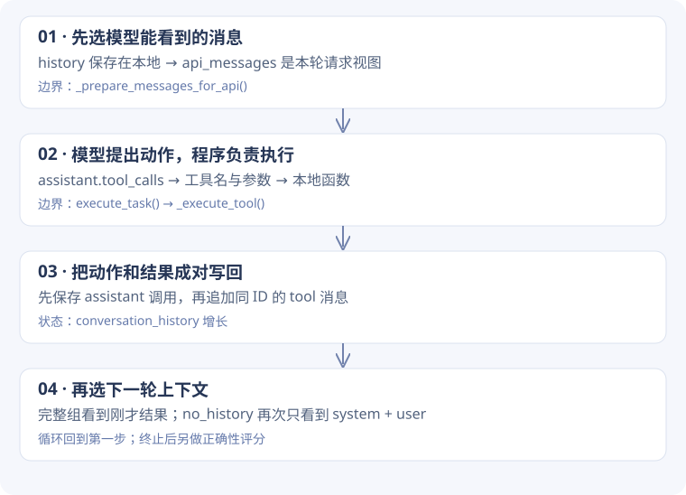

# 1-1 · 从一次调用，搭出上下文消融实验

[实验结果](ablation.md) · [完整源码摘录](source-reference.md)

<div class="design-lead"><span>动手阅读 / BUILD AN AGENT</span><p>先让模型回答一次，再让程序执行工具，接着把结果送回模型。五组消融，就是在这条完整路径上改变信息的可见性。</p></div>

!!! note "本页的代码是什么？"
    下文短代码是逐步搭建的**教学示意**，不是课程文件逐行摘录。它们解释同一个运行过程；可直接运行的完整模拟版在第七节。模型回复由固定规则模拟，不需要 API，也不能代表真实模型能力。每节末尾指明对应的真实函数。

## 先认路：三个文件角色，不必同时通读

| 角色 | 入口 | 现在只关心什么 |
| --- | --- | --- |
| 实验组织 | `run_experiment_1_1.py::main` | 相同任务如何传给不同模式的新 Agent |
| 执行主线 | `agent.py::execute_task` | 请求、工具执行、回写、停止 |
| 实现细节 | `agent.py` 中的辅助方法 | 带着当前问题再跳进去 |

本页以“计算 2 + 3”为教学任务。课程实际评测使用更复杂的换汇任务；简单例子是为了让消息变化更容易看清。

## 第一步：先让模型回答一次

### 问题

用户输入的是字符串，模型接口需要有角色的消息。系统要求与用户任务不能只靠拼接文字来区分。

### 最小实现

```python
messages = [
    {"role": "system", "content": "请借助加法工具计算。"},
    {"role": "user", "content": "2 + 3 等于多少？"},
]
message = model(messages)  # 教学接口：此处暂时把模型当成函数
```

`messages` 是列表，每个元素是消息字典；`message` 是一次返回的一条消息。在真实 SDK 中，这条返回消息先是对象，需要转换为字典后才能按统一方式处理。

### 现在还缺什么？

如果模型只是返回“请执行 add(2, 3)”，Python 不会自动执行它。我们需要一种程序能识别的动作格式。

**对应源码**：`execute_task()` 组装 API 请求，随后从 `response.choices[0].message` 取得消息。SDK 转字典在 `_prepare_assistant_message()`，不是把整个 response 转成一条消息。

**先预测**：`messages[1]["content"]` 得到列表、字典还是字符串？答案是用户问题字符串。

## 第二步：把“想调用工具”变成真实执行

### 问题

程序要区分“普通回答”和“请求执行工具”，还要知道传哪些参数。

### 增加结构化动作

以下是教学版的简化工具调用，真实 SDK 的字段层级见源码备查。

```python
message = {
    "role": "assistant",
    "content": "",
    "tool_calls": [
        {"id": "call_demo", "name": "add", "arguments": {"a": 2, "b": 3}}
    ],
}
call = message["tool_calls"][0]
args = call["arguments"]
result = args["a"] + args["b"]  # 本地程序执行，得到整数 5
```

工具定义告诉模型“可用的名字与参数”；执行器把名字映射到真实函数。模型提出动作，程序执行动作，这是两层责任。

**对应源码**：`execute_task()` 解析工具参数，再调用 `_execute_tool(function_name, function_args)`。课程的 `_execute_tool()` 用工具映射选择真实实现，不是执行任意回答文本。

**先预测**：只给模型工具定义，但删掉本地执行这一步，计算会自动发生吗？不会，接口声明不等于函数执行。

## 第三步：为什么有了结果，还需要下一轮？

### 问题

现在整数 `5` 只在本地变量 `result` 中。下一次模型调用看不到 Python 的局部变量，必须把结果放进消息。

### 先保存动作，再写回反馈

```python
messages.append(message)
messages.append({
    "role": "tool",
    "tool_call_id": call["id"],
    "content": str(result),
})
```

`tool_call_id` 表示这条反馈在回答哪个调用。若一次有多个工具调用，必须各自配对。

| 执行到哪里 | messages 中有什么 | 模型是否已经看到 5 |
| --- | --- | --- |
| 第一次请求前 | system、user | 没有 |
| 本地算出 result 后 | system、user | 没有，结果仍在 Python 变量里 |
| 追加两条消息后 | system、user、assistant 调用、tool 结果 | 尚未再次请求 |
| 第二次请求 | 发送上面的消息列表 | 这时才看到工具反馈 |

### 于是需要循环

```python
for round_number in range(3):  # 教学版限制三轮
    message = model(messages)
    messages.append(message)
    calls = message.get("tool_calls", [])
    if not calls:
        break
    for call in calls:
        result = execute_tool(call)
        messages.append({
            "role": "tool",
            "tool_call_id": call["id"],
            "content": str(result),
        })
```

每一轮重新调用模型。不是模型在后台自动看到变量更新，而是程序主动把新的消息发出去。循环上限用于约束未能结束的执行。

**对应源码**：`execute_task()` 中的主循环。真实代码还有参数解析错误、请求异常，以及同一响应含工具和 `FINAL ANSWER:` 的特殊处理；上面仅展示正常工具路径。



## 第四步：要删除历史，为什么不能直接清空列表？

### 问题

消融希望模型看不见某些消息，但我们还需要复盘已经发生的动作。如果把唯一的历史删掉，会把两个目的混在一起。

### 增加“发送视图”

```python
history = messages
api_messages = prepare_messages(history, mode)
message = model(api_messages)
```

`history = messages` 没有复制列表，两者指向同一个对象。新增的 `api_messages` 表示本轮实际选择发送什么。完整组可直接使用历史，删除历史组另选 system 与最后一个 user。

```python
def prepare_messages(history, mode):
    if mode != "no_history":
        return history
    selected = [m for m in history if m["role"] == "system"]
    users = [m for m in history if m["role"] == "user"]
    if users:
        selected.append(users[-1])
    return selected
```

**对照第二轮**：本地历史已有四条消息；full 发送四条，no_history 只发送 system 和 user 两条。工具已经运行，但反馈不在该组第二轮请求里。

**对应源码**：`_prepare_messages_for_api()`。真实主循环中的 `messages` 是 `self.conversation_history` 的别名，`api_messages` 才传给 API。上面是语义相近的教学写法，不是原文。

## 第五步：五组实验只改哪些位置？ {#context-flow}

不要另写五套循环。用相同骨架，在三个边界做选择：

| 组 | 改动位置 | 教学版操作 | 要回答的问题 |
| --- | --- | --- | --- |
| full | 不删 | 完整上下文与工具声明 | 基线能否完成？ |
| no_history | 请求前选消息 | 只选 system + 最新 user | 看不到先前步骤会怎样？ |
| no_reasoning | assistant 入历史前 | `pop("reasoning_content", None)` | 不继承历史 reasoning 会怎样？ |
| no_tool_calls | 构建请求时 | 不提供工具定义 | 没有接口声明会怎样？ |
| no_tool_results | 执行后写回时 | tool 内容换成空字符串 | 做了操作但看不到结果会怎样？ |

真实 `no_tool_calls` 会省略 `tools` / `tool_choice` 请求字段；模拟版用空列表向假模型表示没有工具。真实 `no_reasoning` 不等于关闭本轮 thinking。真实 `no_tool_results` 的参数解析错误走独立分支，因此不能声称所有工具消息必为空。

[切换五组完整流程图](source-reference.md#context-flow)

## 第六步：运行结束，为什么还要独立评分？

### 问题

“模型停止了”“工具运行了”“答案正确”是三个不同的事实。

教学版没有工具时也能返回“没有可用接口”，这会结束循环，却没有回答 2 + 3。真实运行器同样区分 `completed` 与任务正确性。

验收应按顺序检查：

1. 实际请求是否满足该组消融规则？检查 `api_turns`。
2. 实际执行了什么工具？检查执行轨迹，而不是模型自述。
3. 最后答案是否符合任务目标？用任务专用评分。

**对应源码**：`run_experiment_1_1.py` 的 `evaluate_context_contract()`、`summarize_arm()` 与答案检查函数。每组创建新 Agent，避免把上一组状态带进下一组。

## 第七步：在 Python Tutor 中亲眼看一遍

[下载完整模拟代码](../assets/examples/context_tutor.py) · [打开 Python Tutor](https://pythontutor.com/)

将文件内容复制到 Python Tutor，选择 Python 3，再逐步执行。这份脚本只使用内置数据类型，不请求模型、不执行 shell。

| 暂停位置 | 看哪个变量 | 先想一个问题 |
| --- | --- | --- |
| `api_messages = ...` 后 | history / api_messages | 是同一列表，还是新选出的列表？ |
| `message = fake_model(...)` 后 | message | 有普通内容，还是 tool_calls？ |
| `history.append(message)` 后 | history | 为什么多了一条 assistant？ |
| `result = execute_tool(call)` 后 | result | 为什么还必须写回消息？ |
| 进入第二轮 | api_messages | 这组是否能看到值 5？ |

逐一修改文件顶部 `MODE`，先预测，再运行：

| 模拟模式 | 本模拟的预期 | 解释范围 |
| --- | --- | --- |
| full | 1 次工具，第二轮回答 5 | 演示完整反馈路径 |
| no_history | 3 次工具后达到轮数上限 | 固定规则下看不到结果，重复调用 |
| no_reasoning | 同 full，历史占位字段被删 | 假模型不依赖 reasoning，不能推断真实影响 |
| no_tool_calls | 0 次工具，返回无接口提示 | 演示能力声明的分支 |
| no_tool_results | 3 次工具后达到轮数上限 | 固定规则下空反馈触发重复调用 |

!!! warning "模拟结果不是消融实验结果"
    `fake_model()` 的行为由我们写死。它只帮助理解控制流和数据结构，不能证明真实模型一定重复或一定成功。真实结果仍以[本次 API 实验证据](ablation.md)为准。

## 第八步：回到真实项目，按调用顺序读

现在打开 `run_experiment_1_1.py::main` 找创建 Agent 和执行任务的位置，再进入 `execute_task()`。用前七节的概念给代码标记：输入、发送视图、模型响应、工具执行、回写、退出、评分。

遇到日志、配置兼容或异常分支，先记录用途，等主路径读通再回来看。你的目标是能够解释一次请求怎样穿过这些函数，而不是背出整个文件。

??? tip "检查自己是否理解"
    如果要保留最近一次工具往返，应改消息选择器，而不是加法工具。新窗口要保留 assistant 调用与对应 tool 反馈的配对，并增加实际请求检查。这个新条件不等同于当前 no_history。

## 进一步理解：为什么原项目这样设计

### 1. 从最简单的实现推到现在的设计

假设只写一个循环：把问题发给模型，执行工具，把结果拼回下一次请求。这能跑，但还不能做可信的消融实验。若直接把历史清空，实验结束后也难以复盘；若为五组复制五份循环，修复一组时容易漏掉另一组，差别就不再只是上下文。

源码因此保留**同一个执行循环**，把差异放在三个边界：发送请求之前、保存 assistant 消息时、写回工具结果时。实验运行器为每一组创建新的 Agent，避免上一组历史混进下一组。

先记住一个限制：这里的留存也不是完整原始消息的永不修改副本。`no_reasoning` 会在保存 assistant 字典时删字段，`no_tool_results` 会在对话中存空结果；完整工具执行记录另有轨迹。不同记录承担不同责任。

### 2. 谁拥有哪份数据？

| 实际变量 / 记录 | 谁使用它 | 设计理由 |
| --- | --- | --- |
| `self.conversation_history` | Agent 保存对话；局部 `messages` 指向它 | 执行循环持续追加 assistant 和 tool 消息 |
| `api_messages` | 当前模型请求 | 可以只选一部分历史，而不清空本地列表 |
| `tools` 请求字段 | 模型 | 描述可调用的名字、参数，不是 Python 实现 |
| `_execute_tool` 的工具映射 | 本地执行器 | 把模型提出的名字映射到真实函数 |
| 工具调用轨迹、`api_turns` | 实验评估与复盘 | 分别追踪执行行为和每轮实际请求 |


### 3. 跟一条消息走两轮

**教学推演**：用户要求“计算 2 + 3”。用 S 表示 system，U 表示 user，A₁ 表示第一轮的工具调用，T₁ 表示返回结果 5。工具名与参数形状在此省略，避免把推演误认成原始请求。

| 时刻 | 本地历史 | full 发给模型 | no_history 发给模型 |
| --- | --- | --- | --- |
| 第一轮开始 | `[S, U]` | `[S, U]` | `[S, U]` |
| 执行工具后 | `[S, U, A₁, T₁]` | 尚未发送下一轮 | 尚未发送下一轮 |
| 第二轮开始 | `[S, U, A₁, T₁]` | 知道已经算出 5 | 仍只有 `[S, U]`，看不到上轮动作与结果 |

由此可以先预测：`no_history` 可能反复执行同样工具。它并不是工具没运行，而是下一轮缺少“已经运行”的信息。预测不是必然规律，实际次数要看日志。

#### 设计落点：在请求边界选择，不在循环中删除

**课程源码原文** · `chapter1/context/agent.py` L680–694 · [定位源码](https://github.com/bojieli/ai-agent-book/blob/cf7f7a8e16b234ac303034e4ec8f75bf2d61ac2c/chapter1/context/agent.py#L680)

```python linenums="680"
messages = self.conversation_history
if self.context_mode != ContextMode.NO_HISTORY:
    return messages

# System prompt(s) are always kept as the static prefix.
windowed = [m for m in messages if m.get("role") == "system"]

# Anchor on the latest user task. Nothing after it is retained: those
# messages are precisely the previous-round history being ablated.
user_indices = [i for i, m in enumerate(messages) if m.get("role") == "user"]
if not user_indices:
    return windowed
last_user_idx = user_indices[-1]
windowed.append(messages[last_user_idx])
return windowed
```

这里 `windowed` 是新列表；`append` 选入最后一个 user。它不是“最近 N 轮”，也不是“保留当前工具往返”：**最新 user 后的 assistant / tool 都不选入**。源码调用处的概括性注释不如这段选择逻辑精确。

普通模式直接返回 `messages`，没有复制列表。阅读调用处时，要区分 `messages`（留存列表的别名）与 `api_messages`（实际传给 API 的选择结果）。如果把这里改成 `self.conversation_history.clear()`，就同时改变了留存状态，不能再用同样方式解释实验。

### 4. 另外三种删除，为什么放在不同位置？

| 模式 | 处理位置 | 改了什么 | 仍然保留什么 |
| --- | --- | --- | --- |
| `no_reasoning` | assistant 消息入历史前 | 移除 `reasoning_content` | 工具调用、正常消息；当前轮 thinking 配置仍开启 |
| `no_tool_calls` | API 参数组装时 | 不发送 `tools`、`tool_choice` | 本地工具函数仍存在，但没有正常的结构化工具接口声明 |
| `no_tool_results` | 工具执行后 | 正常结果分支的 tool `content` 替换为空串 | 工具已执行，调用 ID、角色与执行轨迹仍存在 |

三个位置对应三种不同问题：模型是否能继承历史 reasoning？是否知道工具接口？是否能获得执行反馈？只说“删上下文”无法指导你该改哪段代码。

#### 为什么 SDK 消息先转成字典？

SDK 的 `message` 是对象，后续逻辑却需要统一用键来删字段、存入历史。转换发生在 `_prepare_assistant_message` 内；这是程序的数据边界。

**课程源码原文** · `chapter1/context/agent.py` L547–553 · [定位源码](https://github.com/bojieli/ai-agent-book/blob/cf7f7a8e16b234ac303034e4ec8f75bf2d61ac2c/chapter1/context/agent.py#L547)

```python linenums="547"
msg_dict = message.dict() if hasattr(message, 'dict') else message.model_dump()

# Remove reasoning_content if in NO_REASONING mode
if self.context_mode == ContextMode.NO_REASONING and 'reasoning_content' in msg_dict:
    msg_dict.pop('reasoning_content')

return msg_dict
```

`# 教学简化：先把 SDK 响应转换为消息字典` 是旧笔记写的注释，**不是原注释**。上面是课程原文。输入是 `response.choices[0].message`，不是整个 `response`；外层还有用量等数据，不能混为一谈。

#### 为什么空结果还要留一条 tool 消息？

模型先给出调用 ID，返回消息用 `tool_call_id` 对上它。隐藏结果时保留这层配对，就能尽量把“没有结果内容”与“调用协议被破坏”区分开。注意源码的参数 JSON 解析错误走单独分支，会写回错误；不能声称该模式所有 tool 内容都绝对为空。

[切换五组完整 SVG 流程图](source-reference.md#context-flow)

### 5. 从实现推出实验的验收方式

首先检查**实际 API 请求**是否遵守该组规则，然后再检查行动和答案。只检查 `context_mode` 字符串，证明不了请求真的删掉了对应内容。

本次 full 用 3 轮、4 次工具得到正确答案；no_history 达到 5 轮上限，15 次工具里有 12 次重复。这个结果与上面的信息缺失推演相符。但每组只跑一次，不能据此宣称普遍成功率。`completed` 只说明产生终止文本，不代表计算正确；评分必须独立。

### 6. 现在打开源码，按什么顺序读？

1. `run_experiment_1_1.py::main` 附近的模式循环（L645 起）：确认每组新的实例与相同任务。
2. `agent.py::execute_task`（L703 起）：只先标出请求、保存、执行、回写、终止五个位置。
3. `_prepare_messages_for_api`（L663 起）：解释第二轮模型究竟能看到什么。
4. `_prepare_assistant_message` 与 `_execute_tool`：理解数据转换与动作执行的职责。
5. 运行器 `evaluate_context_contract`：对照实验声明和实际请求。

**自检题**：如果想测“只保留最近一次工具往返”，应该改工具执行器还是消息选择器？

??? tip "思路对照"
    改消息选择器，并保留 assistant 调用与其全部 tool 结果的配对。它是新的实验条件，不等同于当前 `no_history`。还应添加请求层的契约检查，确认你真正发出了计划中的窗口。

[继续：逐段源码备查](source-reference.md) · [下一课：搜索循环由谁执行？](search-code.md)
