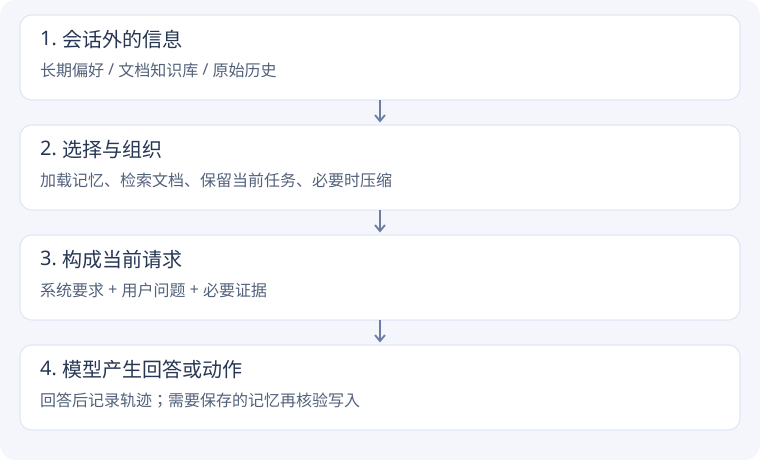

# 信息究竟放在哪里？

## 先区分三个概念

| 概念 | 存在哪里 | 什么时候影响回答 | 例子 |
| --- | --- | --- | --- |
| 短期上下文 | 本轮模型请求里的消息 | 随请求直接送给模型 | 当前用户纠正的问题、最近工具结果 |
| 长期记忆 | 会话之外的文件、数据库等 | 被读取并放回请求以后 | 用户明确长期偏好的讲解方式 |
| RAG | 文档库 + 检索过程 | 找到片段并放回请求以后 | 查出对应产品的退款规则 |

上下文窗口有容量限制。长期记忆并不自动出现在模型脑中，知识库也不等于已经被模型读过：二者都需要选择内容，再送入当前上下文。

## RAG 在 Agent 中的位置

RAG 是检索增强生成：先找资料，再依据资料生成回答。Agent 可以把检索作为工具，发现证据不足后再次检索。本次先跑最小的一次检索→一次生成，以便单独观察 top-k 的影响；并没有因此验证多轮 Agentic RAG。

## 对自己的项目有什么用？

**老师（客服）项目**：把“这个用户是谁、偏好什么”与“当前业务规则是什么”分开。前者可能来自用户记忆，后者应查知识库；当前工单的临时状态留在任务上下文中。具体字段要回到项目代码再确认。

**实时对话项目**：每轮新输入可能纠正前一轮意图。保留必要任务状态，避免无关历史挤占上下文；长期偏好也应支持更新。快速检索的目标不是尽量塞满窗口，而是及时提供当前问题需要的证据。

## 阅读方法

每节先跑最小版本，再增加一个能力。看代码时依次问：输入是什么？数据在哪里保存？何时回到请求？删除这一步会怎样？
