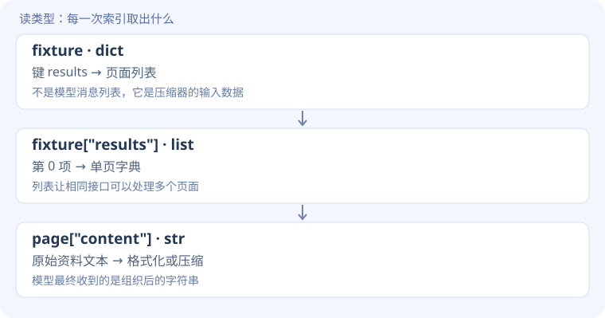
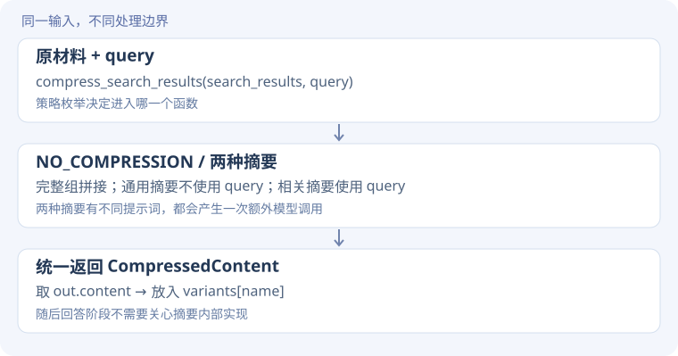
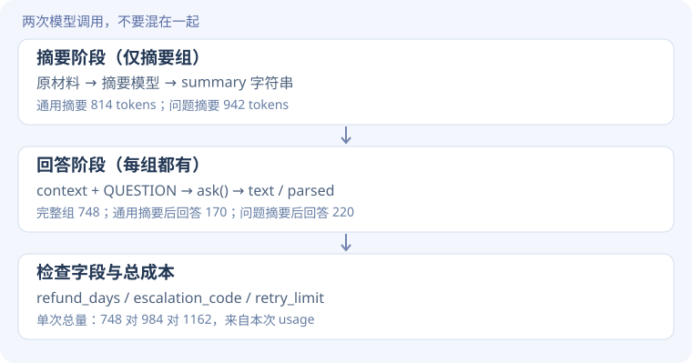

# 上下文源码精读 · 从一段资料到四组请求

[实验说明](context.md) · [实测结果](evidence.md) · [源码摘录清单](../assets/task1/lesson-excerpts.json)

<div class="design-lead"><span>逐步搭建 / READ THE CODE</span><p>先看字符串怎样进入消息，再拆开摘要调用和回答调用，最后解释为什么变短不一定省 token。</p></div>

!!! note "先分清三种代码"
    **课程源码原文**附文件与行号；**学习运行脚本原文**来自本次实验的 `run_learning.py`；**教学示意**与 Python Tutor 脚本用于理解数据变化，不能代替真实模型实验。读完每一步，再跳转相应函数，不必先通读整个文件。

## 本页阅读路线

资料字典 → 格式化文本 → 尾部截断 → 策略分发 → 摘要请求 → 回答与验收。

## 1. 一份材料，为什么要先组织成字典？

**遇到的问题**

如果只把三条答案拼成字符串，就看不出来自哪个页面，也难以复用课程的搜索结果压缩器。

**设计思路**

给每条材料保留 title、url、content；外层用 results 列表容纳多条。这里的 URL 是教学占位符，并没有发起网页搜索。

**关键代码**

```python
# 教学示意：缩短了实际噪声文本
fixture = {"results": [{
    "title": "Synthetic support note",
    "url": "https://example.invalid/support",
    "content": "退款 13 天。无关讨论……升级码 ORBIT-62。重连 4 次。"
}]}
page = fixture["results"][0]
text = page["content"]
```

**执行过程：看数据怎样变**




**接回真实源码**

实际材料在 `run_learning.py` L44–47；进入 `ContextCompressor.compress_search_results()`，参数 search_results 就接收这个字典。

**动手验证**

把第二篇资料加入 results，哪些代码可以继续使用？

??? tip "先预测，再展开对照"
    压缩器内部遍历 results 的代码可以继续使用；如果你的教学代码写死 [0]，它仍只取第一篇。输入结构决定实现能否自然扩展。

## 2. 先跑完整组，再加一个截断条件

**遇到的问题**

要比较压缩，首先需要一份可回答问题的完整基线。直接从一开始就截断，无法分清原材料不足还是处理丢信息。

**设计思路**

先用课程 NO_COMPRESSION 格式化资料，再从同一份 full 派生尾部条件，避免两组使用不同原材料。

**关键代码**

**教学展开版**：为阅读拆开表达式，省略项见注释；不是原文件逐字摘录。

```python
# 教学展开：comp 前缀与记录适配器在原文中保留
compressor = ContextCompressor(
    CompressionStrategy.NO_COMPRESSION,
    KEY,
    enable_streaming=False,
)
full = compressor.compress_search_results(fixture, query).content
variants = {
    "full": full,
    "tail_500_chars": full[-500:],
}
```

??? info "展开对照：本次运行脚本原文与行号"
    **学习运行脚本原文** · [run_learning.py · L48–L51](../assets/task1/run_learning.py)。仅去除公共缩进。

    ```python linenums="48"
    compressor=comp.ContextCompressor(comp.CompressionStrategy.NO_COMPRESSION,KEY,enable_streaming=False)
    compressor.client=SimpleNamespace(chat=SimpleNamespace(completions=recorded))
    full=compressor.compress_search_results(fixture,query).content
    variants={'full':full,'tail_500_chars':full[-500:]}
    ```


**执行过程：看数据怎样变**

`compress_search_results()` 返回 `CompressedContent` 对象；`.content` 才是字符串。`full[-500:]` 新建末尾 500 字符的字符串，不修改 full。

| 表达式 | 类型 | 用处 |
| --- | --- | --- |
| compressor | ContextCompressor 实例 | 保存策略、客户端与分词器 |
| full | str | 带标题、URL 等包装的完整输入 |
| variants | dict[str, str] | 条件名映射到该组输入 |

**接回真实源码**

进入 `_no_compression()`（课程 L230 起），看它如何按页拼接文本；它不请求摘要模型。`SimpleNamespace` 是学习适配层，用相同的 `.chat.completions.create()` 入口记录真实调用。

**动手验证**

把 `full[-500:]` 改为 `full[:500]`，结果只是更短吗？

??? tip "先预测，再展开对照"
    长度可能相同，但保留的是开头而不是结尾。要检查关键事实的位置；本次尾部截断保留了重连值，丢了退款和升级码。

## 3. 怎样用同一接口切换摘要策略？

**遇到的问题**

如果给每组复制一套 API 流程，可能同时改变了模型、问题或解析方法，难以解释差异。

**设计思路**

用策略枚举选择摘要算法，把输出统一成 CompressedContent，再统一送给回答函数。

**关键代码**

**课程源码原文** · [chapter2/context-compression/compression_strategies.py · L117–L124](https://github.com/bojieli/ai-agent-book/blob/cf7f7a8e16b234ac303034e4ec8f75bf2d61ac2c/chapter2/context-compression/compression_strategies.py#L117)。仅去除公共缩进。

```python linenums="117"
if self.strategy == CompressionStrategy.NO_COMPRESSION:
    return self._no_compression(search_results)
elif self.strategy == CompressionStrategy.NON_CONTEXT_AWARE_INDIVIDUAL:
    return self._non_context_aware_individual_summary(search_results)
elif self.strategy == CompressionStrategy.NON_CONTEXT_AWARE_COMBINED:
    return self._non_context_aware_combined_summary(search_results)
elif self.strategy == CompressionStrategy.CONTEXT_AWARE:
    return self._context_aware_summary(search_results, query, current_context)
```

**执行过程：看数据怎样变**




**接回真实源码**

学习脚本 L52–56 修改 `compressor.strategy`，调用后把 `.content` 存起来。这里没有训练模型，只是在改变构建上下文的方式。

**动手验证**

只修改 query，通用摘要和相关摘要都会收到这个新问题吗？

??? tip "先预测，再展开对照"
    相关摘要路径明确传入 query；通用合并摘要只收到 search_results，因此不会因为这个参数本身改变摘要。

## 4. 摘要不是本地切片，而是另一次模型请求

**遇到的问题**

字符串切片由 Python 完成，摘要则需要模型选择和重写信息。忽略这次调用，会低估费用和延迟。

**设计思路**

相关摘要先构造包含问题与资料的 prompt，再请求模型，把响应内容包成统一结果对象。

**关键代码**

**课程源码原文** · [chapter2/context-compression/compression_strategies.py · L530–L546](https://github.com/bojieli/ai-agent-book/blob/cf7f7a8e16b234ac303034e4ec8f75bf2d61ac2c/chapter2/context-compression/compression_strategies.py#L530)。仅去除公共缩进。

```python linenums="530"
    response = self.client.chat.completions.create(
        model=self.model,
        messages=[
            {"role": "system", "content": "You are a helpful assistant that creates focused, context-aware summaries."},
            {"role": "user", "content": prompt}
        ],
        temperature=_reasoning_safe_temperature(self.model, 0.3),
        max_tokens=_reasoning_safe_max_tokens(self.model, Config.SUMMARY_MAX_TOKENS)
    )
    summary = response.choices[0].message.content

return CompressedContent(
    original_length=total_original,
    compressed_length=len(summary),
    content=summary,
    strategy=CompressionStrategy.CONTEXT_AWARE
)
```

**执行过程：看数据怎样变**

输入 `messages` 是列表，里面两条字典；SDK 返回 `response` 对象；`response.choices[0].message.content` 是摘要字符串。`len(summary)` 是字符数，不是 token 数。

本次走 `enable_streaming=False` 分支，输出预算设为 180；记录层实际关闭 thinking。课程还会截取每页前 5000 字符，本次材料在这个范围内。

**接回真实源码**

`_context_aware_summary()` L482 起构造 prompt；L550 起的异常分支回退到 snippet。只看返回对象的 strategy 字段，无法证明真正调用成功。

**动手验证**

如果摘要请求失败，但函数返回了 snippet，能把它算成“摘要成功”吗？

??? tip "先预测，再展开对照"
    不能。需要检查真实调用与结束原因。本次脚本检查调用记录增加，审计另外检查 finish_reason；这不是对未来所有异常的完整防护。

## 5. 怎样让四组进入同一套问答与评分？

**遇到的问题**

摘要质量最终要对任务负责。看起来流畅的摘要可能漏掉关键数字。

**设计思路**

固定问题、回答要求与预期字段，每组只改变提供的 context。保留原文与 JSON 解析结果，避免解析失败丢掉诊断证据。

**关键代码**

**教学展开版**：为阅读拆开表达式，省略项见注释；不是原文件逐字摘录。

```python
# 教学展开：省略调用记录与结束状态字段
messages = [
    {"role": "system", "content": system},
    {"role": "user", "content": content},
]
response = recorded.create(
    model=MODEL, messages=messages,
    temperature=0, max_tokens=800,
)
text = response.choices[0].message.content or ""
try:
    cleaned = text.strip().removeprefix("```json")
    cleaned = cleaned.removesuffix("```").strip()
    parsed = json.loads(cleaned)
except ValueError:
    parsed = {}
```

??? info "展开对照：本次运行脚本原文与行号"
    **学习运行脚本原文** · [run_learning.py · L31–L36](../assets/task1/run_learning.py)。仅去除公共缩进。

    ```python linenums="31"
    def ask(system,content):
     resp=recorded.create(model=MODEL,messages=[{'role':'system','content':system},{'role':'user','content':content}],temperature=0,max_tokens=800)
     text=resp.choices[0].message.content or ''
     try: parsed=json.loads(text.strip().removeprefix('```json').removesuffix('```').strip())
     except ValueError:parsed={}
     return {'text':text,'parsed':parsed,'call_index':len(data['calls'])-1,'complete':resp.choices[0].finish_reason=='stop'}
    ```


**执行过程：看数据怎样变**




**接回真实源码**

`run_learning.py` L57–61 循环 variants，按 expected 逐项比较。当前评分用 str(...) 兼容数字字符串，所以它不是严格 JSON schema 验证。

**动手验证**

假设 text 是说明文字而不是 JSON，`parsed` 会是什么？该如何解释字段评分？

??? tip "先预测，再展开对照"
    parsed 变成空字典，字段比较失败。先看原文：失败可能是格式不符合，不能直接等同于事实全错。

## 跟着执行：Python Tutor 离线版本

[下载 context_walkthrough.py](../assets/task1/context_walkthrough.py) · [打开 Python Tutor](https://pythontutor.com/)

脚本用固定字符串模拟摘要、用确定规则模拟回答，不访问 API。改 `MODE` 为 full、tail 或 summary：在 fixture、api_messages、response、parsed、checks 处暂停，观察对象形状与关键事实是否存在。该模拟只说明数据通路，不测试真实摘要能力。

**最后回到项目**：学习脚本 context 段 → 课程策略分发 → 摘要方法 → 学习脚本 ask → 字段检查。[看真实实验结果](evidence.md#context)。
