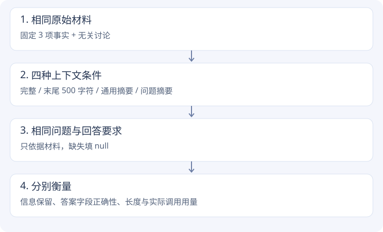

# 上下文实验 · 内容少了，答案还能完整吗？

[本次结果](evidence.md#context) · [源码与复现](evidence.md#source)

## 第一步：先把资料完整传给模型

教学资料中埋入三条 T42 信息：退款 13 个工作日、升级码 ORBIT-62、重连最多 4 次，中间穿插与问题无关的设计讨论。

**为什么先做完整组？** 先确认任务和输入确实足以得到答案，否则无法解释后续删减产生的变化。

```python
# 教学示意，model() 表示一次真实 API 调用
answer = model(context=full_text, question=question)
```

我们要求固定 JSON 字段，未知填 null。评分按事先固定的字段值逐项比较，不根据模型自称“答对了”判断。

## 第二步：只保留末尾，看会丢什么

```python
# 学习脚本实际采用的尾部截断条件
short_context = full_text[-500:]
```

这表示末尾 500 个字符，**不是 500 tokens，也不是模型的真实上下文窗口**。它只演示粗暴缩短内容可能删除前面关键事实。末尾的 retry_limit 可能保留，而前面的退款和升级码可能丢失。

## 第三步：用摘要替代直接删除

调用课程 `ContextCompressor.compress_search_results()`，分别选择通用合并摘要和问题相关摘要。二者使用同一资料和 180 token 输出预算。

```python
# 教学示意：枚举对应课程真实策略
compressor.strategy = CompressionStrategy.CONTEXT_AWARE
summary = compressor.compress_search_results(results, query).content
```

为什么把 query 传给摘要器？摘要不是保存所有内容的缩小副本，需要选择信息。知道接下来要回答什么，有助于保留相关字段；也可能牺牲别的任务所需信息。



## 第四步：压缩率之外，还要看什么？

- 关键事实是否保留？
- 摘要 API 是否正常完成，还是走了失败回退？
- 加上生成摘要的费用后，是否真的更省？
- 摘要过时后，后续新问题是否还适用？

本次脚本记录摘要和回答的所有请求；长度用 `cl100k_base` 估计，不能当成 DeepSeek 的精确分词数。计费 token 以 API 返回的 usage 为准。

## 回到源码

从 `learning/task1/run_learning.py` 的 context 部分进入 → `compress_search_results()` 看策略分发 → `_non_context_aware_combined_summary()` / `_context_aware_summary()` 看 prompt → 再看结果评分。

注意课程摘要器每页截取最多 5000 字符；本次教学材料控制在此范围内，避免误把输入先截断与摘要效果混为一谈。完整原版还有历史窗口与多轮研究流程，本次没有复现那些部分。

**练习**：把关键事实移到末尾或中间，先预测尾部截断会保留什么，再比较结果。不要一次同时改资料位置、问题和摘要预算。

## 对照一段真实源码

课程源码原文，仅去除公共缩进。[chapter2/context-compression/compression_strategies.py:114](https://github.com/bojieli/ai-agent-book/blob/cf7f7a8e16b234ac303034e4ec8f75bf2d61ac2c/chapter2/context-compression/compression_strategies.py#L114)

```python linenums="114"
Returns:
    Compressed content
"""
if self.strategy == CompressionStrategy.NO_COMPRESSION:
    return self._no_compression(search_results)
elif self.strategy == CompressionStrategy.NON_CONTEXT_AWARE_INDIVIDUAL:
    return self._non_context_aware_individual_summary(search_results)
elif self.strategy == CompressionStrategy.NON_CONTEXT_AWARE_COMBINED:
    return self._non_context_aware_combined_summary(search_results)
elif self.strategy == CompressionStrategy.CONTEXT_AWARE:
    return self._context_aware_summary(search_results, query, current_context)
elif self.strategy == CompressionStrategy.CONTEXT_AWARE_CITATIONS:
```

这里按策略枚举分发。query 只传入相关摘要路径，所以它能影响摘要要保留的信息；没有上下文相关策略时，仅改变问题文本不一定改变摘要。
