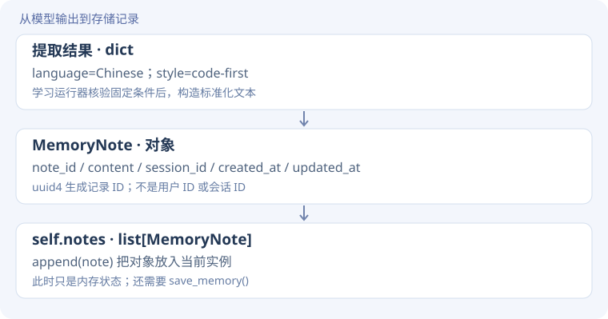
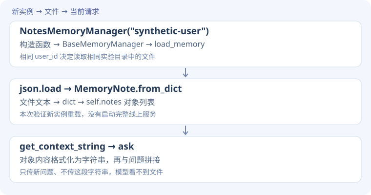
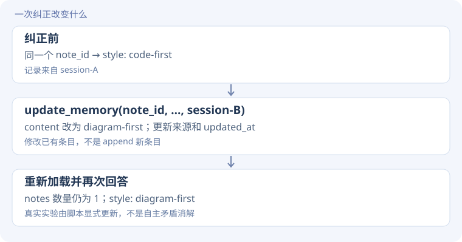

# Memory 源码精读 · 从一条偏好到跨会话使用

[实验说明](memory.md) · [实测结果](evidence.md) · [源码摘录清单](../assets/task1/lesson-excerpts.json)

<div class="design-lead"><span>逐步搭建 / READ THE CODE</span><p>把提取、保存、重载、加入请求、更新分开看。模型不会自动看到磁盘上的文件。</p></div>

!!! note "先分清三种代码"
    **课程源码原文**附文件与行号；**学习运行脚本原文**来自本次实验的 `run_learning.py`；**教学示意**与 Python Tutor 脚本用于理解数据变化，不能代替真实模型实验。读完每一步，再跳转相应函数，不必先通读整个文件。

## 本页阅读路线

对话 → 提取与准入 → MemoryNote → JSON 文件 → 新对象重载 → 请求上下文 → 原 ID 更新。

## 1. 为什么不能把所有对话直接存成长期记忆？

**遇到的问题**

对话同时包含长期偏好与临时状态。今天的工位 B7 不应该自动成为永久画像。

**设计思路**

比较两个提取 prompt；提取后再检查固定教学答案，只有严格组满足条件才进入存储阶段。

**关键代码**

```python
# 教学展开：对应学习脚本 L65–69，实际代码更紧凑
parsed = {"language": "Chinese", "style": "code-first", "temporary_location": None}
checks = {
    "language": parsed.get("language") == "Chinese",
    "style": parsed.get("style") == "code-first",
    "no_temporary": parsed.get("temporary_location") is None,
}
if not all(checks.values()):
    raise RuntimeError("拒绝写入")
```

**执行过程：看数据怎样变**

这里 parsed 是模型文本解析后的字典，checks 是各条件的布尔字典。Python 中 JSON 的 null 解析为 None。`all()` 要求所有检查为真。

注意 `get("temporary_location") is None` 无法区分“字段缺失”和“明确 null”；若要验证完整字段，应该另加键存在检查。这是当前检查的局限。

**接回真实源码**

`run_learning.py` L66–69。通过后 L71 写入的是运行器准备的固定标准化字符串，并非自动将任意模型 JSON 转为记忆。这里验证的是可控教学通路。

**动手验证**

删除 temporary_location 键，当前 no_temporary 检查会失败吗？

??? tip "先预测，再展开对照"
    不会，get 默认返回 None。这说明事实准入与结构完整性应分开验证；不能把当前检查描述成通用记忆审核器。

## 2. 记忆为什么需要 ID 和来源？

**遇到的问题**

仅存一句“喜欢先看代码”，后续不知道该改哪条，也难以追溯哪次会话产生了它。

**设计思路**

用 MemoryNote 数据类给内容附上稳定 ID、session_id、创建和更新时间，再加入 self.notes 列表。

**关键代码**

**课程源码原文** · [chapter3/user-memory/memory_manager.py · L162–L172](https://github.com/bojieli/ai-agent-book/blob/cf7f7a8e16b234ac303034e4ec8f75bf2d61ac2c/chapter3/user-memory/memory_manager.py#L162)。仅去除公共缩进。

```python linenums="162"
def add_memory(self, content: str, session_id: str, tags: List[str] = None):
    """Add a new note"""
    note = MemoryNote(
        note_id=str(uuid.uuid4()),
        content=content,
        session_id=session_id,
        created_at=datetime.now().isoformat(),
        updated_at=datetime.now().isoformat(),
        tags=tags or []
    )
    self.notes.append(note)
```

**执行过程：看数据怎样变**




**接回真实源码**

`MemoryNote` 定义在 memory_manager.py L28 起，`to_dict()` 用 asdict 转成可 JSON 序列化的数据。`add_memory()` 后半段调用 save_memory 并返回 note_id。

**动手验证**

两个用户拥有相同偏好，能直接共用同一个 memory_file 吗？

??? tip "先预测，再展开对照"
    本实现按 user_id 生成文件路径，应隔离用户。相同内容不表示相同记录或相同授权范围。

## 3. append 之后，关掉程序会怎样？

**遇到的问题**

实例中的列表随进程结束而消失；append 并没有持久化。

**设计思路**

先写临时 JSON 文件，再原子替换目标文件，减少中途写入破坏原文件的风险。

**关键代码**

**课程源码原文** · [chapter3/user-memory/memory_manager.py · L148–L157](https://github.com/bojieli/ai-agent-book/blob/cf7f7a8e16b234ac303034e4ec8f75bf2d61ac2c/chapter3/user-memory/memory_manager.py#L148)。仅去除公共缩进。

```python linenums="148"
tmp_file = self.memory_file + '.tmp'
with open(tmp_file, 'w', encoding='utf-8') as f:
    data = {
        'user_id': self.user_id,
        'type': 'notes',
        'updated_at': datetime.now().isoformat(),
        'notes': [note.to_dict() for note in self.notes]
    }
    json.dump(data, f, indent=2, ensure_ascii=False)
os.replace(tmp_file, self.memory_file)
```

**执行过程：看数据怎样变**

`note.to_dict()` 把对象转成字典；外层 data 保留 user_id、type、updated_at、notes。`json.dump` 写入文件，`os.replace` 替换文件。

| 层 | 结构 | 是否自动成为模型上下文 |
| --- | --- | --- |
| self.notes | Python 对象列表 | 否 |
| data | 可序列化字典 | 否 |
| memory_file | JSON 文本文件 | 否 |

**接回真实源码**

`save_memory()` L142 起。它会记录异常而不向调用者重新抛出，因此不能仅凭 add_memory 返回 ID 判定落盘成功；本实验通过重新加载核验。原子替换也不等于解决了多写入者竞争。

**动手验证**

把 save_memory 省掉，当前对象仍能回答偏好吗？新对象呢？

??? tip "先预测，再展开对照"
    当前对象还有列表内容，新对象却无法从文件恢复。这正是必须把内存状态和持久化状态分开验证的原因。

## 4. 新会话如何得到旧记忆？

**遇到的问题**

文件存在还不够，新实例必须加载它，并把内容显式加入模型请求。

**设计思路**

构造时调用 load_memory，把文件字典还原为 MemoryNote；再用 get_context_string 格式化后传给 ask。

**关键代码**

**课程源码原文** · [chapter3/user-memory/memory_manager.py · L127–L140](https://github.com/bojieli/ai-agent-book/blob/cf7f7a8e16b234ac303034e4ec8f75bf2d61ac2c/chapter3/user-memory/memory_manager.py#L127)。仅去除公共缩进。

```python linenums="127"
def load_memory(self):
    """Load notes from storage"""
    if os.path.exists(self.memory_file):
        try:
            with open(self.memory_file, 'r', encoding='utf-8') as f:
                data = json.load(f)
                self.notes = [MemoryNote.from_dict(note) for note in data.get('notes', [])]
            logger.info(f"Loaded {len(self.notes)} notes for user {self.user_id}")
        except Exception as e:
            logger.error(f"Error loading notes: {e}")
            self.notes = []
    else:
        self.notes = []
        logger.info(f"No existing memory file for user {self.user_id}")
```

**执行过程：看数据怎样变**




**接回真实源码**

学习脚本 L70–76 对比空 context 与重载 context；`get_context_string()` L245–258 输出记录文本。get_context_string 不是向量检索，它会格式化现有 notes。

**动手验证**

磁盘有文件，但向 ask 传空字符串，模型应该知道偏好吗？

??? tip "先预测，再展开对照"
    不能根据本次输入知道。实际空记忆组返回 null；不是模型“忘记了文件”，而是从未收到这份证据。

## 5. 用户纠正后，为什么要更新同一个 ID？

**遇到的问题**

如果简单追加“先看图解”，旧的“先看代码”仍在列表里，下一次请求可能同时出现冲突偏好。

**设计思路**

通过 note_id 查找并改写原条目，保存后再创建新实例检查结果与数量。

**关键代码**

**教学展开版**：为阅读拆开表达式，省略项见注释；不是原文件逐字摘录。

```python
# 教学展开：只保留更新、重载与校验
new_content = "Preferred language: Chinese. "
new_content += "Explanation style: diagram-first."
updated = reloaded.update_memory(
    note_id, new_content, "session-B",
    tags=["explicit-correction"],
)
again = NotesMemoryManager("synthetic-user")
assert updated and len(again.notes) == 1
context = again.get_context_string()
# 下一步把 context 与相同问题一起交给 ask()
```

??? info "展开对照：本次运行脚本原文与行号"
    **学习运行脚本原文** · [run_learning.py · L77–L79](../assets/task1/run_learning.py)。仅去除公共缩进。

    ```python linenums="77"
    updated=reloaded.update_memory(note_id,'Preferred language: Chinese. Explanation style: diagram-first.','session-B',tags=['explicit-correction'])
    again=mm.NotesMemoryManager('synthetic-user');assert updated and len(again.notes)==1
    r=ask('Use only provided memory. Return JSON only.',again.get_context_string()+'\n'+memory_question);r.update({'variant':'after_correction','context':again.get_context_string()});data['memory'].append(r)
    ```


**执行过程：看数据怎样变**




**接回真实源码**

课程 `update_memory()` L193–215：遍历记录匹配 ID，更新内容、来源、时间，调用 save_memory 并返回 True。学习脚本同时检查返回值和记录数量。

**动手验证**

传一个不存在的 ID，会自动创建新记忆吗？

??? tip "先预测，再展开对照"
    不会，这个方法最终返回 False。新增与更新是不同操作，调用者应检查返回值。

## 跟着执行：Python Tutor 离线版本

[下载 memory_walkthrough.py](../assets/task1/memory_walkthrough.py) · [打开 Python Tutor](https://pythontutor.com/)

用 `json.dumps / json.loads` 模拟保存与加载；变量 stored_json 代替磁盘文件，**不是真实文件持久化测试**。先看 session_a 与 session_b 是否独立，再更新 session_b，观察 stored_json 是否会自动变化。最后重新序列化并加载 session_c。

阅读完回到 `NotesMemoryManager`，你应能指出哪段负责对象、哪段负责文件、哪段负责模型输入。[看真实实测结果](evidence.md#memory)。
