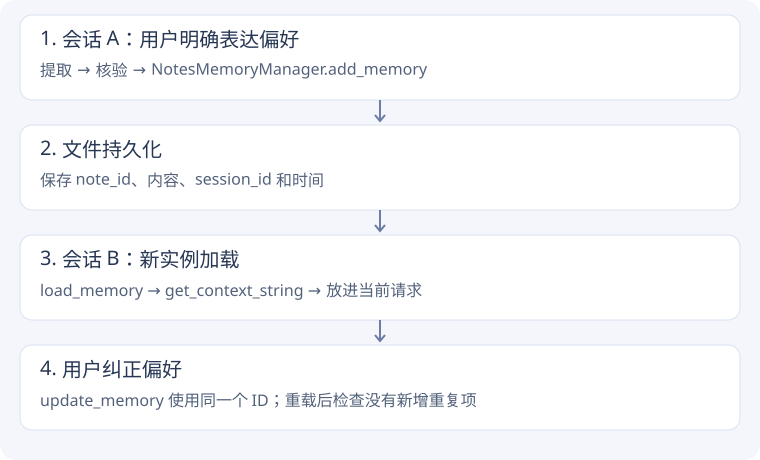

# Memory 实验 · 换一个会话，模型还记得吗？

[本次结果](evidence.md#memory) · [源码与复现](evidence.md#source)

## 第一步：明确短期与长期的边界

教学用户说：长期偏好中文、喜欢先看代码；今天临时在 B7 工位，并明确不要保存临时位置。

聊天记录包含全部内容，但长期记忆不应该原样复制全部聊天。我们比较宽泛的“提取事实”与只保存明确长期偏好的 prompt。

## 第二步：提取后先核验，再写入

```text
对话 → LLM 提取 JSON → 检查预期字段 → 通过才写入记忆
```

本次使用已知教学答案核验 language、style 和临时位置。它是固定夹具的准入检查，不是面向任意用户的通用记忆审核器。

宽泛组和严格组不仅措辞不同，严格组还明确了标准化字段值，因此差异只能解释为整个 prompt 条件的效果，不能单独归因于某一个词。

## 第三步：用课程存储器保存到文件

```python
# 课程真实接口的教学用法
manager = NotesMemoryManager("synthetic-user")
note_id = manager.add_memory(
    "Preferred language: Chinese. Explanation style: code-first.",
    "session-A",
)
```

`add_memory()` 建立带 ID、会话来源和时间的记录，然后 `save_memory()` 持久化。实验把存储目录指向这次独立运行目录，不写入任何真实用户的记忆。

## 第四步：重新创建对象，模拟新会话加载

```python
reloaded = NotesMemoryManager("synthetic-user")
context = reloaded.get_context_string()
```

新对象从文件读回记录，再把 `context` 放进模型请求。相同新问题分别使用空记忆和重载记忆，查看模型能否恢复偏好。这里验证新实例重载，不夸称执行了完整的跨进程服务重启。



## 第五步：偏好变化时，为什么要更新？

用户改为先看图解，实验通过 `update_memory(note_id, ...)` 修改原记录，再重新加载验证。如果只是追加新记录，旧偏好和新偏好可能同时进入上下文。

本次纠正由学习运行器显式调用，不是模型自动完成矛盾消解。课程后台处理器 `BackgroundMemoryProcessor` 有独立分析和应用更新流程，本次未运行整条后台服务链路。

## 回到源码

先读 `NotesMemoryManager.add_memory()` 与 `save_memory()`，再读构造时的 `load_memory()`，最后读 `get_context_string()`、`update_memory()`。你应该能解释“磁盘里有记忆”和“当前请求有记忆”为什么不是同一件事。

**联系项目**：可把长期讲解偏好与当前咨询问题分开；实时对话中的本轮打断、临时地点不应无差别写成长期画像。是否适用，需要在实际项目中定义记忆规则。

## 对照一段真实源码

课程源码原文，仅去除公共缩进。[chapter3/user-memory/memory_manager.py:162](https://github.com/bojieli/ai-agent-book/blob/cf7f7a8e16b234ac303034e4ec8f75bf2d61ac2c/chapter3/user-memory/memory_manager.py#L162)

```python linenums="162"
def add_memory(self, content: str, session_id: str, tags: List[str] = None):
    """Add a new note"""
    note = MemoryNote(
        note_id=str(uuid.uuid4()),
        content=content,
        session_id=session_id,
        created_at=datetime.now().isoformat(),
        updated_at=datetime.now().isoformat(),
        tags=tags or []
    )
    self.notes.append(note)

    if self.verbose:
        print(f"  ➕ Added memory note (ID: {note.note_id[:8]}...):")
        print(f"     Content: {content[:100]}..." if len(content) > 100 else f"     Content: {content}")
```

记录保存 session_id 和时间，是为了追溯这条偏好来自哪里。这里只展示建立记录；后面的 save_memory 才负责落盘，append 本身不等于持久化。
