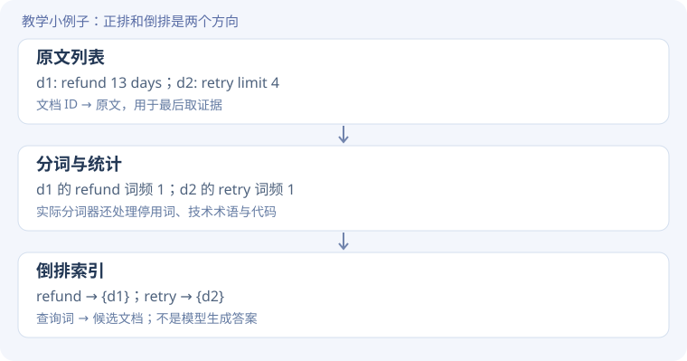
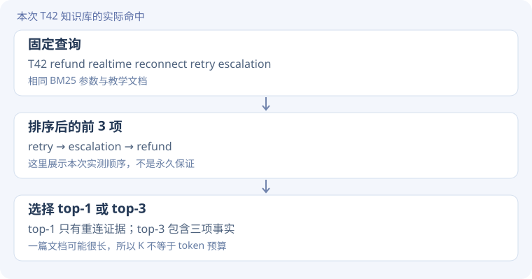
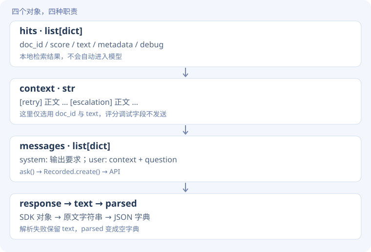

# RAG 源码精读 · 从文档列表到有证据的回答

[实验说明](rag.md) · [实测结果](evidence.md) · [源码摘录清单](../assets/task1/lesson-excerpts.json)

<div class="design-lead"><span>逐步搭建 / READ THE CODE</span><p>先把检索和生成拆开：候选文档怎样找到、为什么排在前面、哪些内容真的进入了模型。</p></div>

!!! note "先分清三种代码"
    **课程源码原文**附文件与行号；**学习运行脚本原文**来自本次实验的 `run_learning.py`；**教学示意**与 Python Tutor 脚本用于理解数据变化，不能代替真实模型实验。读完每一步，再跳转相应函数，不必先通读整个文件。

## 本页阅读路线

文档 → 分词与倒排索引 → 候选集合 → BM25 分数 → top-k → messages → 答案与引用验收。

## 1. 文档列表为什么还要建索引？

**遇到的问题**

逐篇扫描可以做小演示，但每次查询都遍历全部正文，不方便复用词频等统计。

**设计思路**

先建立“词 → 哪些文档含这个词”的倒排索引，同时存原文和文档长度。查询时先找候选，再排序。

**关键代码**

**课程源码原文** · [chapter3/sparse-embedding/bm25_engine.py · L170–L184](https://github.com/bojieli/ai-agent-book/blob/cf7f7a8e16b234ac303034e4ec8f75bf2d61ac2c/chapter3/sparse-embedding/bm25_engine.py#L170)。仅去除公共缩进。

```python linenums="170"
# Process text
processor = TextProcessor()
tokens = processor.tokenize(text)

# Count term frequencies
term_freq = Counter(tokens)
self.term_frequency[doc_id] = term_freq
self.doc_lengths[doc_id] = len(tokens)

logger.debug(f"Document {doc_id}: {len(tokens)} tokens, {len(term_freq)} unique terms")

for term in term_freq:
    if term not in self.index or doc_id not in self.index[term]:
        self.document_frequency[term] = self.document_frequency.get(term, 0) + 1
    self.index[term].add(doc_id)
```

**执行过程：看数据怎样变**




**接回真实源码**

先读 `cli.build_engine()`，再进 `SparseSearchEngine.index_batch()`、`index_document()`，最终到 `InvertedIndex.add_document()`。图中 d1/d2 是教学示例，课程内部使用数字 ID，输出时映射回外部 ID。

**动手验证**

重复两次 refund，倒排候选中 d1 会出现两次吗？

??? tip "先预测，再展开对照"
    不会，候选用集合去重；但 Counter 中的词频变成 2，可能影响后续评分。候选资格与排序分数是两回事。

## 2. 没有候选时，为什么调 top-k 也没用？

**遇到的问题**

原查询 cat 找不到只写 kitten 或 feline 的文档；排名算法不能给根本没进入候选的文档排序。

**设计思路**

先按查询词获取 posting list，取并集作为候选；本实现有大小写回退，不是通用同义词理解。

**关键代码**

**课程源码原文** · [chapter3/sparse-embedding/bm25_engine.py · L362–L378](https://github.com/bojieli/ai-agent-book/blob/cf7f7a8e16b234ac303034e4ec8f75bf2d61ac2c/chapter3/sparse-embedding/bm25_engine.py#L362)。仅去除公共缩进。

```python linenums="362"
for term in query_terms:
    # Try exact match first
    docs = self.index.get_posting_list(term)

    # If no exact match and term is not a number/code, try lowercase
    if not docs and term and not term[0].isdigit() and '-' not in term:
        lowered = term.lower()
        docs = self.index.get_posting_list(lowered)
        if docs:
            term = lowered

    resolved_terms.append(term)
    candidate_docs.update(docs)
    term_doc_mapping[term] = docs
    logger.debug(f"Term '{term}' appears in {len(docs)} documents")

logger.info(f"Found {len(candidate_docs)} candidate documents")
```

**执行过程：看数据怎样变**

`query_terms` 是列表，`docs` 是单个词命中的集合，`candidate_docs.update(docs)` 做并集。`resolved_terms` 保存实际匹配形式，使后续词频查找与候选匹配保持一致。

本次 cat → 空集合；人工扩展 cat kitten feline → doc_7、doc_8。增大 K 并不能改变空候选集合。

**接回真实源码**

`BM25.search()` L341 起。不要把这里的单词匹配称为 embedding 检索；没有生成向量或做神经重排序。

**动手验证**

把查询 cat 的 top-k 从 1 改为 100，会找出 kitten 文档吗？

??? tip "先预测，再展开对照"
    按当前词面索引不会。需要修改查询、分词/同义词策略或引入另一种召回机制；它不只是排序参数问题。

## 3. 候选找到了，为什么还需要打分？

**遇到的问题**

多个文档都含同一个词，但相关程度不同。仅按命中顺序返回会忽略词频、词的稀有程度和长度差异。

**设计思路**

BM25 为每个查询词计算贡献，再对文档求和。k1 调节词频增长的饱和程度，b 调节文档长度归一化。

**关键代码**

**课程源码原文** · [chapter3/sparse-embedding/bm25_engine.py · L303–L324](https://github.com/bojieli/ai-agent-book/blob/cf7f7a8e16b234ac303034e4ec8f75bf2d61ac2c/chapter3/sparse-embedding/bm25_engine.py#L303)。仅去除公共缩进。

```python linenums="303"
def calculate_term_score(self, term: str, doc_id: int) -> float:
    """Calculate BM25 score for a single term in a document"""
    # Get term frequency in document
    tf = self.index.term_frequency.get(doc_id, Counter()).get(term, 0)
    if tf == 0:
        return 0

    # Get document length
    dl = self.index.doc_lengths.get(doc_id, 0)

    # Calculate IDF
    idf = self.calculate_idf(term)

    # BM25 term score formula
    if self.avgdl == 0:
        return 0.0
    numerator = tf * (self.k1 + 1)
    denominator = tf + self.k1 * (1 - self.b + self.b * (dl / self.avgdl))
    score = idf * (numerator / denominator)

    logger.debug(f"Term '{term}' in doc {doc_id}: tf={tf}, dl={dl}, score={score:.4f}")
    return score
```

**执行过程：看数据怎样变**

先取 tf：该词在当前文档出现几次；dl：文档分词后的长度；avgdl：索引平均长度；idf：词的稀有程度权重。tf=0 或 avgdl=0 直接返回 0。

当 b=0，分母中的长度项不再取决于 dl/avgdl；改变 k1 则改变词频增长带来的得分变化。分数不是模型信心，也不是概率。

**接回真实源码**

继续读 `score_document()` L326–339，它遍历 resolved_terms 并累加；`calculate_idf()` L281 起定义本项目的具体 IDF 变体，不能只根据公式名字假定实现。

**动手验证**

只把 b 改为 0，是否意味着一定提高召回？

??? tip "先预测，再展开对照"
    不一定，排名也可能完全不变。本次小语料的单变量对照就没有变化。参数作用与观察到的效果要分开。

## 4. top-k 截的是文档数，不是上下文 token

**遇到的问题**

检索返回太少可能漏关键证据，返回太多则可能引入无关内容。

**设计思路**

先排序，再截取前 K 个，最后将内部结果格式化为带 doc_id、text、score 的字典。

**关键代码**

**课程源码原文** · [chapter3/sparse-embedding/bm25_engine.py · L396–L400](https://github.com/bojieli/ai-agent-book/blob/cf7f7a8e16b234ac303034e4ec8f75bf2d61ac2c/chapter3/sparse-embedding/bm25_engine.py#L396)。仅去除公共缩进。

```python linenums="396"
# Sort by score (descending)
doc_scores.sort(key=lambda x: x[1], reverse=True)

# Return top k results
results = doc_scores[:top_k]
```

**执行过程：看数据怎样变**




**接回真实源码**

`SparseSearchEngine.search()` L461 起把内部数字 ID 映射回外部 doc_id；学习运行器 L98 对 top_k=0 单独返回空列表，构成不检索基线。

**动手验证**

如果排序首位是一篇无关长文，top-1 还会自动选正确文档吗？

??? tip "先预测，再展开对照"
    不会。top-k 只是截断排名。需要检查查询、候选与排序，而不是期待生成阶段一定纠正检索错误。

## 5. 检索结果如何变成模型能看到的证据？

**遇到的问题**

hits 是 Python 字典列表。模型不会自动访问这个变量，必须把内容写进 messages。

**设计思路**

将文档 ID 与正文组合成 context 字符串，再与问题拼接；生成阶段保持问题一致，对照严格和宽泛 prompt。

**关键代码**

**教学展开版**：为阅读拆开表达式，省略项见注释；不是原文件逐字摘录。

```python
# 教学展开：展示固定一组的证据组装，省略实验条件循环
hits = engine.search(rag_query, top_k=3)
parts = []
for hit in hits:
    part = "[" + hit["doc_id"] + "] " + hit["text"]
    parts.append(part)
context = "\n".join(parts)
result = ask(system, context + "\nQuestion: " + question)
```

??? info "展开对照：本次运行脚本原文与行号"
    **学习运行脚本原文** · [run_learning.py · L97–L102](../assets/task1/run_learning.py)。仅去除公共缩进。

    ```python linenums="97"
    for top_k,prompt_mode in [(0,'strict'),(1,'strict'),(3,'strict'),(3,'loose')]:
     hits=engine.search(rag_query,top_k) if top_k else []
     context='\n'.join('['+h['doc_id']+'] '+h['text'] for h in hits)
     system='Return JSON keys refund_days, retry_limit, escalation_code, emergency_phone, sources (document IDs). '
     system+=('Answer only using supplied documents; missing facts must be null. Cite only supplied IDs.' if prompt_mode=='strict' else 'Helpfully answer the user question and provide sources.')
     r=ask(system,context+'\nQuestion: For T42 what are refund days, retry limit, escalation code and emergency phone?')
    ```


**执行过程：看数据怎样变**




**接回真实源码**

进入公共 `ask()` L31–36 看输入拼成两条消息；`Recorded.create()` L24–29 保存请求与输出。这里是一次检索一次生成，没有多轮 Agent 自主补查。

**动手验证**

把 `h["doc_id"]` 删除，只发送正文，对事实回答和引用验收分别有什么影响？

??? tip "先预测，再展开对照"
    事实可能仍然能回答，但来源 ID 与文本的对应关系被破坏，难以要求并验证规范引用。

## 6. 为什么机器判失败，人工却看到答对了？

**遇到的问题**

本次宽泛 prompt 的回答给出了正确事实，但返回了自然语言。JSON 解析后是空字典，字段检查全失败。

**设计思路**

保留原始回答，分别检查格式、事实、引用。不要用单一 success 字段掩盖不同失败原因。

**关键代码**

**教学展开版**：为阅读拆开表达式，省略项见注释；不是原文件逐字摘录。

```python
# 教学展开：保留字段和引用检查的原有语义
checks = {}
for key, expected_value in expected.items():
    checks[key] = (
        key in result["parsed"]
        and result["parsed"].get(key) == expected_value
    )
sources = result["parsed"].get("sources", [])
citation_ids_valid = (
    isinstance(sources, list)
    and all(doc_id in retrieved_ids for doc_id in sources)
)
```

??? info "展开对照：本次运行脚本原文与行号"
    **学习运行脚本原文** · [run_learning.py · L103–L106](../assets/task1/run_learning.py)。仅去除公共缩进。

    ```python linenums="103"
    expected={'refund_days':13,'retry_limit':4,'escalation_code':'ORBIT-62','emergency_phone':None}
    r.update({'top_k':top_k,'prompt_mode':prompt_mode,'retrieved_ids':[h['doc_id'] for h in hits],'context':context,'checks':{k:r['parsed'].get(k)==v and k in r['parsed'] for k,v in expected.items()}})
    sources=r['parsed'].get('sources',[]);r['citation_ids_valid']=isinstance(sources,list) and all(x in r['retrieved_ids'] for x in sources)
    data['rag'].append(r);save();print('rag',top_k,prompt_mode,r['checks'],flush=True)
    ```


**执行过程：看数据怎样变**

`checks` 在 RAG 段既比较值，也要求键存在；未知电话的预期值是 None。`citation_ids_valid` 只检查引用是否属于命中文档，没有要求非空，更没有逐句检查引用是否支持结论。

实测 top-1 引用了 T42（工单 ID），并非 retry（文档 ID）；top-3 引用带方括号，严格比较失败，独立审计去括号后通过。宽泛组则是格式不合格，不能说事实全错。

**接回真实源码**

`audit_learning.py` 中 rag_audit 保存严格检查、去括号检查与人工固定事实复核。原始 evidence 不覆盖，避免事后修改结果而看不出依据。

**动手验证**

若 sources=[]，`all(x in ids for x in sources)` 会返回什么？这说明引用完整吗？

??? tip "先预测，再展开对照"
    返回 True，因为空集合没有反例。它只能说明没有非法 ID，不能证明提供了引用；有证据任务还应另验非空与覆盖度。

## 跟着执行：Python Tutor 离线版本

[下载 rag_walkthrough.py](../assets/task1/rag_walkthrough.py) · [打开 Python Tutor](https://pythontutor.com/)

这份小程序展示倒排索引、候选集合、排名、top-k 与 context 拼接。**排序只按命中词数量，是教学简化，不是 BM25 复刻**。真实 BM25 的计算位置已在第三步标出。将 TOP_K 从 1 改到 2，观察传给后续回答的证据如何变化；将 QUERY 改为 cat，观察空候选。

读完后尝试复述：原文如何变成索引？查询如何找到候选？谁决定排名？谁组装 messages？谁负责判断回答是否合格？[对照实测结果](evidence.md#retrieval)。
