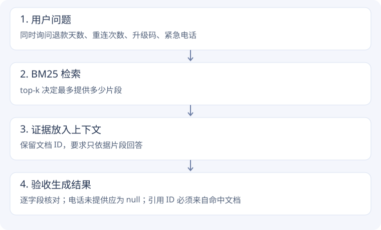

# RAG 实验 · 检索更多，回答一定更好吗？

!!! tip "先跑实验，再跟着代码走一遍"
    [进入本实验的逐步源码教程](rag-code.md)：设计问题、真实代码、SVG 数据变化、练习与 Python Tutor 模拟。


[本次结果](evidence.md#retrieval) · [源码与复现](evidence.md#source)

## 第一步：先只做检索，不调用模型

复用课程 `sparse-embedding/cli.py` 自带的 10 篇英文文档和 5 条标注查询，用真实 `SparseSearchEngine` 建索引。课程分词器面向这套英文示例；没有把这次结果外推到中文客服知识库。

```python
# 课程实际接口；此处展示调用方式
engine = build_engine(corpus, k1=1.5, b=0.75)
hits = engine.search(query, top_k=3)
```

倒排索引先找到包含查询词的文档，BM25 再按词频、稀有程度与文档长度打分。它没有理解任意同义表达的保证。

## 第二步：改变 top-k，分别看召回与噪声

同一索引、同一问题，比较 top-k=1、3、5。K 是最多返回的条数；没有匹配文档时不会凭空补齐。

- Recall@k：正确相关文档找回了多少。
- Precision@k：本次按命中的相关文档数除以 k，未返回的位置也占分母。
- MRR：第一个相关结果出现得有多靠前。

增大 K 可能找回更多证据，也可能带入无关内容；不能只看一个指标。

## 第三步：理解词面检索的边界

课程故意让查询 `cat` 对应的文档只含 `kitten` 或 `feline`。先看原查询，再用人工扩展 `cat kitten feline` 对比。

这一步是**人工同义词扩展**，没有运行 embedding 模型，也不是 LLM 自动改写。它说明查询表述能改变召回，不证明已经解决所有语义检索问题。

## 第四步：把检索结果加入生成请求

新建独立的教学知识库：退款、重连、升级码分别放在三篇 T42 文档中，另加一篇 T99 干扰文档。比较不检索、top-1、top-3。

```python
# 教学示意
hits = engine.search(query, top_k=3)
context = "\n".join("[" + h["doc_id"] + "] " + h["text"] for h in hits)
answer = model(context, question)
```



## 第五步：固定检索结果，再改变 prompt

top-3 下对比宽泛帮助型 prompt 与严格证据型 prompt。严格版要求未知填 null，并只引用提供的 ID。知识库故意不提供紧急电话，用于观察是否承认信息缺口。

有效引用 ID 只证明引用名字存在，不能自动证明每句话受引用支持。实测结果需要和检索片段逐项对照。

## 回到源码

先读 `cli.build_engine()`，再进 `SparseSearchEngine.search()` → `BM25.search()` → `score_document()`。理解检索后，再回到学习脚本 rag 部分，看文档如何变成 messages。

本次没有向量召回、神经重排序、混合融合或多轮 Agentic RAG，因此不替代 3-6、3-8 原版验收。

**联系项目**：客服可先按产品/工单过滤再检索；实时对话可以针对当前意图取少量证据。过滤和流式集成是后续设计方向，本次没有修改你的业务项目。

## 对照一段真实源码

课程源码原文，仅去除公共缩进。[chapter3/sparse-embedding/cli.py:99](https://github.com/bojieli/ai-agent-book/blob/cf7f7a8e16b234ac303034e4ec8f75bf2d61ac2c/chapter3/sparse-embedding/cli.py#L99)

```python linenums="99"
def build_engine(corpus: List[Dict], k1: float, b: float) -> SparseSearchEngine:
    """把语料灌进引擎；用给定的 k1/b 重建 BM25。"""
    engine = SparseSearchEngine()
    engine.index_batch([
        {"text": d["text"],
         "doc_id": d.get("doc_id"),
         "metadata": {"title": d.get("title", "")}}
        for d in corpus
    ])
    # index_batch 内部每篇都会重建 BM25，这里再显式用目标参数固定一次
    from bm25_engine import BM25
    engine.bm25 = BM25(engine.index, k1=k1, b=b)
    return engine
```

先建立相同语料索引，再显式用实验 k1、b 初始化评分器，才能把检索对照的变化定位到参数。
