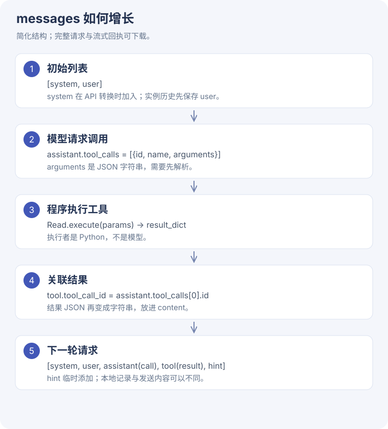

# Coding Agent 源码精读 · 从一个请求长出执行循环

[实验与结果](coding.md) · [学习运行脚本](../assets/task5/run_coding.py)

<div class="design-lead"><span>先懂职责，再读函数</span><p>围绕这次五轮修复，逐步理解历史列表、流式增量、工具注册、文件修改和退出条件。</p></div>

## 1. 入口为什么返回事件流，而不是一个字符串

**问题：** 一次修复需要多轮调用；界面还想及时显示文字、开始执行工具、显示测试结果。如果 `run()` 等到最后才返回字符串，中间进度都藏住了。

**设计：** `run()` 是 generator，以 `yield` 逐步发出事件。外部用 `for event in agent.run(...)` 消费。`yield` 暂停当前函数并把控制权交给调用者，下次迭代再从这里继续；这并不意味着自动并发。

```python
# 教学示意，省略 provider 分支和异常处理
for iteration in range(max_iterations):
    yield {"type": "iteration_start", "iteration": iteration + 1}
    for event in run_one_iteration():
        yield event
        if event["type"] == "done":
            return
```

**执行过程：** 本次第 1 轮读文件，第 2 轮测试，第 3 轮编辑，第 4 轮测试，第 5 轮总结。外层用 max_iterations=8 限制总轮数；不是看到一条工具返回就自动认为结束。

**源码入口：** `agent.py::CodingAgent.run`。先读 `self.messages.append`，再读 `messages_with_hint`，最后读 `should_break` 与 `for ... else`。达到轮数上限会产生 `max_iterations_reached`，它不是正常完成。

## 2. 为什么本地历史与发给模型的列表不同

**问题：** 时间、当前目录、工具次数随执行改变；这些状态需要更新，但不必每轮永久塞入历史。

**设计：** `messages_with_hint = self.messages.copy()` 浅拷贝列表，再临时追加 system hint。列表容器不同，原有字典仍共享引用；当前代码只追加，不修改既有字典，所以不会把新 hint 永久写入 `self.messages`。





```python
# 教学示意：看 append 的对象是谁
history = [{"role": "user", "content": "修复边界"}]
sending = history.copy()
sending.append({"role": "user", "content": "当前工具次数：Read=2"})
assert len(history) == 1
assert len(sending) == 2
```

**源码入口：** `system_state.py::SystemState.get_system_hint` 提供状态，`_convert_to_openai_format` 在发送时加上 system prompt。

**动手验证：** 把 `sending.append(...)` 改成 `sending[0]["content"] = "变了"`，history 会不会变？会。浅拷贝只复制列表壳，不能当作深拷贝使用。

## 3. 模型的工具参数为什么要先攒起来

**问题：** 流式返回可能先给工具名，再多次给 arguments 碎片。一块碎片通常不是合法 JSON。

**设计：** `_run_openai_iteration` 用 `tool_calls_data[index]` 保存每个调用；正文进入 current_text，参数进入该调用自己的 arguments。

```python
# 教学示意，真实字段还有 id 和 name
tool_calls_data = {}
for index, fragment in [(0, '{"file_'), (0, 'path":"policy.py"}')]:
    tool_calls_data.setdefault(index, {"arguments": ""})
    tool_calls_data[index]["arguments"] += fragment
```

多个调用时，index 让参数不会串到一起。循环读完后才 `json.loads`。课程解析失败会改用空字典，这不等于通过参数验证；真实工具可能因此报错。本次笔记保留此行为，不把它包装成可靠恢复。

**动手验证：** 在 Python Tutor 看每次循环后字符串变化，再构造第二个 index=1 的调用。观察“缓冲区按调用隔离”为什么比只用一个字符串安全。

## 4. 从工具名走到 Python 函数

**问题：** 模型只返回字符串 `Read`，它不会执行本机文件 I/O。

**设计：** registry 把名字映射到类，实例化时传入 SystemState，再 `.execute(params)`。

**课程源码原文**：[ `ToolRegistry.get_tool` · L38–43](https://github.com/bojieli/ai-agent-book/blob/cf7f7a8e16b234ac303034e4ec8f75bf2d61ac2c/chapter5/coding-agent/tool_registry.py#L38)

```python linenums="38"
    def get_tool(self, name: str, system_state) -> BaseTool:
        """Get tool instance by name"""
        tool_class = self._tools.get(name)
        if tool_class is None:
            raise ValueError(f"Unknown tool: {name}")
        return tool_class(system_state)
```


这层让循环不必知道每个工具怎样工作。Read 的读文件逻辑与 Edit 的字符串替换逻辑都放在各自类里。

学习脚本在 registry 外面增加 `Restricted` 包装器，先检查文件路径，再调用课程工具。RunTests 则是本次增加的固定命令工具。**这两项是学习版限制，不是原课程自带沙箱。**

## 5. Edit 为什么要求 old_string 唯一

**问题：** 替换一个很短的字符串，可能误改多处。

**设计：** 课程 `EditTool._execute_impl` 依次检查文件存在、old_string 非空、字符串存在、匹配次数，再执行替换并写回。

```python
# 教学压缩版；完整实现还处理 replace_all、异常和语法检查
occurrences = content.count(old_string)
if occurrences > 1 and not replace_all:
    return {"error": "匹配不唯一，请提供更多上下文"}
new_content = content.replace(old_string, new_string, 1)
```

本次把 `hours < 24` 改成 `hours <= 24`。Edit 返回的 lint_check 只检查 Python 语法；“能编译”无法证明边界逻辑正确，所以还必须调用 RunTests。

注意源码注释写了“编辑前必须 Read”，但这个方法本身没有强制检查读历史。不能因为注释或工具描述说必须，就声称框架已经强制执行。

## 6. 工具结果如何回到下一轮

**问题：** 模型怎样知道刚才的替换是否成功、测试失败在哪里？

**设计：** 先保存 assistant 调用，再把结果编码成 tool 消息，通过 tool_call_id 关联本次调用。

```python
# 教学示意
messages.append({"role": "assistant", "tool_calls": [call], "content": ""})
messages.append({
    "role": "tool",
    "tool_call_id": call["id"],
    "content": json.dumps(result_dict, ensure_ascii=False),
})
```

`id` 连接一次请求和一次结果。不要只靠工具名：同一轮可能读多个文件，工具名都是 Read。

课程 `BaseTool.execute` 中，工具实现若直接返回 `{"error": ...}`，外层仍可能构造 success=True 的 ToolResult；因此不能只看这个布尔字段。应查看实际数据、错误字段及进程退出码。这也是我们用独立测试验收的原因。

## 7. 如何从小示例写回完整项目

先自己写一个只含 Read 的循环，再加入 Edit，最后加入固定测试执行器。每增加一个能力，都回答：输入是什么类型、会改哪个状态、失败怎么返回、完成由谁判断。

学习版没有暴露通用 Shell。等你理解这一条最短路径，再读课程 BashTool 的进程生命周期与输出读取，否则很容易被执行器细节淹没。

**自测题：** 模型不调用 RunTests 就发出 done，是否结束循环？是。是否完成我们的任务？不一定。循环的终止条件和外层任务验收是两层逻辑。

## 源码导航：读完后回到这些函数

按职责定位，先读主路径，再补适配器。下面的行号来自本次固定版本。

| 文件 / 函数 | 行号 |
| --- | --- |
| `agent.py::CodingAgent.__init__` | [L27](https://github.com/bojieli/ai-agent-book/blob/cf7f7a8e16b234ac303034e4ec8f75bf2d61ac2c/chapter5/coding-agent/agent.py#L27) |
| `agent.py::CodingAgent._load_tools` | [L63](https://github.com/bojieli/ai-agent-book/blob/cf7f7a8e16b234ac303034e4ec8f75bf2d61ac2c/chapter5/coding-agent/agent.py#L63) |
| `agent.py::CodingAgent._load_system_prompt` | [L70](https://github.com/bojieli/ai-agent-book/blob/cf7f7a8e16b234ac303034e4ec8f75bf2d61ac2c/chapter5/coding-agent/agent.py#L70) |
| `agent.py::CodingAgent._get_git_branch` | [L85](https://github.com/bojieli/ai-agent-book/blob/cf7f7a8e16b234ac303034e4ec8f75bf2d61ac2c/chapter5/coding-agent/agent.py#L85) |
| `agent.py::CodingAgent._get_main_branch` | [L93](https://github.com/bojieli/ai-agent-book/blob/cf7f7a8e16b234ac303034e4ec8f75bf2d61ac2c/chapter5/coding-agent/agent.py#L93) |
| `agent.py::CodingAgent._get_git_status` | [L106](https://github.com/bojieli/ai-agent-book/blob/cf7f7a8e16b234ac303034e4ec8f75bf2d61ac2c/chapter5/coding-agent/agent.py#L106) |
| `agent.py::CodingAgent._get_recent_commits` | [L114](https://github.com/bojieli/ai-agent-book/blob/cf7f7a8e16b234ac303034e4ec8f75bf2d61ac2c/chapter5/coding-agent/agent.py#L114) |
| `agent.py::CodingAgent.run` | [L122](https://github.com/bojieli/ai-agent-book/blob/cf7f7a8e16b234ac303034e4ec8f75bf2d61ac2c/chapter5/coding-agent/agent.py#L122) |
| `agent.py::CodingAgent._run_anthropic_iteration` | [L181](https://github.com/bojieli/ai-agent-book/blob/cf7f7a8e16b234ac303034e4ec8f75bf2d61ac2c/chapter5/coding-agent/agent.py#L181) |
| `agent.py::CodingAgent._run_openai_iteration` | [L304](https://github.com/bojieli/ai-agent-book/blob/cf7f7a8e16b234ac303034e4ec8f75bf2d61ac2c/chapter5/coding-agent/agent.py#L304) |
| `agent.py::CodingAgent._convert_to_openai_format` | [L421](https://github.com/bojieli/ai-agent-book/blob/cf7f7a8e16b234ac303034e4ec8f75bf2d61ac2c/chapter5/coding-agent/agent.py#L421) |
| `agent.py::CodingAgent._convert_tools_to_openai_format` | [L473](https://github.com/bojieli/ai-agent-book/blob/cf7f7a8e16b234ac303034e4ec8f75bf2d61ac2c/chapter5/coding-agent/agent.py#L473) |
| `agent.py::CodingAgent.reset` | [L489](https://github.com/bojieli/ai-agent-book/blob/cf7f7a8e16b234ac303034e4ec8f75bf2d61ac2c/chapter5/coding-agent/agent.py#L489) |
| `agent.py::main` | [L495](https://github.com/bojieli/ai-agent-book/blob/cf7f7a8e16b234ac303034e4ec8f75bf2d61ac2c/chapter5/coding-agent/agent.py#L495) |
| `tool_registry.py::ToolRegistry.__init__` | [L18](https://github.com/bojieli/ai-agent-book/blob/cf7f7a8e16b234ac303034e4ec8f75bf2d61ac2c/chapter5/coding-agent/tool_registry.py#L18) |
| `tool_registry.py::ToolRegistry.get_tool` | [L38](https://github.com/bojieli/ai-agent-book/blob/cf7f7a8e16b234ac303034e4ec8f75bf2d61ac2c/chapter5/coding-agent/tool_registry.py#L38) |
| `tool_registry.py::ToolRegistry.get_all_tool_names` | [L45](https://github.com/bojieli/ai-agent-book/blob/cf7f7a8e16b234ac303034e4ec8f75bf2d61ac2c/chapter5/coding-agent/tool_registry.py#L45) |
| `edit_tool.py::EditTool.name` | [L15](https://github.com/bojieli/ai-agent-book/blob/cf7f7a8e16b234ac303034e4ec8f75bf2d61ac2c/chapter5/coding-agent/tools/edit_tool.py#L15) |
| `edit_tool.py::EditTool._execute_impl` | [L18](https://github.com/bojieli/ai-agent-book/blob/cf7f7a8e16b234ac303034e4ec8f75bf2d61ac2c/chapter5/coding-agent/tools/edit_tool.py#L18) |
| `edit_tool.py::EditTool._check_lint_errors` | [L85](https://github.com/bojieli/ai-agent-book/blob/cf7f7a8e16b234ac303034e4ec8f75bf2d61ac2c/chapter5/coding-agent/tools/edit_tool.py#L85) |
| `base.py::ToolResult.to_dict` | [L19](https://github.com/bojieli/ai-agent-book/blob/cf7f7a8e16b234ac303034e4ec8f75bf2d61ac2c/chapter5/coding-agent/tools/base.py#L19) |
| `base.py::BaseTool.__init__` | [L32](https://github.com/bojieli/ai-agent-book/blob/cf7f7a8e16b234ac303034e4ec8f75bf2d61ac2c/chapter5/coding-agent/tools/base.py#L32) |
| `base.py::BaseTool.name` | [L37](https://github.com/bojieli/ai-agent-book/blob/cf7f7a8e16b234ac303034e4ec8f75bf2d61ac2c/chapter5/coding-agent/tools/base.py#L37) |
| `base.py::BaseTool.execute` | [L41](https://github.com/bojieli/ai-agent-book/blob/cf7f7a8e16b234ac303034e4ec8f75bf2d61ac2c/chapter5/coding-agent/tools/base.py#L41) |
| `base.py::BaseTool._execute_impl` | [L87](https://github.com/bojieli/ai-agent-book/blob/cf7f7a8e16b234ac303034e4ec8f75bf2d61ac2c/chapter5/coding-agent/tools/base.py#L87) |
