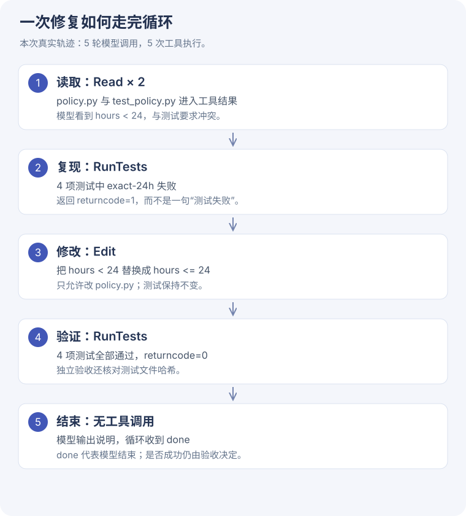

# Coding Agent 入门 · 修复一个 24 小时边界

[一步步读源码](coding-code.md) · [完整实验记录](../assets/task5/coding-evidence.json)

## 要解决的问题

如果只让模型解释某个函数，无法看到它怎样执行操作。这次让它真的读取、修改一个临时目录中的 Python 文件，并在修改前后运行同一套测试。

输入代码是教学夹具，不是老师/客服项目的退款实现：

```python
# 夹具原始代码：有意留下边界错误
def refundable(hours, flexible=False):
    return flexible or hours < 24
```

需求：24 小时内**含 24 小时**；超过 24 小时仅 flexible 票可退。

## 怎样限制实验范围

- 复用课程 `CodingAgent.run` 及其 OpenAI-compatible 流式循环。
- 工具只保留课程 Read、Edit，新增学习版 RunTests；没有暴露 Bash、联网或其他文件操作。
- Read 只能访问两个夹具文件，Edit 只能写 policy.py。
- 测试由运行脚本预置；模型没有修改测试的权限。
- 每轮完整 API 请求、流式 chunks 和工具事件都留存。

这是进程内学习隔离与路径白名单，不是生产级沙箱。





## 本次结果

| 项目 | 结果 |
| --- | --- |
| 模型调用 | 5 次 |
| 已回报 total_tokens | 11,527 |
| 模型使用工具 | Read × 2、RunTests × 2、Edit × 1 |
| 修改前独立测试 | 4 项中 1 项失败：exact-24h |
| 修改后独立测试 | 4/4 通过 |
| 测试文件哈希 | 修改前后相同 |

模型共执行 **5 次工具调用**。脚本另外在循环前后各运行一次固定测试，用于独立验收。

```diff
- return flexible or hours < 24
+ return flexible or hours <= 24
```

## 怎么判断这次真的完成

不能只用 `done` 事件：它仅表示模型这轮没有继续请求工具。这里要求原始测试失败、修改后测试通过、测试文件未被篡改；再记录实际修改内容。

这组测试只覆盖这一个函数的四个条件，不证明整个课程 Agent 对复杂仓库可靠。收益在于你可以完整追踪“模型输出如何变成磁盘变化与进程结果”。

## 动手练习

把 fixture 的 `hours < 24` 改成 `hours <= 25`，先预测哪一项测试会失败。然后运行脚本，在新的时间戳目录里观察轨迹，避免覆盖本次证据。

??? tip "预测答案"
    24.1 小时测试会失败。虽然 exact-24h 通过了，但多退了窗口外的票。边界测试要同时覆盖边界以内、边界点、边界以外。
