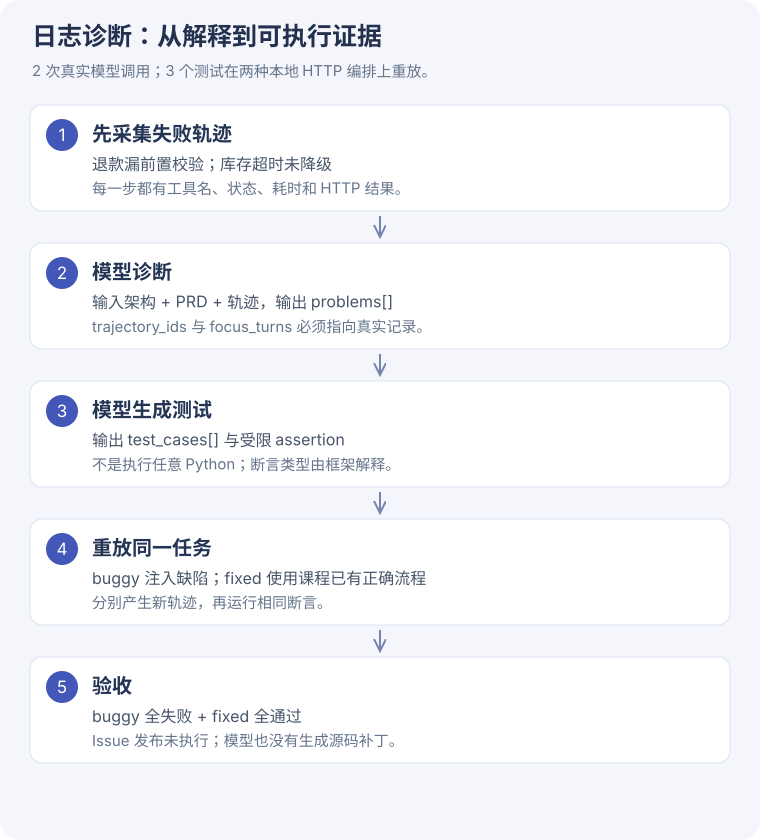
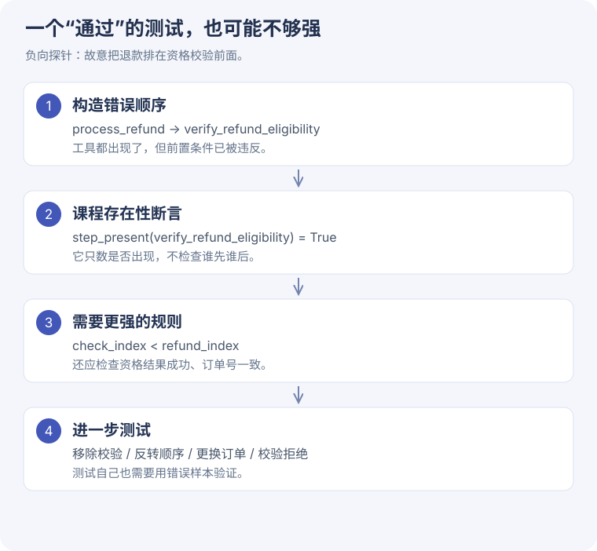

# 5-11 日志诊断 · 让模型的解释接受测试

[一步步读源码](diagnosis-code.md) · [完整证据](../assets/task5/diagnosis-evidence.json) · [学习运行脚本](../assets/task5/run_diagnosis.py)

## 为什么这个实验值得做

老师/客服和实时对话都会产生长链路。用户说“没办成”，我们需要知道哪次工具失败、哪里违反需求、以后怎样自动发现同类问题。

本次使用课程生成的教学订单数据，在本机启动真实 HTTP 子进程。没有读取用户生产日志，也没有真实退款。

## 两个缺陷怎样产生

- **退款流程**：注入缺陷的 orchestrator 直接调用 process_refund，省掉 verify_refund_eligibility。
- **库存流程**：源站故意变慢；缺陷流程等待超预算后失败，正确流程提前超时并走降级缓存。

服务、计时、HTTP 返回是真实运行；业务数据和故障由课程夹具构造。正确流程已经存在于课程 `_trajectory`，通过 inject_regressions 切换。

## 模型做了什么

第 1 次调用输入架构、PRD、两条失败轨迹，生成两个带具体轨迹 ID/轮次的诊断。第 2 次调用输入诊断与约束，生成三条 DSL 测试。

| 测试 | 断言 | 错误流程 | 正确流程 |
| --- | --- | --- | --- |
| `TC-R1-001` | `step_present` | 失败（预期） | 通过 |
| `TC-R2-001` | `latency_under` | 失败（预期） | 通过 |
| `TC-R2-002` | `final_status_is` | 失败（预期） | 通过 |

本次一次生成就通过结构校验和双版本重放，没有触发最多三轮的反馈修正。调用 2 次，total_tokens=3,207。

### 真实测量的一个例子

库存延迟测试：错误流程最大 check_stock 耗时约 351.9ms，超过 250ms；正确流程先以约 100ms 的截止时间试源站，再请求缓存。具体每次 HTTP 的耗时见原始证据，不把本机时延推广为线上服务性能。

## 必须区分的四件事

1. **模型发现问题**：已完成，有原始响应。
2. **模型生成测试**：已完成，用程序实际重放。
3. **模型生成并应用业务修复**：本实验未做，正确实现来自课程。
4. **向 GitHub 创建 Issue**：未做，不触发外部沟通操作。

因此完整表述是“模型诊断与测试生成，通过课程已有两种流程验证”；不能写成“自动修好了生产故障”。

## 一个通过结果之外的新发现

课程退款测试只要求校验工具出现。故意构造“先退款、后校验”，`step_present` 仍判 True。这是我们另外执行的离线负向探针，说明断言弱于 PRD 的“必须先校验”。

同理，latency_under 检查的是某工具单次最大耗时，不是整条库存链路端到端耗时。真实项目要同时记录阶段预算和总截止时间。

## 对你的项目意味着什么

先固定日志结构：task/turn/tool、输入、输出、状态、耗时；用稳定错误码与请求标识串起一次操作。再把需求写成可执行规则，例如“答复操作成功前，必须有对应成功回执”。

本次不是给业务项目安装诊断系统，而是准备一条可迁移的学习路径；后续需用脱敏的真实案例检验规则。
