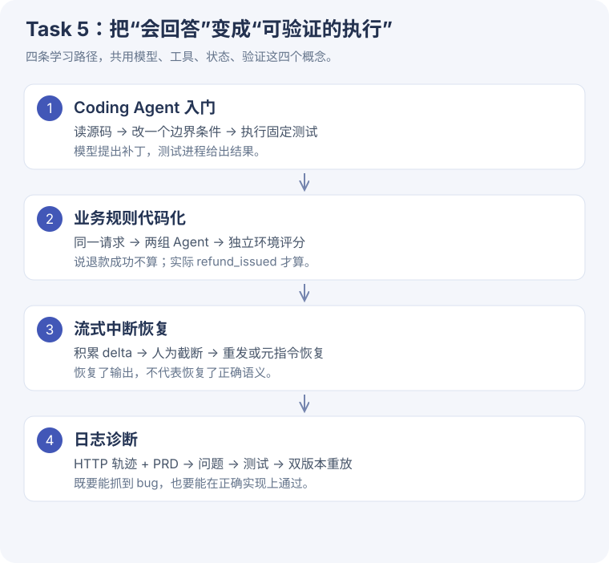

# Task 5 · Coding Agent 与可验证的执行

从会调用到能验收 / TASK 5
读完这一章，你应能解释：程序为何相信一次工具执行、如何从中断恢复，以及怎样用证据证明任务真的完成。

本次按你的老师/客服与实时对话项目挑选重点，不跑全章。这里的 Task 5 沿用本站按章节组织的编号。实验在 **2026-09-29** 本地执行，使用 DeepSeek `deepseek-flash`；课程源码固定在 `cf7f7a8e16b2`。

## 先看范围，再看结论

| 学习单元 | 本次完成 | 不能据此声称什么 |
| --- | --- | --- |
| [Coding Agent 入门](coding.md) | 课程真实循环、两文件夹具、读取—修改—测试 | 没有在你的业务仓库里自动改代码 |
| [5-5 业务规则代码化](rules.md) | 8 案例 × 2 臂、8 个错误自报探针、边界措辞后续对照 | 不是 60 案例 Qwen3-4B 正式活动；不能证明总体提升 |
| [5-2 流式恢复](stream.md) | 2 断点 × 2 策略 × 2 重复，真实流式响应 | 不包含思考断点、原生前缀续写、语音播放取消 |
| [5-11 日志诊断](diagnosis.md) | 真实本地 HTTP、模型诊断/生成测试、双版本重放 | 未创建 GitHub Issue；正确实现来自课程，不是模型写的修复 |

课程部分子目录仍使用旧编号（如规则写“5-3”、诊断写“5-8”）。本站以 **chapter5/README.md** 当前目录为编号准则，同时保留真实文件名；不要仅靠编号猜文件。

## 正文补读

新增 [正文串讲与架构选择](reading.md)：解释 Coding 基础能力的适用范围、工作区与可复用能力、Harness 以及客服/实时对话的架构区别。建议先读这一页，再进入下面的实验。

## 建议的阅读顺序

1. [知识点地图](concepts.md)：先掌握模型、工具、运行环境、验证器之间的关系。
2. [Coding Agent 实验](coding.md) → [一步步读源码](coding-code.md)：跟随一个 24 小时边界修复。
3. [规则实验](rules.md) → [源码设计](rules-code.md)：为什么后端能防误退，却不能自动防误拒。
4. [流式恢复实验](stream.md) → [源码设计](stream-code.md)：半截字符串如何变回可验证的输出。
5. [诊断实验](diagnosis.md) → [源码设计](diagnosis-code.md)：把“看起来有道理的诊断”变成能失败的测试。
6. [项目结合与动手练习](practice.md)：把机制迁移到你的工作；[运行证据](evidence.md)可复查。

## 本次最有价值的三个发现

- 两组退款实验均 **7/8**。同一个 exact-24h 案例误拒，原因是模型没有调用后端，而非后端规则算错。
- 流式恢复 **8/8** 通过本次语义检查；元指令臂没有表现出总 token 优势。不能把“少写一点正文”直接当作“整次恢复更便宜”。
- 诊断生成的 **3 个测试均能在错误流程失败、正确流程通过**，但课程的 `step_present` 仍抓不到“先退款、后校验”的顺序错误。

## 本次不做的实验

5-1 跨厂商接管、5-12 动态表单、5-15 权限数据层留作后续；数学、逻辑、多媒体、CAD、自动创建 Agent 等不在本次选定范围。优先把以上四条主线学懂，再扩展应用形态。

!!! note "教学代码与真实代码"
    小代码块若标“教学示意”，仅用于解释机制；标“课程源码原文”的内容按固定提交摘录，并有文件、函数、行号。运行适配脚本、请求/响应与实验记录均可下载。业务项目部分是迁移设计建议，本次没有读取或修改你的老师/客服、实时对话业务代码。
