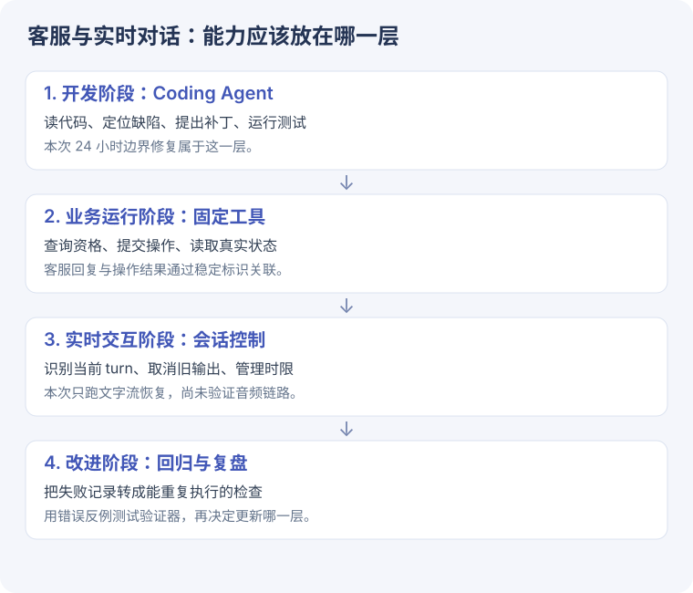
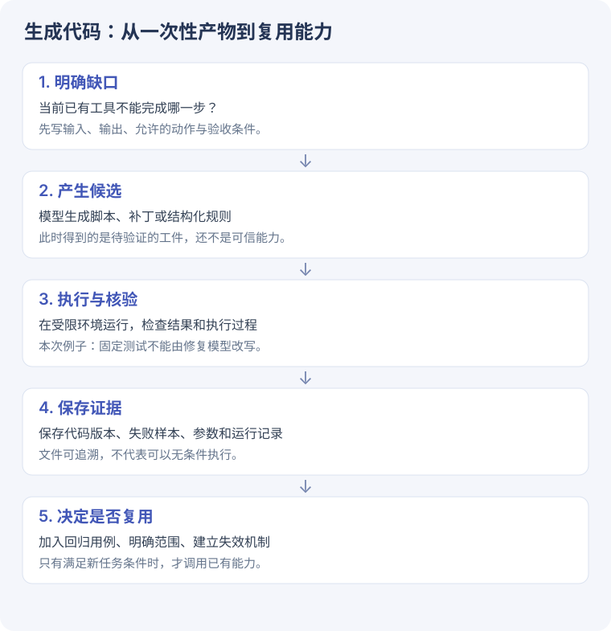

# 正文串讲 · Coding 为什么是基础能力，怎样用到我们的项目

[原书第 5 章正文](https://bojieli.github.io/ai-agent-book/book/chapter5/) · [知识点地图](concepts.md) · [实验导航](index.md)

**补读日期：2026-09-29。** 本页对照在线正文，并结合本地固定版本和我们已经完成的实验。书中的架构观点、我们的实测结果、后续设计建议分别标明；在线正文可能继续更新，实验源码仍固定在证据页记录的提交。

## 1. 先抓住主张，再判断适用范围

**原书观点概括：** Coding 能让 Agent 按任务构造新能力；文件工作区可承接中间工件。开放任务与垂直客服的架构重心不同，不能从前者直接推导出后者也要围绕动态代码执行。参见[基础能力](https://bojieli.github.io/ai-agent-book/book/chapter5/#coding-是-agent-的基础能力)及其后架构案例中的适用边界。

**用我们自己的例子理解：** 老师/客服要判断某个动作是否符合规则时，有两种不同问题：

- **开发问题**：规则函数写错了，需要读代码、修改、测试。这适合 Coding Agent。
- **运行问题**：用户这次是否符合已经确定的规则。这适合调用经过验证的业务接口。

如果每次用户提问都临时生成一个退款判断程序，同一个产品就可能出现许多略有不同的规则实现。我们的 exact-24h 失败已经说明，小小的边界歧义也足以改变结果。因此“具备 Coding 能力”不等于“每一轮对话都应该现场编程”。



### 判断自己是否需要动态生成代码

先问三个具体问题：

1. 已有工具能否稳定完成任务？能，就先复用。
2. 缺少的是一种固定业务能力，还是每次都变化的数据处理步骤？前者适合工程化新增接口；后者可能适合生成临时脚本。
3. 生成结果怎样检查？如果只能让同一个模型说“看起来对”，先改善验收，再扩大执行范围。

这里是我们的设计判断，没有对你的业务仓库做新修改。

## 2. 七种基础工具，读成能力覆盖表

原书列出的工具包括解释执行、Shell、文件读取/写入/编辑、文件名搜索、内容搜索；这是理解动作能力的划分，不是所有系统必须有七个同名接口。[对应正文](https://bojieli.github.io/ai-agent-book/book/chapter5/#coding-是-agent-的基础能力)

**下面是我们对入门实验的拆解：**

| 任务步骤 | 需要的能力 | 本次怎么实现 | 没有验证什么 |
| --- | --- | --- | --- |
| 定位文件 | 搜索路径与内容 | 任务直接给两个文件路径 | 没有测大仓库定位能力 |
| 了解当前实现 | 读文件 | 课程 Read | 没有测跨模块理解 |
| 改一个条件 | 局部编辑 | 课程 Edit，字符串唯一匹配 | 没有测复杂重构 |
| 检查行为 | 执行固定程序 | 学习版 RunTests | 没有开放任意 Shell |
| 保存结论 | 工件与日志落盘 | 学习运行脚本保存证据 | 没有自动更新业务知识库 |

这张表解释了为什么五轮循环能跑通，也解释了为什么它不能代表完整 Coding Agent 评测。缺少的能力应该写成范围，而不是靠“用了课程类”就假定全部覆盖。

### 读源码时怎样找工具

从“我想观察哪个动作”出发：Read 看返回值形状；Edit 看匹配与写入；RunTests 看退出码；最后回到循环，检查结果是否被写进下一轮消息。不要先把工具注册表所有类全部读一遍。

## 3. 代码是产物，经过验证后才可能成为能力

**我们的学习展开：** 一段生成代码至少有三种状态：候选代码、已在特定输入上验证的代码、带适用范围和回归检查的可复用组件。不要把它们都叫“Agent 学会了”。



本次 policy.py 修改通过四项测试，只能说这个夹具上的边界缺陷被修复。它不等于模型今后永远不会弄错 24 小时，也不等于代码自动进入你的业务系统。

如果想把经验留下，至少记录：

```yaml
# 教学示意：能力说明，不是本次已经上线的组件
name: refund_boundary_check
inputs: [hours_since_booking, fare_type]
known_boundary: "24.0 included; 24.1 excluded for basic fare"
verification: "normal + exact boundary + outside + exception"
owner: "business policy maintainer"
invalid_when: "policy version changes"
```

这段说明最有用的字段不是名字，而是 invalid_when：业务规则变更后，旧经验需要失效。写入文件提供了保存手段，不能代替正确性与时效检查。

## 4. 工作区不仅放代码，还应让结果可追溯

**对应本次实际文件：**

```text
learning/task5/
├── run_rules.py           # 怎么执行对照
├── common.py              # 怎么记录调用
└── runs/rules/<时间>/
    ├── calls.json         # 每轮实际请求与响应
    ├── rows.json          # 按案例组织的轨迹
    ├── evidence.json      # 范围、评分、源码哈希
    └── evidence.sha256    # 检查文件是否变化
```

这几种文件各回答不同的问题：脚本回答“怎么跑”，调用记录回答“模型当时看到什么”，证据回答“如何评分”，哈希回答“文件是否和当时一致”。哈希正确并不能证明实验设计正确。

### 本次记录器修复为什么值得学习

第一版记录器把消息列表的引用存了下来。课程循环下一轮继续 append，先前记录也跟着变了。修复时在调用前深拷贝请求，再重跑受影响对照。

```python
# 教学示意：记录当时的快照，而不是未来还会变化的对象
request_snapshot = copy.deepcopy(request)
response = client.create(**request)
save(request_snapshot, response)
```

这里的教训是：能保存日志不等于保存了准确的历史。以后复盘“模型为什么做错”时，必须先确认日志真的对应当时的信息。

## 5. 用本次证据理解 Harness，而不是记一个名词

**原书阅读入口：** [Harness 工程](https://bojieli.github.io/ai-agent-book/book/chapter5/#harness-工程在-coding-agent-中的实践)。下表是我们对已跑实验的归纳。

| 设计问题 | 本次做法 | 仍然存在的边界 |
| --- | --- | --- |
| 允许模型改什么？ | 只允许 Edit 写 policy.py | 路径白名单不是操作系统沙箱 |
| 什么算完成？ | 原测试失败，改后通过，测试文件哈希不变 | 只覆盖四个指定条件 |
| 操作失败怎么反馈？ | 返回结构化工具结果进入下一轮 | 模型不调用工具时没有这份反馈 |
| 如何避免无限运行？ | 设置最大轮数/尝试数 | 达到上限应报告未完成 |
| 结果由谁裁决？ | 程序评分与 HTTP 重放 | 评分程序自身可能太弱 |

最后一行很关键：课程 step_present 放过“先退款、后校验”，不是模型生成 JSON 的问题，而是验收口径没表达顺序。改进模型之前，也应该检查测试是否真的描述了需求。

## 6. 恢复不应只有一个 retry 按钮

**对应阅读：** [故障与错误恢复](https://bojieli.github.io/ai-agent-book/book/chapter5/#故障与错误恢复)。下面是给两个项目准备的判断练习，除已注明项外尚未实测。

| 看到的现象 | 先检查什么 | 合理的下一步 | 本次证据 |
| --- | --- | --- | --- |
| 当前文字流被截断 | 已提交历史与当前缓冲是否分开 | 重发当前轮或明确说明断点 | 已跑两策略 |
| 参数不能解析 | 调用是否完整、schema 是否仍在 | 退回结构化错误或重新生成 | 做了缓冲讲解，未跑完整修复矩阵 |
| 同一错误反复出现 | 输入和状态是否真的变化 | 停止无进展重试，改变方案 | 未做循环熔断实验 |
| 业务请求超时 | 服务端动作是否已生效 | 先查 operation_id 的状态 | 设计建议，未接业务接口 |
| 连接一直不出新内容 | 最近一次活性信号时间 | 触发空闲超时并分类恢复 | 本次未测静默卡死 |

对实时对话，“尽量自动恢复”还要受时延预算约束。一个后台任务可以等的时间，未必适合用户正在说话的主链路。这里不设拍脑袋的通用秒数：应先测阶段耗时，再定义产品能接受的延迟。

## 7. 搜索与编辑：把未知问题缩小到可改的一处

从[搜索工具](https://bojieli.github.io/ai-agent-book/book/chapter5/#coding-agent-中的搜索工具)和[文件编辑工具](https://bojieli.github.io/ai-agent-book/book/chapter5/#coding-agent-中的文件编辑工具)继续读时，可以补做下面的**离线练习**，无需新增模型实验：

1. 不告诉自己 policy.py 的路径，先按测试失败中的函数名找定义。
2. 查看调用方，确认 hours 单位确实是小时。
3. 阅读边界测试，写出修改前的预测结果。
4. 只替换唯一匹配的表达式，再检查 diff。
5. 测试后重新读文件，确认没有改动其他条件。

**为什么这些步骤有价值？** 本次任务直接给了路径，因此省略了最容易读错位置的阶段。真实仓库里同名函数、包装层和过时副本都可能让“改对了逻辑”发生在错误文件中。

如果字符串出现多次，不应立即 replace_all；先补足上下文，确认想改的是哪一个调用路径。这里是从本次 Edit 的匹配机制推导出的工作方法。

## 8. “代码能跑”仍然不够

原书强调执行反馈的价值。我们需要给这条认识加上实验中的限制：

- `{"city":"大阪"}` 是合法 JSON，却不满足东京任务。
- `hours < 24` 是合法 Python，却不满足包含边界的需求。
- “先退款、后校验”的日志可以满足工具存在性断言，却违反前置顺序。

所以验收应同时看表示、逻辑、状态与过程。确定性程序会稳定执行错误规则；“用代码表达”本身并不能证明规则来自正确需求。

## 9. 怎么用这次补读安排后续学习

本次继续保留原来的选做范围，不因读到更多案例就扩大到全章实验。

| 后续目标 | 最值得补的工作 | 开始条件 |
| --- | --- | --- |
| 让客服判断更一致 | 只读资格接口与误拒回归 | 先拿到明确的业务规则 |
| 让实时对话恢复更稳 | 空闲超时、旧 turn 丢弃、动作状态查询 | 有可测的对话链路与测试夹具 |
| 支持备用模型 | 两厂商轨迹接管对照 | 两边凭据和协议能力明确 |
| 把脚本变成长期能力 | 固定接口、回归集、版本与失效条件 | 同类任务已重复出现 |

读正文时先问“它解决什么类型的问题”，再问“我们现有哪条证据支持它”，最后问“还缺哪一个反例”。这样笔记会同时保留原理和判断依据，而不是把正文改写成另一份长摘要。

## 回到原书与本地证据

- [在线第 5 章](https://bojieli.github.io/ai-agent-book/book/chapter5/)：继续阅读尚未选做的应用方向。
- [本次实验与源码入口](index.md)：只把实际运行的部分标为完成。
- [运行证据和适配范围](evidence.md)：核对模型、样本、记录器修复和未执行项。
- [项目结合练习](practice.md)：把本页的架构选择转换成自己的代码任务。
