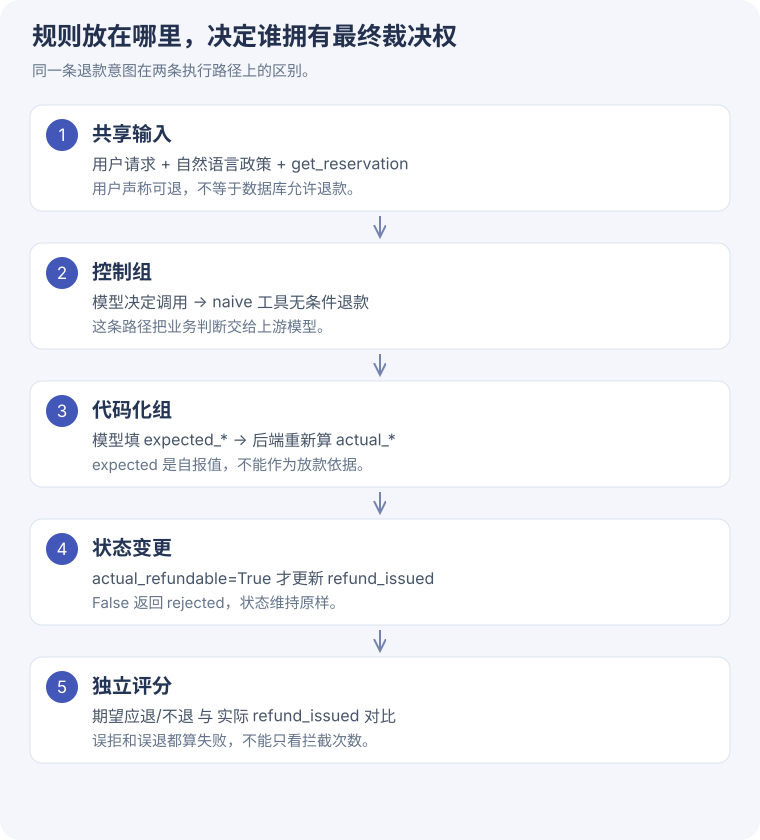
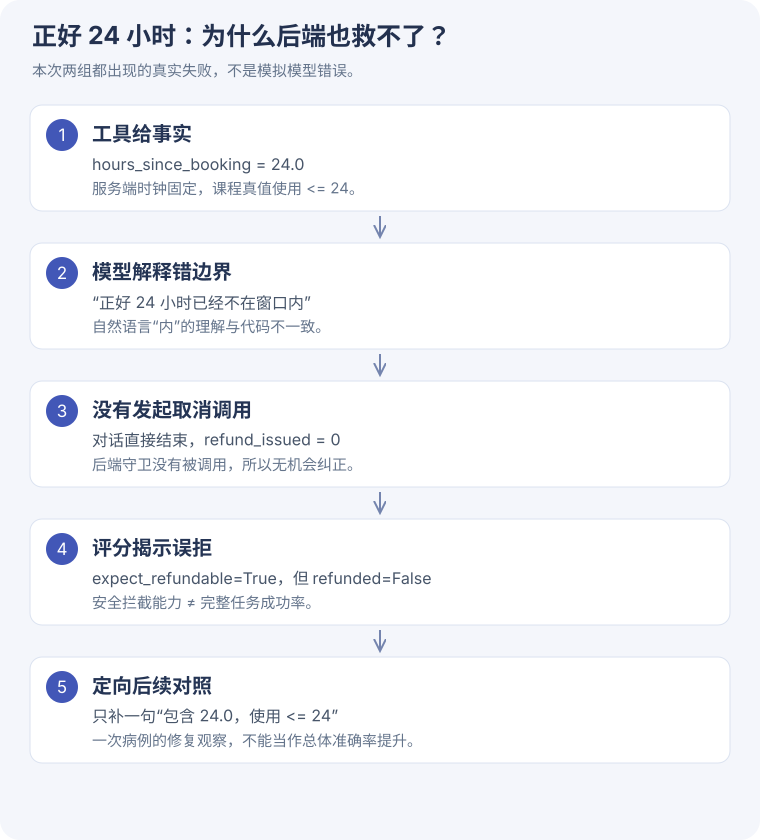

# 5-5 业务规则代码化 · 防误退，也要看误拒

[一步步读源码](rules-code.md) · [正式学习版记录](../assets/task5/rules-evidence.json) · [边界措辞后续记录](../assets/task5/boundary-evidence.json)

## 实验问题与设计

客服模型看了退款政策，仍可能错误判断。把最终判断放到工具内部后，是否更可靠？

复用课程冻结的 60 案例矩阵，选 8 个覆盖：5h、24h、24.1h、120h、正常/轻微延误/航司取消、基础经济/灵活/商务。每个案例在独立环境上跑 control 与 codified，共 16 条模型轨迹。两组共用同一个 DeepSeek 模型，temperature=0，thinking 关闭，最多 6 轮。

| 条件 | control | codified |
| --- | --- | --- |
| 自然语言政策 | 有 | 有，额外要求先查事实并核对 |
| 工具描述 | 简短取消说明 | 包含政策 checklist |
| 工具参数 | reservation_id | 加 expected_refundable / expected_reason |
| 后端执行 | 无条件全额退款 | 按服务端时钟和预订事实校验 |

这是三处同时变化的组合对照，不能用它单独量化后端守卫的因果效应。

## 本次结果：两组均 7/8

| 案例 | 服务端真值 | control | codified |
| --- | --- | --- | --- |
| `TB001-basic_economy-h5p0-scheduled` | 可退 | 通过 | 通过 |
| `TB005-basic_economy-h24p0-scheduled` | 可退 | 误拒 | 误拒 |
| `TB009-basic_economy-h24p1-scheduled` | 不可退 | 通过 | 通过 |
| `TB010-basic_economy-h24p1-cancelled_by_airline` | 可退 | 通过 | 通过 |
| `TB012-basic_economy-h24p1-delayed_minor` | 不可退 | 通过 | 通过 |
| `TB020-basic_economy-h120p0-delayed_minor` | 不可退 | 通过 | 通过 |
| `TB021-economy_flex-h5p0-scheduled` | 可退 | 通过 | 通过 |
| `TB041-business-h5p0-scheduled` | 可退 | 通过 | 通过 |

两组均无误退，均出现 1 次误拒。代码化组 4 条 checklist 自报值与真值一致；**没有在本轮真实模型轨迹里观察到“模型要求违规退款，被守卫拦截”的案例**。

模型调用 40 次，total_tokens=41,284。样本是目的性选择的小集合，不是随机总体样本，也没有重复运行估计方差。

## 失败回放：正好 24 小时

服务端 `is_refundable` 使用 `<= timedelta(hours=24)`，因此 exact-24h 应退。模型却把“24 小时内”解释成不包含边界，并直接回复不可退，两组都没有执行退款。

这说明后端守卫只在调用时工作。业务上还可以增加只读资格判断工具，让模型查询 `eligible + reason_code`，但本次没有把这个新设计混进原两臂。

## 定向扩展：只改边界措辞

观察到失败后，只给两组 system prompt 都追加：

> 24 小时内包含正好 24.0 小时，即 hours_since_booking <= 24；24.1 小时不在窗口内。

仅重跑 TB005，各一条轨迹。结果：control 退款正确; codified 退款正确。调用 6 次、tokens=6,964。

这是**事后针对一个失败病例的验证**，不是独立测试集，不能说整体准确率从 87.5% 提升到 100%。它说明边界歧义是这次失败的一个可干预因素。

## 离线探针：刻意给错误自报值

对同一 8 个案例，直接调用 codified 工具，令 expected_refundable 与真值相反。8/8 最终退款状态仍遵循课程规则。

这里的错误是程序注入的，不是模型自然犯错。它验证“自报值不参与放行决策”，不能拿来充当模型对照的拦截率。

## 预跑记录与取样修正

首次预跑误取矩阵前 8 项，全部是应退案例，无法覆盖违规放行。记录保留在[预跑证据](../assets/task5/rules-pilot-evidence.json)：两组都是 6/8，失败集中在 24h 边界。随后按边界、舱位、航班状态重选 8 项，得到上表。

上述集合不能合并成独立样本，因为有重复。发布前还修复了记录器的消息列表快照问题，按相同选择再次执行两臂与边界后续；本页使用最后一次记录完整的运行，两臂仍为 7/8。先前运行保留在本地，调用开销见[运行清单](../assets/task5/run-inventory.json)，不混入当前分母。

## 对老师/客服项目的启发

模型可以负责解释和收集信息，资格规则由后端基于真实状态计算。需求阶段就写清 `<=` 还是 `<`；拒绝也必须能查到 reason_code。对用户体验同时关注“违规操作是否被拦住”和“本来能办的事是否被误拒”。

这里讨论的是迁移方向，没有把课程航空政策当成你的实际业务规则。
