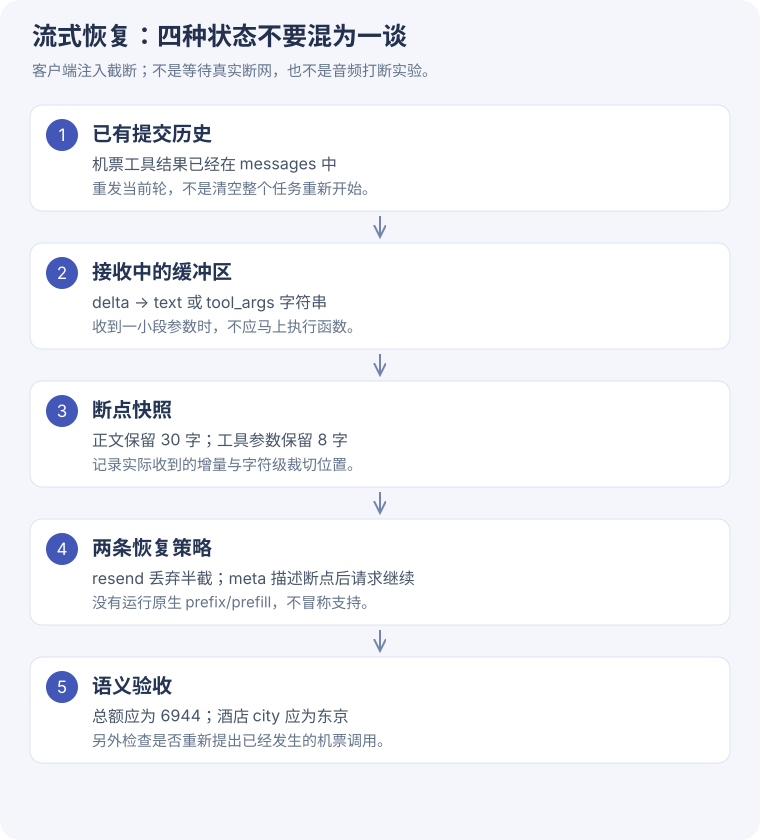

# 5-2 流式中断恢复 · 能接上，也要接对

[一步步读源码](stream-code.md) · [原始流片段](../assets/task5/stream-streams.json) · [恢复调用回执](../assets/task5/stream-calls.json)

## 固定任务与正确答案

课程差旅任务：北京到东京，机票 3200 元，住宿 18000 日元/晚 × 3 晚，餐费 6000 日元/天 × 4 天，汇率 0.048。

**正确总额 = 3200 + 18000×3×0.048 + 6000×4×0.048 = 6944 元。**

价格工具是本地确定性函数，没有查询真实机票。故障是客户端主动截断真实模型流，不是等待厂商自然断网。

## 两类断点与两种策略

- **正文断点**：四种价格结果已经齐备，模型写总结时保留前 30 个字符。
- **参数断点**：机票已在历史中，强制下一步酒店工具，把参数保留前 8 个字符。
- **resend**：保留已提交历史，丢掉本轮半截内容，重发当前轮。
- **meta**：在相同历史后加 user 消息，说明断在哪里并要求继续。

每个断点重复 2 次，同一断点快照交给两种恢复策略。共 4 次取流、8 次恢复调用。

## 实测结果

| 断点 | 重复 | 恢复策略 | 本次语义检查 | 恢复输出 tokens | 恢复总 tokens |
| --- | ---: | --- | --- | ---: | ---: |
| text | 1 | resend | 正确 | 200 | 984 |
| text | 1 | meta | 正确 | 191 | 1017 |
| text | 2 | resend | 正确 | 205 | 989 |
| text | 2 | meta | 正确 | 196 | 1020 |
| tool_args | 1 | resend | 正确 | 64 | 484 |
| tool_args | 1 | meta | 正确 | 64 | 509 |
| tool_args | 2 | resend | 正确 | 34 | 454 |
| tool_args | 2 | meta | 正确 | 64 | 509 |

本次 8/8 正确；未发现再次提出同一机票调用。参数臂固定 tool_choice=get_hotel_price，因此这个结果只衡量固定工具下的恢复，不能证明自由工具选择也可靠。

## 元指令没有更省总 token

正文两次：元指令分别少输出 9 个 token，但多了断点说明等输入，总 token 反而分别高 33、31。参数两次：元指令总 token 也更高。

只比较恢复请求，8 次合计 5,966 tokens。**截断流在 usage 返回前关闭，其 token 消耗未知，没有算入总量。** 因此不能把这里写成整个实验的完整账单，也不据此估算费用。

## 原课程判定与本次补充判定

课程 `recovered` 对正文主要看长度增长，对参数主要看能否得到 JSON。学习版同时要求：

- 正文通过课程 `answer_is_correct`：文本中出现 6944 附近（课程允许 1% 误差）的数值。
- 参数等于 `{"city":"东京"}`，并且工具名是 get_hotel_price。

正文判据依然较弱：没有逐项核算整段叙述，也没有完整验证字符重复。这里的“语义检查通过”应按这个具体口径理解。

离线负例 `{"city":"大阪"}` 完全可以解析，但城市不对。它说明 JSON 合法与业务语义正确不是同一个条件；不是说本次模型真的输出了大阪。

## 与实时对话的关系

适用：模型流中断时如何保留已完成工具结果、放弃不完整参数、记录恢复后的语义是否变化。

未覆盖：麦克风输入、ASR、TTS、音频缓存、用户插话后取消旧任务。本次没有音频实验，更不能把“再次生成文字”直接当作“语音对话无缝恢复”。

## 动手验证

先把参数截断长度从 8 改成 4，预测它是否还在键名中；再观察恢复时的完整参数。每次只改一个条件，并另外记清是流增量边界还是客户端字符裁切。

本次采用课程的字符级故障注入：即使一个 SSE 增量一次给了较完整内容，也会裁到字符阈值。因此这并不证明厂商天然逐字符输出参数。
