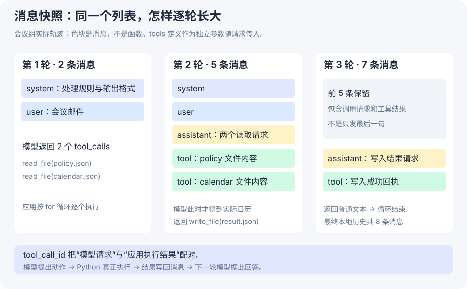

# 6-1 代码精读：从一个事件到三轮模型调用

[实测结果](event-agent.md) · [上一课：事件队列](event-trigger-code.md)

本课的目标：看完之后，你能写出一个小 Agent 循环，并指出哪些步骤由模型做、哪些步骤由 Python 做。先沿着会议邮件读，不从 1300 行 `agent.py` 第一行开始。

## 1 先看调用关系，找到要读的几处

```text
我们的 run_61_model.py
  ├─ 创建合成 Event，放入原版队列
  └─ 原版 EventLoop.run()
       └─ 教学 dispatch(event)
            └─ 原版 agent.handle_event(event)      ← 本课主线
                 ├─ event.to_user_message()
                 ├─ client.chat.completions.create()
                 ├─ _execute_tool(name, args)
                 │    └─ 原版 _tool_read_file / _tool_write_file
                 └─ 将工具结果追加到 conversation_history，再次调用模型
```

不要混淆两个循环：**外层事件循环每次处理一封邮件；内层 Agent 循环为同一封邮件多次调用模型。** 本次每个样例启动独立 Agent，外层只取一条事件，内层实际运行三轮。

## 2 第一处：把事件适配成模型能读的消息

问题：队列里是 Python `Event` 对象，模型接口需要的是消息列表。适配位置应该在处理器入口，避免每个事件源都要了解模型协议。

课程 `handle_event()` 的关键语句（中间省略可选时间戳与计时处理）：

```python
user_message = event.to_user_message()
self.conversation_history.append({
    "role": "user",
    "content": user_message,
})
```

本次 IM 之外使用 `EMAIL_REPLY`，`to_user_message()` 会生成包含来源、主题和正文的字符串。名字叫 EMAIL_REPLY 不意味着真的连接了邮箱；它只是课程的事件类别。

此刻历史有两条：

```python
[
    {"role": "system", "content": "测试邮件处理规则……"},
    {"role": "user", "content": "[Email Reply from sender@example.invalid]\nSubject: 会议邀请\n请于……"},
]
```

这个列表中还没有日历内容。模型知道文件名，是因为系统提示指定了 `calendar.json`；文件的内容需要工具读取后才出现。

**源码：** [event_types.py::to_user_message](https://github.com/bojieli/ai-agent-book/blob/cf7f7a8e16b234ac303034e4ec8f75bf2d61ac2c/chapter6/agent-with-event-trigger/event_types.py#L37)；[agent.py::handle_event](https://github.com/bojieli/ai-agent-book/blob/cf7f7a8e16b234ac303034e4ec8f75bf2d61ac2c/chapter6/agent-with-event-trigger/agent.py#L1059)。

## 3 第二处：messages 与 tools 为什么分开

课程调用核心（省略温度等参数）：

```python
messages_to_send = self.conversation_history.copy()
response = self.client.chat.completions.create(
    model=self.model,
    messages=messages_to_send,
    tools=self._get_tools_description(),
    tool_choice="auto",
)
message = response.choices[0].message
```

- `messages`：这次要让模型看到的上下文。
- `tools`：可调用函数的名称、说明、参数结构。
- `tool_choice="auto"`：让模型决定返回文字还是提出工具调用。
- `message`：SDK 返回的对象；不是整个历史列表。

`.copy()` 是浅拷贝列表。它方便本次请求追加临时提示而不直接改变列表长度，但不是把每个嵌套字典都深复制。本课关闭 system hints，使观察焦点保持在邮件和工具回传。

工具定义只告诉模型“可以怎么请求”。它没有在 API 调用期间把你电脑里的 Python 函数传到模型服务器执行。

## 4 第三处：模型提出调用，Python 才真正执行

会议第一轮返回两个调用：`read_file(policy.json)` 和 `read_file(calendar.json)`。结构示意如下，ID 已缩短：

```json
{
  "role": "assistant",
  "tool_calls": [{
    "id": "call_00_…",
    "type": "function",
    "function": {
      "name": "read_file",
      "arguments": "{\"file_path\":\"policy.json\"}"
    }
  }]
}
```

注意 `arguments` 是 **JSON 字符串**，还不是 Python 字典。课程先做 `json.loads(raw_args)`，再执行函数。

```python
# 教学简化：省略解析失败处理、计数和日志
self.conversation_history.append(message.model_dump())
for tool_call in message.tool_calls:
    name = tool_call.function.name
    arguments = json.loads(tool_call.function.arguments)
    result, error = self._execute_tool(name, arguments)
```

这里的 `message.model_dump()` **确实存在于课程源码**，是把 SDK 消息对象转换成字典后保存在历史中，不是笔记额外发明的步骤。

为什么先保存 assistant 消息？因为后面要追加工具结果，需要保留“模型刚才请求了哪个调用”作为配对依据。

课程 `_execute_tool()` 根据函数名称分发到 `_tool_read_file(**arguments)` 等函数。模型说要读文件，与 Python 成功读出文件，是两件事。真实文件结果可以在本次 tool receipts 中看到。

**源码：** [agent.py::_execute_tool](https://github.com/bojieli/ai-agent-book/blob/cf7f7a8e16b234ac303034e4ec8f75bf2d61ac2c/chapter6/agent-with-event-trigger/agent.py#L737)。

## 5 第四处：为什么工具结果要放回 messages

若 Python 只把文件内容打印到终端，模型并不会自动看到终端。所以应用需要创建一条 `role=tool` 消息。

```python
# 课程真实结构；本课已关闭前缀提示
self.conversation_history.append({
    "role": "tool",
    "tool_call_id": tool_call.id,
    "content": json.dumps(result),
})
```

三个字段各有用途：

|字段|含义|遗漏后失去什么|
|---|---|---|
|`role="tool"`|这是一条工具返回|无法按工具结果的协议处理|
|`tool_call_id`|回答的是哪次请求|多个调用时无法可靠配对|
|`content`|执行结果序列化为字符串|模型看不到真正读出的资料|

会议第一轮 assistant 一次提出两个调用，因此后面是两条 tool 消息。**一条 assistant 消息不等于一次工具调用。**

[](../assets/task6/61-model-messages.svg)

现在可自己数：system + user + assistant + tool + tool = **5 条**。第二轮请求就是带着这五条去调用模型。

## 6 第五处：第二轮为什么会写文件，第三轮为什么结束

第二轮已经看到日历，因此模型能比较时间，生成 `write_file` 请求。课程的 `_tool_write_file()` 真正打开文件写入字符串，并返回 `success`、`file_path`、`bytes_written` 等信息。

Python 将写入请求与成功回执加入历史：5 + 1 + 1 = **7 条**。这时第三轮模型收到的是“文件已经写成功”的证据，于是返回普通文字总结。

课程当前的普通结束分支是：

```python
# 教学简化，省略 FINAL ANSWER: 兼容解析和轨迹保存
has_tool_calls = bool(getattr(message, "tool_calls", None))
if not has_tool_calls:
    self.conversation_history.append(message.model_dump())
    final_answer = (message.content or "").strip()
    break
```

所以不用强迫模型输出 `FINAL ANSWER:` 才能结束。最终回复也被保存，历史从 7 变为 **8 条**。

有两种边界要记住：空回复也会结束但不构成非空最终答案；达到 `max_iterations` 也会退出，不能仅凭循环停止就宣称任务成功。我们另外检查落盘结果和工具回执。

## 7 教学适配器到底改了什么

[完整实验脚本](../assets/task6/run_61_model.py) 定义 `LearningAgent(EventTriggeredAgent)`，**没有覆盖 `handle_event()`**。

|适配点|原因|保留的课程逻辑|
|---|---|---|
|DeepSeek 客户端|课程 provider 列表无直接 DeepSeek 分支|Chat Completions 的消息与工具协议、整个处理循环|
|测试专用 system prompt|把通用 Agent 定向为邮件任务，规定输出 JSON|事件转消息、历史维护、模型决策|
|工具列表只留 read/write|本课只需要测试文件读写|原版函数 schema、实际文件工具实现|
|路径白名单|限定读取 policy/calendar、写 result|允许路径通过后调用原版 `_execute_tool`|
|请求记录器|保存每一轮实际请求、响应和 usage|请求仍真实发往 DeepSeek|

### DeepSeek 是怎样接进去的

课程 `dashscope` 初始化分支允许通过 `DASHSCOPE_BASE_URL` 指定兼容接口。实验在进程内将该地址设为 DeepSeek 地址，用 DeepSeek key 初始化，再把记录用的 provider 标签改为 `deepseek`，并接入带记录器的真实客户端。**没有请求 DashScope 服务，也没有修改 `.env` 或课程 provider 枚举。**

这是为了最小改动复用课程循环的教学适配。生产代码更适合显式注入 client 或新增 DeepSeek provider，避免初始化标签和实际服务需要额外解释。

### 为什么工具列表过滤和执行检查都有

列表过滤减少模型可见选项；执行检查保证返回未知函数或越界路径时不会直接执行。两层职责不同。本课只允许：

```text
read_file  → 当前样例目录的 policy.json / calendar.json
write_file → 当前样例目录的 result.json
```

这只是固定实验范围的限制，不是通用沙箱。我们未测试恶意并发替换文件、操作系统级隔离等问题。

### Recorder 为什么仍然是真模型

核心结构：

```python
# 教学简化：省略序号、计时和文件路径
class Recorder:
    def create(self, **kwargs):
        save_request(kwargs)
        response = real_client.chat.completions.create(**kwargs)
        save_response(response.model_dump())
        return response
```

它不编造响应，只把请求和响应旁路记录。要验证这一点，读实际脚本里的 `Recorder.create()`，再看 `calls.json` 中的 API usage。

## 8 为什么“Agent 说完成”还不够

`handle_event()` 的 `success` 主要取决于是否获得最终答案，并不是逐条业务规则校验器。模型即使解释错了，也可能有最终文本。

本次验收分开看：

1. **执行证据**：调用 ID 配对、工具实际成功、结果文件存在。
2. **结构化结果**：分类和动作是否符合预设、订单号是否一致。
3. **语义复核**：摘要是否保留诉求、日历是否真冲突、有没有多余推断。
4. **交付边界**：文件产出不等于通知真人或修改邮箱。

因此投诉组多读日历仍可通过本次功能检查，但要单独记为效率问题。原始报告不因这条观察被事后改成“全方位优秀”。

## 9 对照我们的客服项目

在 `next-tweakcube-chain` 中，可以把“邮件”换成家长消息来理解职责：

- 接入层负责构造事件或内部消息，不必直接拼模型协议。
- 业务工作流负责组织上下文与调用模型。
- 工具执行器负责真实查询或动作；模型只提出请求。
- 工具返回后，模型才具备基于实际资料继续回答的条件。
- 候选回复交给发送链路之前，还要通过任务时效与业务规则检查。

本次验证覆盖中间的模型与工具闭环。它没有验证业务项目的 Redis、撤回消息、start_token 竞争或真实发送回执。

## 10 自测：能讲明白这些，就掌握了本课主线

??? question "模型第一轮说 read_file，文件是谁打开的？"
    是应用程序调用 `_execute_tool`，再由 `_tool_read_file` 打开文件。模型返回的是函数名和参数，不是已经执行好的读取结果。

??? question "会议第二轮为什么是 5 条消息，而不是 4 条？"
    system、user、assistant 共三条；assistant 提出两个读取调用，每个调用都有自己的 tool 结果，因此再加两条。

??? question "去掉 tool 结果消息，只在终端打印日历，会怎样？"
    模型看不到终端输出；下一轮历史还可能因缺少 tool_call_id 对应结果而不符合接口协议。不能用“程序读过了”替代“模型收到结果”。

??? question "营销结果里 action=archive，说明已经归档了吗？"
    没有。我们只允许本地 read_file/write_file，生成的是归档建议。真实归档必须有邮件服务执行和回执。

### 留给你的一次小改动

在实验副本中把测试日历时间改成 **11:00～11:30**，先预测会议判断是否应从 decline 变成 accept，再运行并检查草稿和工具记录。注意要修改 runner 创建 fixture 的位置；直接改旧 runs 里的日历只会破坏历史证据，不会影响下一次生成的新 fixture。

这个变体本次没有运行。先能预测输入变化会影响哪一轮上下文，再动手，比只看 PASS 更能证明理解。
