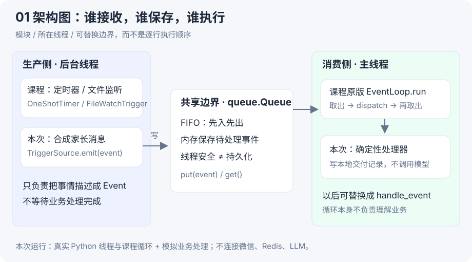
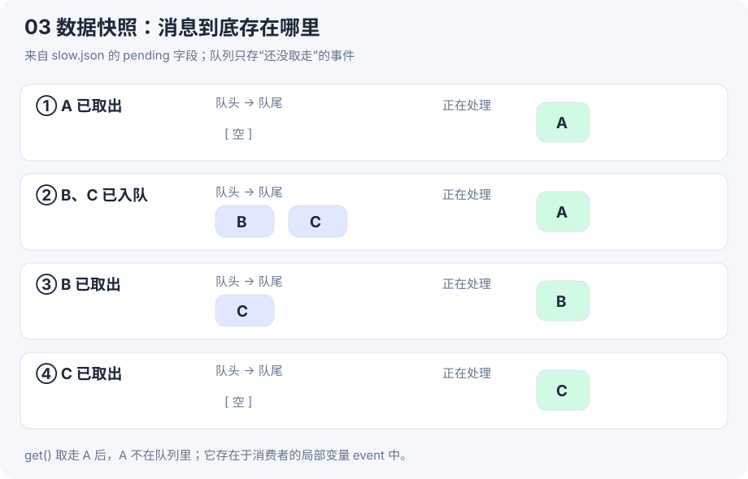
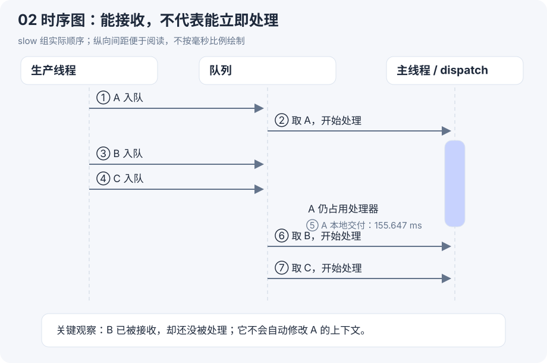

# 6-1 代码精读：一步步长出事件循环

**后续进度：已完成 [第二课：真实模型与工具](event-agent.md)，本页保留第一课的离线实验与证据。**

[实验结果与证据](event-trigger.md) · [客服项目对应](events.md)

本页的目标不是逐行翻译英文，而是让你能自己写出结构，并解释为什么每一步放在这里。课程源码位置都固定到 `cf7f7a8`；小代码标明教学简化，不假装是可直接替换的生产实现。

## 第一步 为什么先定义 Event

### 遇到的问题

网页消息是字符串，定时器是到期时间，文件监听拿到的是文件路径。如果处理器为每个来源另写一条完整执行链，后续日志、错误处理和接模型都要重复做。

### 设计：先统一“发生了什么”

**教学简化：**

```python
from dataclasses import dataclass, field

@dataclass
class Event:
    event_type: str
    content: str
    metadata: dict = field(default_factory=dict)
    event_id: str | None = None
```

它是一个对象，不是数组。`event.content` 取的是对象字段。`metadata` 是字典，用于保存发送者、文件路径等补充信息。

`default_factory=dict` 会为每个新事件创建独立字典，避免把不同事件的数据混到同一个共享容器里。课程真实版本用 `EventType` 枚举约束类别，并多了 `timestamp` 字段。

真实实验创建 A：

```python
Event(
    EventType.IM_MESSAGE,
    '查一下课程',
    {'sender': 'demo-parent'},
    event_id='A',
)
```

此时 A 只是内存里的对象，没有入队，也没有发给模型。不要把“创建了消息”和“模型读到了消息”混为一谈。

**对应源码：** [event_types.py · Event](https://github.com/bojieli/ai-agent-book/blob/cf7f7a8e16b234ac303034e4ec8f75bf2d61ac2c/chapter6/agent-with-event-trigger/event_types.py#L28)。

### Event、dict、messages 是三个层次

```python
# 使用课程真实方法
payload = event.to_dict()          # Python dict，便于 JSON 序列化
text = event.to_user_message()     # str，包含来源提示

# 教学示意：适配模型请求时才组装消息列表
messages = [{"role": "user", "content": text}]
```

`messages` 是列表；列表里一项是消息字典；字典的 `content` 在这个例子里是字符串。`Event` 转文本后不代表全部结构字段都被保留：例如 `event_id` 并不自动出现在该 IM 文本中。运行时追踪 ID 和给模型读的内容可以分开。

本次只记录 `to_user_message()` 的结果。日志字段名 `model_input` 表示拟传给模型的文本，实际没有发送模型请求。

## 第二步 为什么要有队列

### 没有队列会怎样

```python
# 教学反例
on_parent_message = dispatch
on_parent_message(event)  # 接入方要等这次 dispatch 返回
```

直接调用本身并非错误，但如果处理很慢，接收和处理就绑在一起了。要持续接收更多消息，需要给尚未处理的工作一个存放位置。

### 设计：生产者只交接，消费者再处理

课程 `TriggerSource.emit()` 的核心是真实这一行：

```python
self.event_queue.put(event)
```

它把 Event 放到共享 `queue.Queue`。课程 `EventLoop.__init__()` 创建队列，触发器构造时接收同一个队列引用；不是每个模块各建一个互不相通的队列。

```python
# 课程用法：同一个队列对象传给定时器
loop = EventLoop(dispatch)
trigger = OneShotTimer(loop.event_queue, delay=1, content="检查备份")
loop.add_trigger(trigger)
loop.run(duration=2)
```

注册触发器只是加入 `loop.triggers`。真正启动线程发生在 `run()` 中的 `t.start()`；不要直接把 `t.run()` 当成开启新线程。

**对应源码：** [TriggerSource.emit](https://github.com/bojieli/ai-agent-book/blob/cf7f7a8e16b234ac303034e4ec8f75bf2d61ac2c/chapter6/agent-with-event-trigger/event_loop_demo.py#L64)、[EventLoop](https://github.com/bojieli/ai-agent-book/blob/cf7f7a8e16b234ac303034e4ec8f75bf2d61ac2c/chapter6/agent-with-event-trigger/event_loop_demo.py#L171)。

[](../assets/task6/61-architecture.svg)

### 定时器为什么不一直 while 检查时间

课程 `OneShotTimer.run()` 用下面的方式等待：

```python
if self._stop.wait(self.delay):
    return
self.emit(Event(...))  # 省略字段
```

这里 `_stop` 是 `threading.Event`，是线程间的“停止信号”，和业务 `Event` 数据类不是同一种东西。`wait(delay)` 在收到停止信号时提前返回真，否则等到超时返回假，接着发出业务事件。它让等待期间也能响应停止。

本次原版 CLI 运行走了这条线程启动链；四组对照为了精确安排 A/B/C，另外使用自己的生产线程调用**原版 `emit()`**，不经过定时器。

## 第三步 消费者为什么是循环

一次 `get()` 只能取一条事件。如果程序需要持续响应，就要反复等待、取出、执行。

以下是**教学简化**，保留课程的核心语义，省略了时长控制、触发器启动/停止和日志：

```python
while running:
    try:
        event = event_queue.get(timeout=0.5)
    except queue.Empty:
        continue

    processed += 1
    try:
        dispatch(event)
    except Exception as error:
        print(error)
```

按执行顺序读，不要一次背完整文件：

1. `get()`：队列有数据就取出队头；没数据就等待，当前线程不会空转刷屏。
2. 超过 0.5 秒还没数据：抛 `queue.Empty`，这不是业务失败，回去检查循环条件。
3. `processed += 1`：记录一次取出尝试，因此之后业务报错也已经计数。
4. `dispatch(event)`：同步函数调用。它没返回，当前线程就不会执行下一个 `get()`。
5. 捕获处理异常：继续循环。这只是让下一条有机会执行，没有重试、死信队列或持久化。

`timeout=0.5` 是最大等待区间，不是每条事件强制增加 500ms 延迟。课程 `duration` 只在循环边界判断；已进入的 `dispatch` 即使慢也不会被自动中断。

**对应源码：** [EventLoop.run](https://github.com/bojieli/ai-agent-book/blob/cf7f7a8e16b234ac303034e4ec8f75bf2d61ac2c/chapter6/agent-with-event-trigger/event_loop_demo.py#L188)。

## 第四步 用队列快照解释变量

[](../assets/task6/61-snapshots.svg)

图中绿色卡片表示消费者当前的局部变量 `event`。A 被 `get()` 取出时就离开队列，但这时 A 还没有完成业务处理。

因此：

- `queue` 空，不一定表示系统没在工作，A 可能正在执行。
- `queue` 有 B、C，不表示模型已看到 B、C。
- 单独一个 `qsize()` 无法回答“还有多少业务未完成”。

课程循环没有使用 `task_done()/join()` 维护“未完成任务”计数。不能在这个原版循环外面随便加一个 `queue.join()` 就认为它一定会正常退出。

### 手推一次：A 正在处理，B 到了

```text
生产线程                         主线程
emit(B)                          仍停在 dispatch(A)
  └─ queue.put(B)                不会回头读取 B
emit(C)
  └─ queue.put(C)
                                 A 返回
                                 get() 得到 B
                                 dispatch(B)
```

这就是架构图与时序图的区别：架构图显示职责分工，时序图显示两个线程的动作怎么交错。

## 第五步 怎样让实验可靠地发生“处理中又来消息”

如果随便写两次 `sleep()`，快机器和慢机器上可能得到不同顺序。我们用两个线程信号协调：`active` 表示 A 已进入处理器，`release` 表示允许 A 完成。

**实验脚本核心摘录，省略超时判断和日志：**

```python
# 消费侧：先宣布 A 开始，再等待放行
if event.event_id == 'A' and case == 'slow':
    active.set()
    release.wait(2)

# 生产侧：确认 A 开始后，才投递 B 和 C
emitter.emit(A)
active.wait(2)
emitter.emit(B)
emitter.emit(C)
time.sleep(hold)
release.set()
```

完整脚本检查 `wait()` 的返回值，并在生产线程的 `finally` 中放行，防止异常时一直卡住。`sleep(hold)` 只拉开可观察的间隔，**执行先后由信号控制**。

别把这两个实验控制信号误认为客服项目必须采用的生产设计。它们的职责是稳定复现我们想观察的并发场景。

[](../assets/task6/61-sequence.svg)

## 第六步 处理函数为什么可以替换

`EventLoop` 构造时接收一个 `dispatch` 函数，调用时只知道它能接收 Event，不需要知道内部是规则还是模型。这就是把“调度”与“业务处理”分开。

```python
# 教学简化：本地替身
receipts = []

def dispatch(event):
    receipts.append(event.event_id)

loop = EventLoop(dispatch)
```

课程 `make_mock_dispatch()` 返回一个内层 `dispatch`，用于打印模拟动作；`make_agent_dispatch()` 返回另一个内层函数，它调用 `agent.handle_event(...)`。函数可以作为参数传递，也可以作为另一个函数的返回值。

以后接模型时，**入口换了，不代表调度机制变了**：如果 `handle_event()` 同步阻塞，当前消费者仍然要等它返回。

本次 failure 组在处理 B 时 `raise ValueError(...)`，观察到 C 继续开始；duplicate 组投递同一个 B 两次，观察到两份交付记录。说明队列既不懂业务成功，也不会因为 ID 相同就自动去重。

**真实源码：** [make_mock_dispatch](https://github.com/bojieli/ai-agent-book/blob/cf7f7a8e16b234ac303034e4ec8f75bf2d61ac2c/chapter6/agent-with-event-trigger/event_loop_demo.py#L221)、同文件 `make_agent_dispatch`。

## 第七步 我们怎样记录和验收

完整可运行文件：[run_61.py](../assets/task6/run_61.py)。建议按这个顺序读：

|位置|职责|为什么放这里|
|---|---|---|
|`main` 开头|解析路径、记录版本、运行课程 CLI|先确认测的是什么版本|
|`record`|记录序号、时间、阶段、事件 ID|同一条事件可以串起完整轨迹|
|`RecordedQueue._put/_get`|在队列锁内记录快照|避免刚入队就被取走，导致日志顺序看起来反了|
|`dispatch`|模拟等待、失败或本地交付|仅改变本课要研究的条件|
|`produce`|创建入队顺序和并发时机|让输入可控、可复现|
|`checks`|比较预设顺序和实际证据|不只看程序退出码|

`RecordedQueue` 是实验观测用子类，通过 Python Queue 的内部钩子观察真实入队/出队；它不增加去重、并行或重试。生产应用不要依赖遍历内部队列来做业务判断。

这次具体检查：所有输入是否按预期出队、本地交付是否匹配、尝试计数是否正确、生产线程是否退出、错误是否只有预期的 B；slow 组再查 B 确实在 A 活跃期间到达、B 确实等到 A 交付后才开始。

这些检查没有证明多生产者竞争、崩溃恢复、消息持久化、跨会话隔离、并发发送幂等。**一次本地事件循环实验的证据范围就到这里。**

## 你来动手：先预测，再运行

### 练习 1 只改等待时间

```bash
python3 docs/assets/task6/run_61.py \
  --course /Users/tal/Documents/Codex/learning-projects/ai-agent-book \
  --hold 0.5
```

先预测：B 的等待时间会增加，但 A/B/C 的执行顺序会不会改变？这条变体留给你操作，本页报告是默认 0.15 秒那次运行。

??? success "答案与读证据方法"
    正常情况下顺序不变。打开新生成的 slow.json，比较 B 的 enqueue 与 start 时间，再看 A 的 local_delivery 是否仍在 B 的 start 之前。数值不要求恰好 500ms。

### 练习 2 不运行也应该能判断

failure 组 `processed=3`，是否可以向老师说“三条消息全部成功”？

??? success "答案"
    不可以。B 有 error，没有 local_delivery；只有 A、C 两条写入本地记录。即便有 local_delivery，也只能说本地替身成功，不能声称微信真实送达。

### 练习 3 设计下一步

B 是“只看周末”，如果它只在 A 的查询结束后才被执行，该怎样避免先把不符合条件的 A 发给家长？

??? success "思路"
    可以在查询前短暂聚合连续消息；查询进行中记录新版本并尝试取消旧任务；交付前检查旧结果是否仍有效。每个机制解决不同阶段的问题。只把 B 放入队列不够，只打印“取消成功”也不够。这些将进入 6-2；本课不提前把它们当作已经实现。

## 本课学会的标志

你能合上文件，用自己的话解释：**生产者把结构化事件放入共享队列；消费者循环取出并同步分发；取出不是完成，入队不是进入模型上下文；异常后继续和去重是不同能力。**

下一步仍可留在 6-1，把确定性 `dispatch` 替换成模型处理器，单独验证内容理解；无需现在就跳到所有异步与语音实验。
