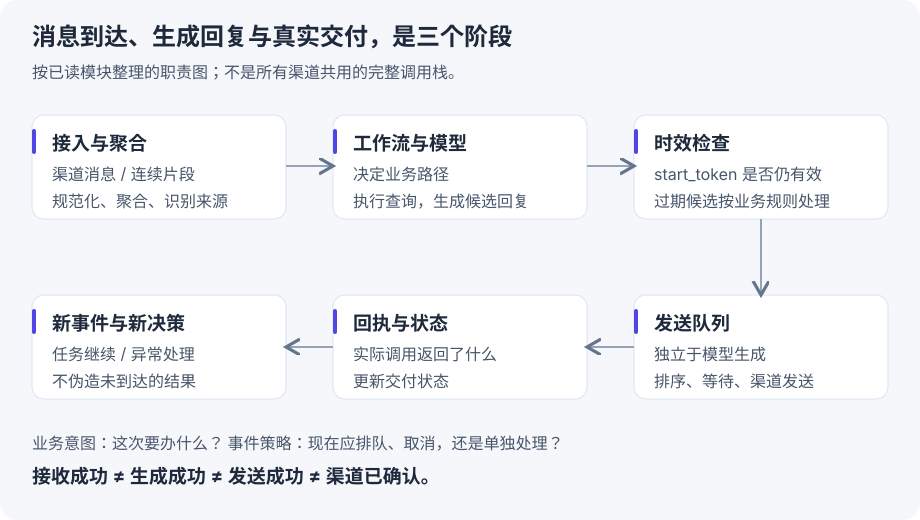

# 客服项目 从识别意图到处理正在变化的任务

[整章串讲](reading.md) · [逐课实验计划](plan.md) · **[已运行：6-1 实验与代码课](event-trigger.md)**

这一条线对应 `next-tweakcube-chain`，也就是之前老师/客服的消息工作流项目。第六章带来的新问题是：**已经知道用户想做什么之后，用户又发来消息，现有任务如何调整？**

## 1 先分清两个判断

|判断|问题|例子|
|---|---|---|
|业务意图识别|要办什么业务，交给谁？|查课程、加时、改教材、退款咨询|
|事件时机判断|当前正在执行别的工作，这条消息怎么处理？|补充条件、替换旧任务、停止、独立提问|

“改成周六”既可能是课程安排意图，也可能是对上一条查课请求的修正。这两个判断不能只靠一个 intent 标签替代。

课程 6-2 的 `classify_urgency()` 使用关键词判定：包含“取消/停止”等为 interrupt，疑问词为 immediate，其余为 deferred。它适合讲清机制，**不是可直接上线的语义分类器**。“不要取消”也包含“取消”；孩子说“嗯”也不一定是在要求老师停下。后续实验要把策略局限单独测出来。

## 2 先看一条完整业务链

下面是依据已读模块整理的职责图，不是声称所有渠道都经过完全相同的调用栈。



1. **接入**把渠道消息或回执转成内部可处理数据。
2. **聚合**处理用户连续发送的片段，避免每个字触发一轮完整工作流。
3. **工作流**结合上下文与业务路由生成候选回复。
4. **时效检查**确认这份候选仍属于当前有效任务。
5. **发送队列**决定什么时候、按什么顺序交付。
6. **回执处理**记录渠道真正返回的结果。

这些状态应分别观察。接入 HTTP 返回成功，不等于家长已经收到回复。

## 3 第一次读源码 只看事件循环的十来行

先不打开一千多行的 Agent 文件。课程最小入口是 `chapter6/agent-with-event-trigger/event_loop_demo.py::EventLoop`。

**课程控制流摘录（省略日志与异常分支）**：[L195 起](https://github.com/bojieli/ai-agent-book/blob/cf7f7a8e16b234ac303034e4ec8f75bf2d61ac2c/chapter6/agent-with-event-trigger/event_loop_demo.py#L195)。

```python
while time.monotonic() < deadline:
    try:
        event = self.event_queue.get(timeout=0.5)
    except queue.Empty:
        continue
    self.processed += 1
    # 此处课程源码还有日志与 try/except
    self.dispatch(event)
```

上面抽掉了日志和异常分支，保留控制流。读它时问四个问题：

- **数据从哪里来？** 触发器通过 `event_queue.put(event)` 放入队列。
- **谁等待？** 当前事件循环在 `get()` 等待。这里是线程安全的 `queue.Queue`，不是 `asyncio.Queue`。
- **谁决定下一步？** `dispatch` 负责处理，可能是模拟处理器，也可能调用 Agent。
- **何时处理下一条？** 当前 `dispatch` 返回后。事件入队可以并发，消费仍是顺序的。

这里的 `timeout=0.5` 是等待队列的超时上限，用于周期性检查退出条件；它不是“每条消息必须等 500ms 才能被处理”。有消息时 `get()` 可以立刻返回。

### 手推一遍状态

|时刻|队列|事件循环在做什么|
|---|---|---|
|收到 A|`[A]`|取出 A|
|处理 A 时收到 B|`[B]`|仍在 `dispatch(A)`|
|又收到 C|`[B, C]`|仍在处理 A|
|A 结束|`[C]`|开始 B|

这解释了为什么**“事件驱动”不等于“任何新消息都会立即抢占当前任务”**。下一课才增加取消与独立任务。

## 4 再看 6-2 为什么多了两个队列和一个列表

课程 `AgentRuntime.__init__` 定义：

|对象|结构|职责|
|---|---|---|
|`inbox`|`asyncio.Queue`|收所有新事件|
|`work`|`asyncio.Queue`|存已经分好类的事件批次|
|`pending`|`list[Event]`|暂存待合并的补充条件|
|`trajectory`|`list[Event]`|保留已经进入处理过程的事件轨迹|

不要把它们统称成“messages 数组”。`messages` 是将轨迹转换成模型请求格式后的列表；原始事件、等待处理的事件和模型已看到的历史不是一个集合。

```python
# 教学简化，对应 runtime.py::_dispatcher
if event.type == "user.interrupt":
    await handle_interrupt(event)
elif event.type == "async.result":
    batch = [event] + pending
    pending = []
    await work.put(batch)
else:
    pending.append(event)
```

**简化范围：** 省略了空闲时直接处理、immediate 分支和停止哨兵；不能将这几行原样替换课程调度器。完整入口是 [`runtime.py::_dispatcher`](https://github.com/bojieli/ai-agent-book/blob/cf7f7a8e16b234ac303034e4ec8f75bf2d61ac2c/chapter6/async-agent/runtime.py#L198)。

“用户补充条件”保存在 pending，“后台查询返回”触发批量送入 work。最终模型应同时看到结果和全部约束，避免只看到最后一句话。

## 5 为什么已经 cancel 还要检查旧结果

假设一个慢查询 A 已经发出去。新任务 B 开始后，A 才返回。取消请求可能来不及阻止远端生成；即使生成停止，回复也可能已经在网络缓冲里。

因此需要在消费边界检查任务版本：

```python
# 教学简化，表现结果归属思想；不是生产并发安全实现
my_version = current_version
result = await run_query()
if my_version != current_version:
    return  # 不再把旧候选回复交付给用户
await send_reply(result)
```

它表达了一个检查点，但检查到发送之间还可能发生新更新；跨进程场景还要设计原子性、会话隔离和发送前校验。教学代码不能证明 exactly-once，也不能处理所有业务副作用。

项目的 `WorkflowController._execute_main_workflow()` 已有相近机制：启动前在 Redis 写入新的 `start_token`，运行前尝试取消前一工作流，结束后再检查是否已有更新的 token。**它也有作业拆解结果的业务豁免，所以不能把项目总结成“所有旧结果一律丢弃”。**

这与课堂 `generation` 的共同点是检查结果是否还有效；区别在于客服的业务产物可能需要保留，而课堂旧音频不能在新一轮随便继续播放。

## 6 已确认的项目源码位置

以下路径相对于本地 `/Users/tal/next-tweakcube-chain/`，只用于定位；本文不复制业务提示词、真实消息和凭据。

|阅读顺序|源码|先看什么|
|---|---|---|
|1|`src/core/ai_teacher/message_queue/receive/message_aggregator.py` · `add_message`|区分列表批量输入与单条输入；再看业务线和撤回消息分支|
|2|`src/core/private_agent/processors/workflow_controller.py` · `_execute_main_workflow`|启动令牌 → 取消前任务 → `arun` → 过期检查|
|3|`src/core/private_agent/workflows/public/ttl_team.py` · `create_ttl_team`|业务与跨学科路由；不要与事件调度混为一谈|
|4|`src/core/ai_teacher/message_queue/sender/send_queue_manager.py`|入队与取队头的边界|
|5|`src/core/ai_teacher/message_queue/sender/message_sender.py` · `start_consumers`|按 chat 建消费者、订阅事件、孤儿队列扫描兜底|
|6|`src/router/wxcallback_router.py` · `req_post_qn_msg_callback`|这是发送回执入口，别误认为所有用户入站消息入口|

发送器既有事件订阅，也有周期性的孤儿队列扫描。这说明“事件推送”与“兜底轮询”可以共存，不能把使用轮询简单等同于设计失败。

## 7 这条线怎么逐课学

**第一课 6-1：** 只验证“外部事件 → 队列 → 处理 → 交付记录”。使用合成家长消息和本地假发送器，先不连接真实微信、Redis 或客户数据。

**第二课 6-2：** 保持同一场景，加慢任务、补充条件、取消、迟到返回。学习 `create_task`、`CancelledError`、任务 ID 和版本校验。

**第三课 6-3：** 再比较运行时兼容与模型原生异步。原生协议是否接受消息、最终是否采用全部新约束，要分开验收。具体 API 能力不能靠把普通 Chat Completions 改成 `async def` 来替代。

??? question "自测：家长说‘不用取消，帮我继续查’，能直接用关键词判成 interrupt 吗？"

    不能。字面上含“取消”，语义却是继续。机械关键词可以用于教学，但业务策略应结合否定、上下文、任务状态；确定性的停止按钮可走独立控制通道。后续实验分别记录策略判断与执行结果，不能只测队列有没有收到事件。
