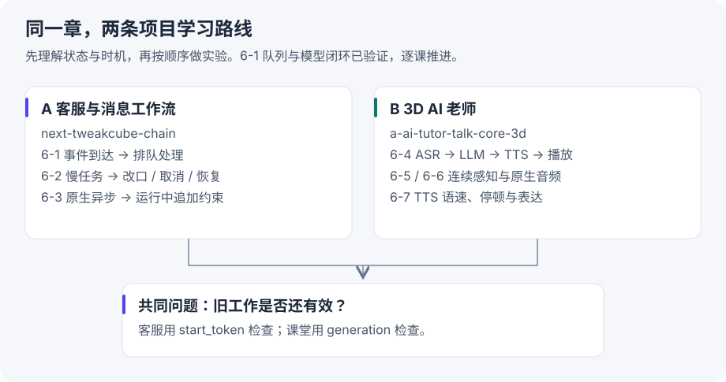

# 第六章 交互时机与实时课堂

先读懂，再逐个实验
这一章学习两件事：用户在任务进行中改变要求，系统怎么跟上；学生在老师说话时插话，课堂怎么接住。

本章按两个实际项目展开。**6-1～6-3 先对照客服与消息工作流项目 `next-tweakcube-chain`；6-4～6-7 再对照三段式课堂项目 `a-ai-tutor-talk-core-3d`。** 两者共用事件、取消、结果归属的思想，但事件来源、延迟要求和交付证据不同。

**当前进度：完成正文学习、关键源码阅读和项目对应分析；6-1 已完成离线队列与真实模型/本地工具实验，真实邮箱接入及后续章节待运行。** 课程仓库里的历史验收是作者的运行记录，不是我们的实测。这次不修改业务项目，不提交 Git，不发布网站。

**最新进度：[6-1 第二课：真实模型与工具](event-agent.md) → [逐轮读代码](event-agent-code.md)**。

**第一课：[6-1 实验与结果](event-trigger.md) → [一步步读代码](event-trigger-code.md)**，配架构图、时序图和队列快照。

## 阅读顺序

|顺序|这次要弄懂的问题|入口|
|---|---|---|
|1|第六章为什么要从“模型回答什么”转向“什么时候观察和行动”？|[整章知识串讲](reading.md)|
|2|客服项目已有消息队列和意图识别，还要学什么？|[客服项目与事件驱动](events.md)|
|3|三段式能不能边听边说？GPT-Live 的区别是什么？|[3D 课堂与语音节奏](voice.md)|
|4|先跑哪个实验，怎样判断自己真正学会了？|[逐课实验与验收计划](plan.md)|

## 先建立本章的三个判断

**事件到达不等于模型已经使用它。** HTTP 收到了请求，消息可能仍在队列里；模型接口确认接受了更新，也可能还没用更新后的条件作答。

**结果生成不等于交付完成。** 客服回复可能还在发送队列；老师的文字可能已经生成完，但音频只播了一半。两种项目都不能用“模型说完了”替代“用户收到了”。

**停止请求不等于旧结果消失。** 网络返回、工具回调和播放器里已经缓存的音频仍可能迟到，需要在消费结果时检查它是否属于当前任务。

## 哪些内容现在深入，哪些先建立概念

- **深入第一条线：6-1 事件触发 → 6-2 异步、取消与状态 → 6-3 原生异步与运行中引导。** 重点关联家长消息聚合、任务改口、旧回复抑制、发送与回执。
- **深入第二条线：6-4 三段式基线 → 6-5 流式感知的限制 → 6-6 音频信息保留 → 6-7 TTS 表达控制。** 重点关联 AI 老师接话、抢话、被打断、恢复与语速。
- **6-8～6-9 Computer Use：** 先学动作之后重新观察的闭环，暂不启动浏览器任务。
- **6-10～6-14 机器人：** 先学规划、技能、控制、反馈的分工，暂不跑硬件或 GPU 实验。项目名里的“3D”不意味着它对应机器人实验。

## 代码阅读约定

每节先给完整的小流程，再只读实现该流程的几个函数。代码分为三类：

1. **课程原文**：注明课程文件、函数和固定提交链接。
2. **教学简化**：解释一个机制，明确省略了什么，不冒充业务源码。
3. **项目对应**：列出本地文件和实际看到的行为；“可以扩展”与“已经实现”分开写。

后续每次实验都按“问题 → 设计 → 小段代码 → 状态变化 → 源码位置 → 自己改一个条件验证”推进。每次只新增一课的运行证据，下一课先标待做。

## 来源和版本

正文与课程源码来自 [AI Agent Book 第六章](https://github.com/bojieli/ai-agent-book/blob/cf7f7a8e16b234ac303034e4ec8f75bf2d61ac2c/book/chapter6.md)，固定提交 `cf7f7a8`。当前实验编号按 `chapter6/README.md`；个别子目录 README 仍写“第4章”，不能按旧路径照抄。

项目对应基于 2026-09-30 本地源码阅读：客服项目 HEAD `0a1cee8`，3D 项目 HEAD `9bed030`。这里只确认所读函数和文档，不表示完成全仓审计，也不把本地 LLM SDK 独立 checkout 当成 3D 运行时实际安装版本。

原生能力的说明另参考官方 [异步工具调用](https://developers.openai.com/api/docs/guides/async-tool-calling)、[运行中引导](https://developers.openai.com/api/docs/guides/steering)、[GPT-Live 会话](https://developers.openai.com/api/docs/guides/live-conversations)。核对日期为 2026-09-30；本次未调用这些 API。
