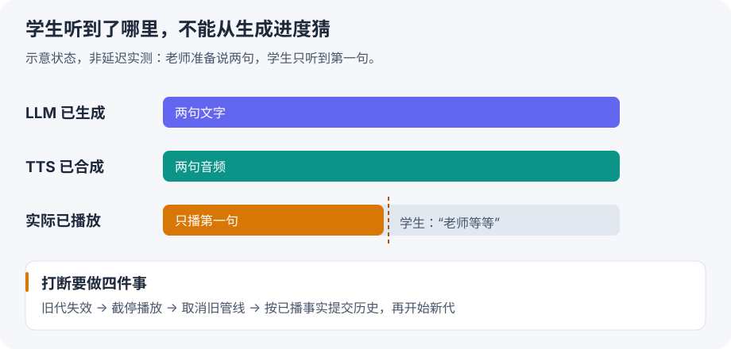

# 3D 课堂 三段式怎样形成自然的对话节奏

[整章串讲](reading.md) · [逐课实验计划](plan.md)

这一条线明确对应 **`/Users/tal/a-ai-tutor-talk-core-3d`**。该仓 README 写明内核是 ASR、LLM、TTS 三段式；不把旧的 `ai-tutor-talk-core` 豆包语音路线混进来，也不将独立 LLM SDK 的最新源码当作这个仓实际安装的版本。

## 1 先拆开“节奏好”

“听起来顺”至少包括以下几件事，它们需要不同的证据：

|体验|需要观察的事实|常见混淆|
|---|---|---|
|接话快|学生真实说完，到老师首个可听音频的间隔|只测 LLM 首 token|
|不抢话|学生短暂停顿后继续，系统是否错误接管话轮|把静音等同说完|
|打断灵敏|有效插话发生后，旧声音何时真正停止|只测取消请求发出的时间|
|能继续讲|恢复后是否知道已经讲到哪里|把完整生成文本当已播放文本|
|表达自然|语速、重音、停顿是否适合当前教学任务|只看音色像不像真人|
|教学连贯|追问后能否回到正确教学步骤|为了接话快而忽略课堂状态|

这些维度不能压缩成一个“模型延迟”。本次没有做 GPT-Live 与课堂项目的真人听感或延迟对照。

## 2 三段式 原生音频 与全双工怎么区分

**ASR** 把音频识别成文字；**LLM** 根据上下文生成回复；**TTS** 把回复变成声音。三段式保留了明确的文本接口，方便定位错误、替换组件和控制教学内容。

**原生音频输入输出**描述模型是否直接处理声音，而不必在模型之间用纯文本交接。它有机会保留语气等非文字信息；这不自动说明产品如何决定话轮。

**全双工交互**关注同时听说以及如何持续调整表达。你提到的 GPT-Live 的确有这一能力：官方会话文档明确说明可同时听和说，并要求分别跟踪文字、已播放音频和后台任务。不能据此推断我们的三段式只要换一个 LLM 就会拥有相同能力。[GPT-Live 会话文档](https://developers.openai.com/api/docs/guides/live-conversations)

|设计|语音经过哪里|交互时机主要由谁处理|
|---|---|---|
|三段式|ASR → 文本模型 → TTS|应用负责片段、话轮、打断、播放；各服务可流式|
|按轮次的原生音频|音频模型直接输入输出|模型与外围话轮控制共同决定|
|原生全双工|持续音频输入和输出|模型参与持续听说决策，应用仍负责媒体与业务动作|

这是一张帮助理解的分类表，不是“所有 Omni 永远半双工”的产品定律。应检查具体模型、API 和运行配置。

## 3 三段式也可以流水线运行

最慢的教学版本是：整句识别完 → 整篇回复生成完 → 整段语音合成完 → 才开始播放。

更实际的流式链路是：ASR 持续接收输入，LLM 输出可用文本增量，TTS 持续消费文本并返回 PCM，播放器按节奏消费 PCM。后面的文字还没生成完，前面的声音可以已经开始播放。

**不能简单把 ASR、LLM、TTS 三个函数一起 `gather()`。** LLM 依赖识别内容，TTS 依赖生成文本。这里的并行是不同阶段通过队列传递增量，像流水线那样重叠运行。

对三段式的首声延迟，可按实际时间点拆成：

```text
学生最后一个语音采样
  → 端点/转写确认
  → 首个适合交给 TTS 的文本
  → 首个可用音频块
  → 首个实际播放音频
```

必须记录这些时间点再计算间隔。ASR可能在学生说话期间已经工作，不能把整段识别耗时再次加在说完之后；LLM首token也可能是标签或半个词，不等于可播内容。网络、服务排队和播放缓冲也在用户体感之内。

## 4 VAD ASR final 和语义说完不是同一个信号

**VAD（语音活动检测）**判断某段音频是否有人声。**端点判断**决定当前片段什么时候结束。**ASR final**表示识别服务将某片段定稿。**语义话轮结束**则问：学生这个意思表达完了吗？

学生说：“我觉得……是 B。”中间可能安静几百毫秒。缩短静音阈值能更早响应，也可能把“我觉得”当成完整答案。

课堂还需要区分：

- “嗯”可能是附和，老师不一定该停止；
- “等等，我没听清”通常需要让出话轮；
- 老师在等待回答时，学生发声是正常作答，不叫打断；
- 背景人声、回声和主讲学生声音不能直接视为等价输入。

6-5 正好帮助理解连续感知，但课程用递增音频前缀模拟，不应把它说成真正低延迟流式识别。后续我们先复现一个可解释的停顿案例，再考虑模型与设备成本。

## 5 三个进度必须分开记



老师候选话术：“我们先看第一张图。接下来跟我读 apple。”

|进度|此刻可能是什么状态|
|---|---|
|LLM 生成|两句话都已经生成|
|TTS 合成|两句话的音频都已经返回|
|真实播放|学生只听到“我们先看第一张图。”|

学生此时插话。如果把整段候选都写成老师已说内容，下一轮模型可能认为学生已经听过 apple 的发音，然后直接跳过跟读。

因此，**历史要表达实际交付事实，不只是模型生成事实**。用时长比例估算文字前缀只是近似：前后语速、停顿、数字读法可能不同。有音频与文本对齐证据时可以更准确；仍应按项目真实接口和配置验证，不能想当然认为“拿到 PCM 就是播完”。

## 6 你们当前 3D 代码已经做了什么

阅读入口：`docs/system/flows/realtime-three-stage-session.md`，再读以下小范围。该仓核心链路是 `TalkSession → Orchestrator → ASR / LLM / TTS → MediaSink 或 PacingPlayer`。

### 6.1 先理解 generation

`talkcore/core/generation.py::GenerationClock` 维护递增代次。产物携带创建时的 token，消费时看它还有效吗。

```python
# 教学简化，变量名用于手推，非业务源码摘录
current_generation = 7
old_audio_generation = 7
current_generation += 1  # 接受打断，旧输出失效
can_play = old_audio_generation == current_generation
assert can_play is False
```

**设计思路：** 远端取消可能来不及，但本地可以拒绝旧结果产生新的副作用。失效检查不是物理停止播放器，所以还要下一步。

### 6.2 按顺序读一次实际打断

`talkcore/core/orchestrator.py::_do_interrupt` 中能看到以下调用顺序。下面是职责摘要，不是可直接运行的源码：

```text
保存 old_token
→ clock.advance() 先作废旧代
→ pacer.cut() 截停并取得已播时长
→ abort_speak_pipeline() 终止旧输出管线
→ commit_playback(old_token, interrupted=True, ...)
→ 把学生插话和已播内容投影到历史
→ begin_speak(new_token, new_input)
```

**为什么先 advance，再 await 清理？** 清理中有等待点，其间其他协程可能收到旧音频。先失效，消费端才能在这段窗口拒绝旧产物。这个顺序体现了设计意图，是否所有边界都覆盖仍需要竞争条件测试。

**为什么提交的是 old_token？** 要结算的是被打断的旧轮次，新回复用新 token。二者混淆会把新输出当成旧账清掉。

**为什么不是收到任何声音都执行？** 前面还有 ASR 文本聚合与 `_maybe_interrupt` 的裁决；播放等待、有效插话和继续说的场景要分别处理。

### 6.3 哪个事件才叫播放完成

`talkcore/core/pacer.py` 把 `source_done()` 与 `playback_done` 分开。前者表示上游不再产生音频，后者还要求缓冲被消费完。

有宿主 MediaSink 的路径还涉及宿主播放回报，不能仅凭本地队列排空就宣称学生设备已经听到。本地 pacer 的进度与真实终端听感应分别采集证据。

### 6.4 按这个顺序打开源码

路径相对于 `/Users/tal/a-ai-tutor-talk-core-3d/`：

|顺序|文件与函数|这一遍只回答|
|---|---|---|
|1|`talkcore/core/generation.py`|token 是什么，什么时候失效？|
|2|`talkcore/core/orchestrator.py::_maybe_interrupt`|什么时候发起判定，迟到判定怎么识别？|
|3|`talkcore/core/orchestrator.py::_do_interrupt`|失效、截停、取消、结算、新回复按什么顺序？|
|4|`talkcore/core/pacer.py::source_done / cut / _pump`|合成结束为什么不等于播放结束？|
|5|`talkcore/providers/sdk_llm.py::commit_playback`|怎样把播放事实交给 LLM SDK？|
|6|`tests/test_interrupt_truncation.py`|测试用什么输入验证截断后的结果？|

本次只读源码，没有运行这些业务测试。源码存在某个机制不等于已经证明所有课堂条件下都稳定。

## 7 课堂是否应该马上换成全双工模型

现在不能仅凭演示听感作决定。先知道现有延迟和失败在哪一段，再判断替换模型能解决多少。

- 如果主要等在 ASR 定稿与静音阈值，优先测端点策略。
- 如果主要等在 LLM 首段文字，优先测首个可播片段与提示长度。
- 如果首包很快但孩子仍听得晚，检查媒体缓冲与播放回报。
- 如果“停”之后还在说，先查 generation、取消、音频队列和终端截停。
- 如果识别文字正确，但语气/犹豫理解不对，原生音频能力才是重要对照方向。

这些是诊断假设，不是这次已经测出的瓶颈。自然度、教学质量、成本和可控性要一起比较，不能只追求最低首声时间。

??? question "自测：老师音频合成已经结束，学生打断时还需要取消或清理吗？"

    需要检查播放缓冲与实际播放状态。即使没有正在进行的合成请求，旧音频可能还排在播放器中。需要截停、清理旧代媒体，并根据实际播放事实结算历史；不能因为生成已结束就跳过打断。
