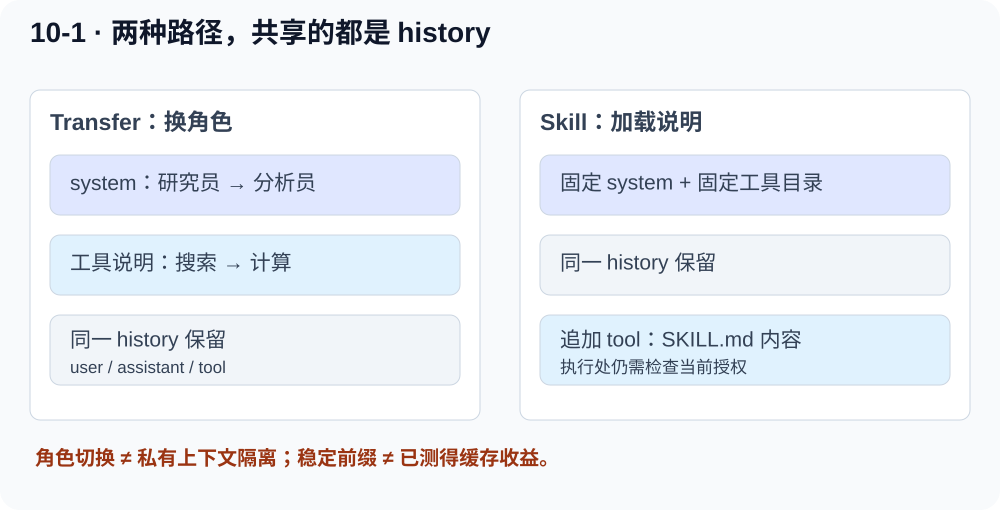
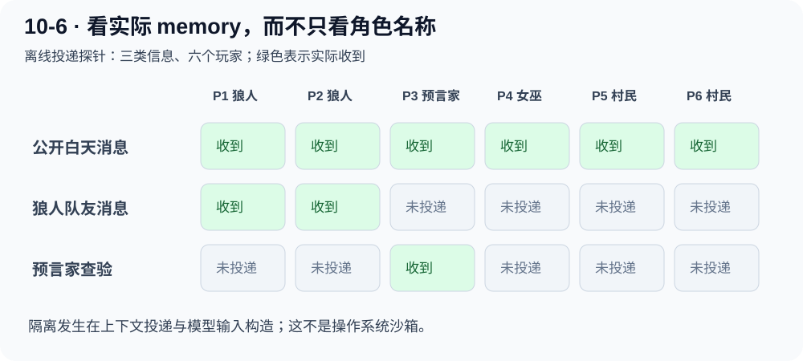

# Builder：共享历史、角色切换与私有上下文

[Starter 主线](parallel-research-code.md) · [Maintainer 检查](collaboration-maintainer.md)

这一层按课程指南**阅读 10-1 与 10-6**，并运行小型离线代码检查。本轮没有做 10-1 的正式模型 A/B，也没有运行 10-6 的语音游戏。下面的“通过”都指明确列出的局部机制。

## 1 先别把所有“多 Agent”当成同一种结构

|例子|控制权|上下文|这一层要看什么|
|---|---|---|---|
|10-4 并行检索|多个 worker 同时运行，Manager 结算|每个 worker 的网站资料独立|消息、并发、取消|
|10-1 Transfer|一次只有一个当前角色|同一条 history 保留|system 与 tools 怎么切|
|10-1 Skill|一个固定 Agent 加载能力说明|同一条 history 追加内容|前缀稳定与执行权限|
|10-6 狼人杀|法官按阶段调度玩家|每位玩家只有自己的 memory|哪些事实可以投递给谁|

**多个角色名称不等于并发，也不等于上下文隔离。**

## 2 10-1 的设计问题：怎样把研究员变成分析员

假设当前对话已经拿到数据，下一步需要计算。最简单的方案是切换当前角色，但沿用历史，避免重新解释任务。

原版 `MultiRoleOrchestrator._messages_for_api()`：

```python
system_msg = {
    "role": "system",
    "content": ROLES[self.current_role].system_prompt,
}
return [system_msg] + self.history
```

这里 `history` 是列表，里面有 user/assistant/tool 字典，没有 system。切换 current_role 之后，下一次请求最前面的 system 改变，后面历史还在。

`_tools_for_current_role()` 同时根据角色装配工具说明。研究员看到搜索工具，分析员看到计算工具。

### 真实 transfer 在哪里发生

模型调用 `transfer_to_agent`；Python 检查角色名、拒绝转给自己，暂存 `pending_transfer`。本轮所有 tool_calls 都补上 tool 回执后，才更新 current_role，进入下一次模型调用。

这样避免切换中途丢失工具回执，也解释了为什么移交不是另开一段完全空白的聊天。

## 3 Skill 方案改了什么

固定 system 与完整工具目录，每次需要能力时调用 `load_skill`，文档通过 tool 消息追加到 history。

```python
# 原版 SkillOrchestrator 的请求组装
return [{"role": "system", "content": _fixed_system_prompt()}, *self.history]
```

原版还有独立执行门禁：未加载 Skill 不能直接调用业务工具；首个 Skill 必须是 triage；当前 Skill 不授权的工具会被拒绝。

```python
# 原版 _handle_tool() 的教学缩写
if not self.loaded_skills:
    return "策略门拒绝：请先加载 triage"
allowed = SKILL_TOOLS[self.current_skill or "triage"]
if name not in allowed:
    return "策略门拒绝：当前 Skill 未授权工具"
```

因此要分别理解三个层次：工具 schema 是否可见，Skill 文档如何指导行为，Python 是否允许执行。固定暴露全部 schema，并不意味着运行时一定放行全部工具。

反过来，Transfer 路径虽然按角色筛选可见 schema，当前 `_run_one_llm_turn()` 的分发主要按全局实现表查找，不能仅凭“模型没看到某工具”就宣称有完整的服务端权限校验。权限应在执行处落实。

<div class="svg-scroll" tabindex="0" role="region" aria-label="两种共享历史的请求结构，窄屏可横向滚动"></div>

[打开 SVG 大图](../assets/task7/ch10-context.svg) · 窄屏可左右滑动查看。

## 4 本轮离线检查了什么

直接构造原版对象，不调用模型：

1. Transfer 从 triage 状态快照切到 data_analysis，history 内容不变。
2. system 发生变化。
3. 暴露的工具集合发生变化。
4. Skill 路径加载能力前后 system 保持一致。
5. 未加载 Skill 时计算被策略门拒绝。
6. 依次加载 triage、data_analysis 后，实际计算 `2+3` 得到 5。

六项检查通过。这里手工切换 current_role 只是观察状态快照，**不证明模型会自主正确选择移交路径**。静态前缀保持一致，也不证明实际 KV cache 命中或节省了账单 token。

## 5 10-6 的设计问题：狼人知道的事村民不能看到

每个 `PlayerAgent` 有自己的 `memory: List[str]`。法官维护完整游戏状态，但只通过三种投递方法给玩家信息：

- `broadcast()`：所有玩家，包括已出局者。
- `private_send(player)`：指定一名玩家。
- `wolves_send()`：只给狼人阵营。

<div class="svg-scroll" tabindex="0" role="region" aria-label="玩家信息权限矩阵，窄屏可横向滚动"></div>

[打开 SVG 大图](../assets/task7/ch10-visibility.svg) · 窄屏可左右滑动查看。

法官的 `private_send()` 实际就是：

```python
player.observe(content)
self._log(category, content, [player.name])
```

一条信息同时改变某个 memory，并记下 visible_to。只审日志可能漏掉未记录的写入，所以本轮还逐个读取实际 memory，交叉核对接收者。

## 6 传给模型的上下文怎样构造

`PlayerAgent._chat()` 使用自己的 `_context_block()`，它只把 `self.memory` 拼成文本，不拼所有人的 memory。

```python
# 教学缩写
messages = [
    {"role": "system", "content": self._system_prompt(players)},
    {"role": "user", "content": self._context_block() + instruction},
]
```

这属于模型输入层的信息隔离，**不是 Python 对象的访问控制或操作系统沙箱**。如果另给玩家任意代码执行权限、允许读取法官进程内存，就不能再靠这个列表保证保密。

法官决定夜晚/白天/投票转换、药剂是否用过、生死与规则胜负；玩家模型提出发言或动作，不能自己更改中央状态。

## 7 本轮可见性小实验

创建六个离线玩家：P1/P2 狼人、P3 预言家、P4 女巫、P5/P6 村民。发送三个专用标记，再检查 memory：

|信息|实际接收者|预期|
|---|---|---|
|公开白天消息|P1—P6|所有人|
|狼人队友消息|P1、P2|只有狼人|
|预言家查验消息|P3|只有预言家|

三项检查通过。这没有运行夜间推理、完整胜负、TTS 或 ASR；不能引用课程历史语音成绩当作本轮结果。

## 8 按什么顺序自己读

1. 先读 Transfer 的 `_messages_for_api()`，画出 system + history。
2. 再看 pending_transfer 最后如何改变 current_role。
3. 对照 Skill 的固定 system 与 `_handle_tool()` 门禁。
4. 转到狼人杀，先读三种投递方法，最后看 `_chat()`。
5. 能解释每个模型调用到底看到哪些字段后，再读音频适配器。

源码：[10-1 orchestrator.py](https://github.com/bojieli/ai-agent-book/blob/cf7f7a8e16b234ac303034e4ec8f75bf2d61ac2c/chapter10/multi-role-transfer/orchestrator.py) · [skill_orchestrator.py](https://github.com/bojieli/ai-agent-book/blob/cf7f7a8e16b234ac303034e4ec8f75bf2d61ac2c/chapter10/multi-role-transfer/skill_orchestrator.py) · [10-6 game.py](https://github.com/bojieli/ai-agent-book/blob/cf7f7a8e16b234ac303034e4ec8f75bf2d61ac2c/chapter10/voice-werewolf/werewolf/game.py)
