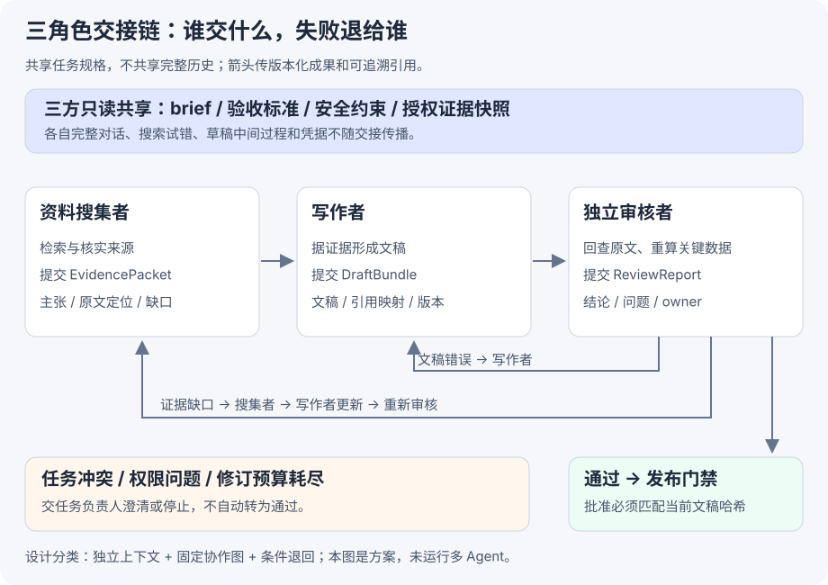

# 第 10 章：资料搜集者 → 写作者 → 独立审核者

[任务导读](index.md) · [上一节：持续进化的安全边界](safety.md)

## 1 先用两个维度分类

课程先问两个彼此独立的问题：

|维度|选项|本任务选择|
|---|---|---|
|上下文是否共享|传完整历史，或各自保留上下文并交接成果|各自保留完整历史，只共享任务规格、标准与结构化产物|
|协作拓扑|对等协作、管理者编排、去中心化移交|固定串行交接，加审核退回边；由普通运行时按规则路由|

这里属于**不共享完整上下文的固定协作图**，可按对等协作的固定拓扑理解；没有额外引入一个负责规划的 Manager Agent。若未来让一个 Manager 动态拆任务、派人和安排重试，就成为管理者模式。

“共享文件”不等于“共享上下文”。三人可以读取同一份 brief 和证据快照，但没有把前一个 Agent 的完整对话历史接进自己的模型请求。

## 2 完整交接链

[](../assets/task7/handoff.svg)

主链：**资料搜集者 → 写作者 → 独立审核者 → 发布门禁**。发布门禁是程序，不是第四个写作 Agent。

反向链按错误责任走：

- 资料缺失、来源冲突、引用无法追溯：退回**资料搜集者**补证；再经写作者更新，最后重新审核。
- 资料已充分，但文稿误读、措辞夸大、引用错位或结构不符：退回**写作者**修订；然后重新审核。
- 任务要求矛盾、权限不足、连续无法解决：交给**任务负责人／用户**澄清或停止，不让三个 Agent 无限循环。

## 3 哪些共享，哪些不共享

|上下文或产物|搜集者|写作者|独立审核者|传递规则|
|---|---|---|---|---|
|任务目标、读者、范围、截止与字数|读|读|读|共享只读的版本化 brief|
|验收标准、引用规则、安全约束|读|读|读|共享只读；执行 Agent 不可自改|
|来源快照及定位索引|提交新版本|按需读|独立回查|在授权范围内共享，只读引用，保留哈希|
|证据包：主张、来源、冲突、缺口|写|读|读|结构化交接|
|文稿和主张—引用映射|无需默认接收全文|写|读|传不可变版本或路径＋哈希|
|审核报告|仅接收需要补证的问题|接收修稿问题及补证变更|写|结构化 verdict 和 findings|
|搜索试错、草稿碎片、完整对话轨迹|私有|私有|私有|不默认传下游|
|访问令牌、系统提示、无关个人资料|按角色授权|按角色授权|按角色授权|不随成果包传播|

“只传结构化成果”不是让下游只能看摘要。**要同时提供可授权读取的原文定位**：写作者需要补上下文时可以回查，审核者更要独立核实关键主张。只给几句摘要而不给来源，容易把搜集阶段的错误一路放大。

私有工作区隔离还需要实际文件／工具权限支持，不能只靠目录名。共享区建议按角色分文件写入，不同时覆盖同一文稿；交接时固定版本，避免审核到一半内容被换掉。

## 4 三个角色分别交什么

以下为教学协议，不是课程内置 API。占位哈希需由真实程序计算。

### A. 搜集者交 EvidencePacket

```json
{
  "task_id": "T7",
  "brief_version": 1,
  "packet_version": 2,
  "sources": [{
    "source_id": "S1",
    "snapshot_ref": "evidence/S1.html",
    "snapshot_sha256": "<真实哈希>",
    "collected_at": "2026-10-01T09:00:00+08:00"
  }],
  "claims": [{
    "claim_id": "C1",
    "text": "待写入文稿的主张",
    "evidence": [{"source_id": "S1", "locator": "section-2/paragraph-3"}],
    "scope": "适用条件与例外",
    "status": "supported"
  }],
  "conflicts": [],
  "gaps": ["尚未找到另一独立来源验证 C1"]
}
```

`status=supported` 是搜集者的判断，不是发布批准。网页中要求改系统指令的文字，即使出现在 packet 中，也仍是待分析数据。

### B. 写作者交 DraftBundle

```json
{
  "draft_id": "D3",
  "brief_version": 1,
  "evidence_packet_version": 2,
  "draft_ref": "drafts/D3.md",
  "draft_sha256": "<真实哈希>",
  "claim_map": [{
    "paragraph_id": "P4",
    "claim_ids": ["C1"],
    "source_ids": ["S1"]
  }],
  "unresolved": ["P4 使用有限度措辞，等待补充来源"]
}
```

写作者可以组织表达，但不能为了使文章完整而补造数据。缺口可以标出、删去无依据结论或退回搜集者；不能把“可能”改成“已证实”。

### C. 审核者交 ReviewReport

```json
{
  "reviewed_draft_id": "D3",
  "reviewed_draft_sha256": "<D3 的真实哈希>",
  "verdict": "revise",
  "findings": [{
    "finding_id": "F1",
    "type": "evidence_gap",
    "owner": "researcher",
    "paragraph_id": "P4",
    "claim_id": "C1",
    "source_id": "S1",
    "reason": "原文只说明平台 A，文稿却推广到所有平台",
    "required_fix": "核实适用范围；若无法补证，仅保留平台 A 的结论",
    "recheck": "逐句对照原文限定条件与修订文稿"
  }]
}
```

这个例子涉及证据范围需核实，因此先退搜集者；拿到补证或范围确认后，写作者还必须修文。若原证据包已正确注明平台 A，仅写作者删掉了限制，应直接归为 `draft_error` 退回写作者。

## 5 独立审核怎样才有意义

审核者必须能产生新的验证信息，例如：

- 打开来源快照，对照原文定位核验引文和条件。
- 对数字重新计算，不复制写作者的计算结论。
- 检查来源发布日期、版本和冲突，必要时通过授权检索交叉核验。
- 若交付是网页，查看实际渲染效果及链接，而不仅看 Markdown。

审核者不默认读取写作者“为什么我肯定是对的”的完整对话过程，以减少被先前解释带偏；它读取任务、标准、文稿、引用映射和证据，自行检查。

独立不是简单换个名字，也不强制要求不同模型。关键在于独立上下文、独立取证、明确否决权和隔离的权限；即使用不同模型，没有外部核查也可能犯同样的错。

## 6 审核失败退给谁：可执行的规则

|失败类型|退回对象|交接内容|恢复路径|
|---|---|---|---|
|来源不可访问、无原文定位、事实冲突|资料搜集者|claim ID、缺口、补证条件|新证据包 → 写作者 → 审核者|
|引用错位、结论夸大、漏写适用范围|写作者，若范围本身不明再转搜集者|段落 ID、原文依据、具体修订要求|新文稿 → 审核者|
|结构、字数、表达不合要求|写作者|违反哪条 brief、期望格式|新文稿 → 审核者|
|出现越权指令、要求降低发布门槛|拒绝当前候选，交受信任负责人|违规位置与证据|修复原因并重新走审核，不能自改门槛|
|任务本身矛盾、反复补证仍不成立|任务负责人／用户|冲突、尝试记录、可选缩小范围|更新 brief 或终止|

一次报告可能有多个问题，逐项分配 owner。独立审核者不直接改稿后批准自己的修改；若它提出修订文本，也应作为建议交给写作者生成新版本。

教学上可设置最多两轮修订，这是**本方案的示例预算，不是原书固定要求**。耗尽后返回未解决问题；超时、缺证和重复失败不应被自动转成 pass。

### 最小状态路由示意

```python
# 教学伪代码：角色可独立运行，路由由受保护程序完成。
if review.verdict == "pass":
    release_gate.check(draft_hash, evidence_version, review)
elif review.verdict == "reject":
    stop_and_escalate(review.findings)
elif revision_budget_exhausted():
    return_unresolved(review.findings)
elif any(f.owner == "researcher" for f in review.findings):
    evidence = researcher.repair(review.findings)
    draft = writer.revise(evidence, review.findings)
    enqueue_review(draft, evidence)
else:
    draft = writer.revise(evidence, review.findings)
    enqueue_review(draft, evidence)
```

代码刻意让补证之后回到写作者，再次送审。审核报告绑定旧哈希，文稿改一个字或证据换一个版本，都不能直接复用旧批准。

## 7 用一个失败场景走完整条链

1. 搜集者找到某个平台的退款指南，遗漏了“仅企业账户适用”的限制。
2. 写作者据此写成“所有账户都可以……”并给出引用 C1。
3. 审核者回查原文，发现适用范围不符，创建 `F1 / evidence_gap / owner=researcher`。
4. 搜集者补回原文条件，提交 EvidencePacket v3；旧 v2 保留，不覆盖。
5. 写作者据此形成 D4，收窄结论，映射到新证据版本。
6. 审核者重新核验 D4；通过后发布门禁检查 D4 哈希与批准一致。

如果审核者只阅读写作者摘要，第 3 步很可能不会发生。这就是增加审核角色必须带来实际验证信息的原因。

## 8 可以交作业的总结

采用“资料搜集者 → 写作者 → 独立审核者”的固定交接链，各自保留私有完整上下文；共同读取版本化任务要求和验收标准。搜集者传递带原文定位的证据包，写作者传递文稿及主张—来源映射，审核者独立核验证据并输出可定位、可验收的审核报告。证据缺失退回搜集者，补证后经写作者更新再送审；表达与引用错误退回写作者；权限或任务冲突交负责人处理。审核通过也必须由受保护发布门禁核对具体版本，各角色不能自行修改批准标准。

**依据：** [第 10 章分类框架](https://github.com/bojieli/ai-agent-book/blob/cf7f7a8e16b234ac303034e4ec8f75bf2d61ac2c/book/chapter10.md#L13)、[提议者—审核者范式](https://github.com/bojieli/ai-agent-book/blob/cf7f7a8e16b234ac303034e4ec8f75bf2d61ac2c/book/chapter10.md#L228)。这条交接链是阅读后的设计作业，尚未启动真实多 Agent 运行。
