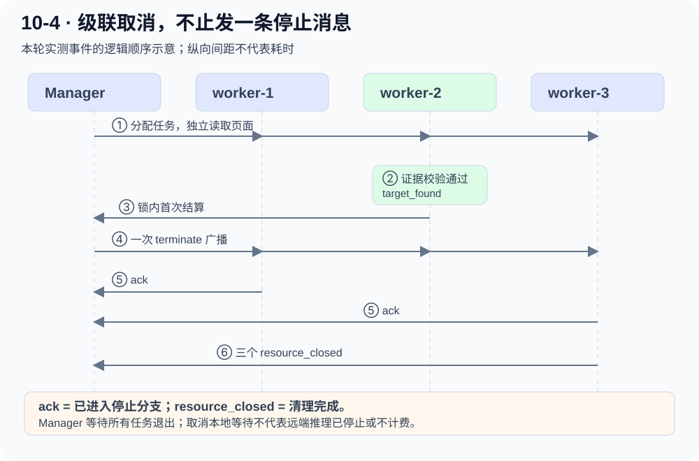

# Starter · 10-4：几个 worker 并行找同一位教师

[代码精读](parallel-research-code.md) · [证据与复现](chapter10-evidence.md)

## 1 把任务定义清楚

目标是找到机器学习领域的 Andrew Ng 教师信息。完成条件不是“页面出现 Andrew Ng”，还需要原文证据支持教师身份与机器学习领域。

本轮的最后一组输入：

|站点|在实验中的作用|
|---|---|
|Stanford 教育学院页面|无目标信息的真实页面|
|Stanford Profiles 的同名个人页|姓名相同但职位不符的反例|
|Stanford AIMI 教师介绍|包含目标教师与领域说明的页面|

页面读取使用真实 HTTP 请求；资料抽取使用真实 DeepSeek `deepseek-flash`，关闭 thinking。没有编造网页内容，没有人为插入网站延迟。

原始页面会变化，以上是 **2026-10-01 本次采集**的观察。[AIMI 来源](https://aimi.stanford.edu/people/andrew-ng)明确提供该教师的介绍；[Profiles 同名页](https://profiles.stanford.edu/andrew-ng)当时显示财务岗位，不能直接当成同一人。

## 2 两个早期结果为什么不能丢

### 静态 HTML 没有正文

第一组用了课程中的 HAI 页面，HTTP 提取只得到 `Stanford HAI`。三站点没有产生模型调用，不能写“模型没找到教授”。更准确地说，是采集结果缺少正文。本次没有覆盖 JS 渲染。

### 姓名和引文都正确，却找错人

第二组换用 Profiles 页面，程序确实拿到了同名资料。弱验证只要求 found 是布尔 true、姓名匹配、引文是网页原文，于是接受了财务岗位。

这不是模型凭空编造信息，而是**任务验收条件缺少身份消歧**。我们保留该轮报告，在下一轮明确要求引文同时支持姓名、professor 和 machine learning。

这两次是定位问题的探索运行，不和最后一轮合并统计。

## 3 最后一轮结果：不要把耗时比叫加速比

|阶段|输入|实测耗时|结果|资源关闭|
|---|---|---:|---|---|
|三站点并行|同一份 3 URL 清单|2.610 秒|未找到通过完整校验的结果|3/3 HTTP clients|
|三站点串行|同一份 3 URL 清单|9.531 秒|在 AIMI 页面找到通过校验的结果|3/3 HTTP clients|
|级联取消|3 个 worker 同时请求同一个 AIMI 页面|1.764 秒|worker-2 获胜；其他两个应答取消|3/3 HTTP clients|

**不能声称加速 3.652 倍。** 并行组没有成功交付，串行组成功了，任务质量不相同。脚本最初保存了这个算术耗时比；追加的 `analysis.json` 明确将有效加速比设为 null，保留原记录便于追溯。

单次成功对照即使质量相同，也还需要多轮、交替执行顺序、网络波动和模型消耗统计，才能讨论稳定加速。

## 4 并行组为什么漏报正确页面

AIMI 页的确包含目标信息。但并行模型返回的 evidence 只引用了姓名和教师职位，没有包含机器学习领域。Python 校验要求这三个要素都出现在可定位原文中，因此拒绝了候选。

串行模型返回了较完整引文，通过了检查。**低温度不是完全确定性。** 同一模型、同一页面，也会产生不同的证据范围。

这说明要区分：

- 页面没有目标；
- 模型没有抽取到目标；
- 模型认为找到了，但证据不足；
- 经验证的结果可以结算。

教学适配器仍沿用原版 `not_found` 事件承载校验拒绝原因。下一步应单列 `candidate_rejected`，并考虑有预算的修复轮次。本轮没有不断重跑直到出现好成绩。

## 5 级联取消实际发生了什么

[打开 SVG 大图](../assets/task7/ch10-lifecycle.svg) · 窄屏可左右滑动查看。

这轮三个 worker 都读取同一个真实页面，只用于制造竞争，**不是三份独立来源交叉验证**。

1. worker-2 的候选先通过验证。
2. Manager 在锁内设置 winner，只发出 **1 次 terminate 广播**。
3. worker-1、worker-3 的模型等待被取消，均发送 ack。
4. 三个 HTTP client 最终全部关闭，missing ack 为空。

收到 ack 不等于清理已经结束，所以 Manager 仍等 `resource_closed`。取消本地 API 等待也不保证供应商停止推理或不计费。

正式最后一轮收到 **5 份完整模型响应**，另有 **2 次取消等待**；已返回响应共 **3,820 tokens**，取消请求的实际用量未知。自定义学习门槛 **7/9**，未通过的是三站点并行命中与该阶段的成功广播条件。

## 6 这一课学到了什么

- 并发收益依赖任务能否独立，以及结果是否正确。
- 同名文本不是身份验证；真实引文也需要与验收条件相关。
- 独立校验可能误拒正确候选，需要记录拒绝原因。
- 取消、应答、资源释放是不同状态。
- 有失败结论的实验仍有价值；尤其不能用更快的失败宣称系统更快。

## 7 动手题

先看原始事件，找出获胜消息、广播、两个 ack 和三个 resource_closed。预测：如果某个 worker 在获胜前就已经正常结束，它还欠一个取消 ack 吗？然后到下一页看 `expected_loser_acks` 的实现。
