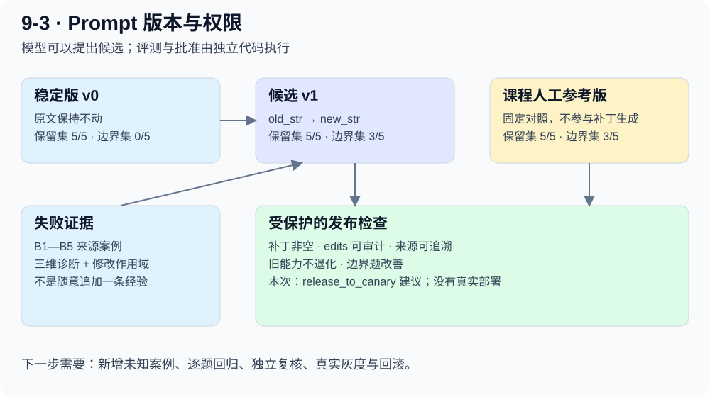

# 9-3 实验：从失败轨迹到最小 Prompt 补丁

[一步步读代码](prompt-evolution-code.md) · [原始证据](evidence.md)

## 一句话理解

航空客服遇到争议就转人工。我们让模型读取失败诊断，修改转接规则，再拿相同测试分别评估初始、自动候选和课程人工参考三版 Prompt。

**这里“自动进化”是提示词文件发生变化，模型参数没有训练。**

## 本次结果

2026-10-01，DeepSeek `deepseek-flash`，显式关闭 thinking；完整 10 个案例 × 3 组。成功实验共 **74 次调用**：任务 Agent 53 次，质量裁判 20 次，Coding Agent 1 次。

|Prompt|原有能力保留集|政策争议边界集|
|---|---|---|
|初始|5/5|0/5|
|自动候选|5/5|3/5|
|课程人工参考版|5/5|3/5|

原版发布门槛输出 `release_to_canary`，即“具备进入灰度评估的条件”。**没有部署、没有覆盖稳定 Prompt，也没有启动真实灰度流量。**

自动与人工的 3/5 相同，只表示本轮小样本计数相同，不能推导两者等效。

## 到底改了哪条规则

旧规则要求：乘客表达不满或提出无法完全满足的诉求时及时转人工。

自动补丁把范围收紧到：明确要求人工、紧急安全事件；普通政策争议先查政策、解释依据、给出合规替代方案。一个精确替换，保留其余提示词。

补丁的来源记录了 B1—B5 五条失败案例，不是无来源地追加一句“以后聪明一点”。完整 diff 在证据文件 `diff` 字段和运行日志中。

## 为什么仍有两题没解决

自动候选的 B2（免改签费）、B3（小延误索赔）没有再转人工，但回复停留在索要订单号，没有给出 rubric 要求的政策解释或替代方案，所以判“未转接但处理不当”。

这说明两个目标不同：

- 减少不必要转接，是策略边界改善。
- 真正解决请求，是业务完成度改善。

本实验是单次用户请求的短流程，没有模拟用户补充订单号。因此“需要订单号”的合理澄清也可能在这个评测协议下失败；要迁移到业务，应补多轮用户模拟及真实政策约束，不能只为了测试分数要求客服猜订单。

## 这套评价还有哪些限制

1. 保留集是课程命名 `holdout` 的既有行为回归集，不是证明业务全面泛化的全新测试集。
2. 自动补丁看过边界集失败，再在相同边界集上评估，有针对题目优化的风险。
3. 门禁比较保留集总正确数；总数相同可能掩盖“一题变好、一题变坏”。本次 `regression_case_ids` 为空，但生产门禁应逐例检查关键能力。
4. 任务模型和裁判使用同一个模型，可能共享偏差；高风险结论仍要靠业务事实与独立复核。
5. 本课程场景把转人工限定为两类，不是所有企业客服的通用规则。真实权限、法律与企业政策仍由业务方制定。

## 遇到的接口问题也保留了

第一次运行在强制调用 `apply_edits` 时得到 HTTP 400：thinking 模式不支持这个 tool_choice。按 [DeepSeek 官方接口说明](https://api-docs.deepseek.com/api/create-chat-completion/)，在整个正式 9-3 对照中统一传 `thinking.type=disabled` 后重新完整运行；没有把两种模式的数据拼接成一轮。

正式结果用 72,156 tokens；首次失败尝试的收据另存，不计入这个数。供应商没有返回货币成本，因此未估算金额。
